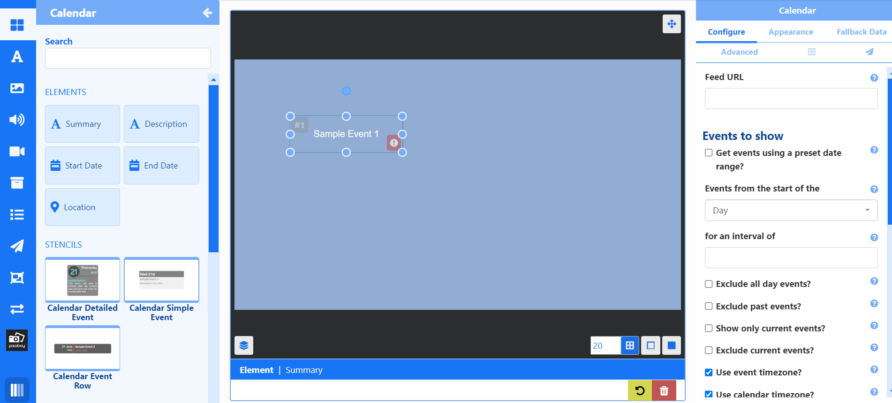
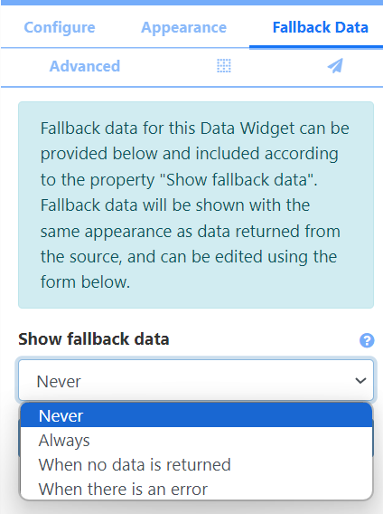
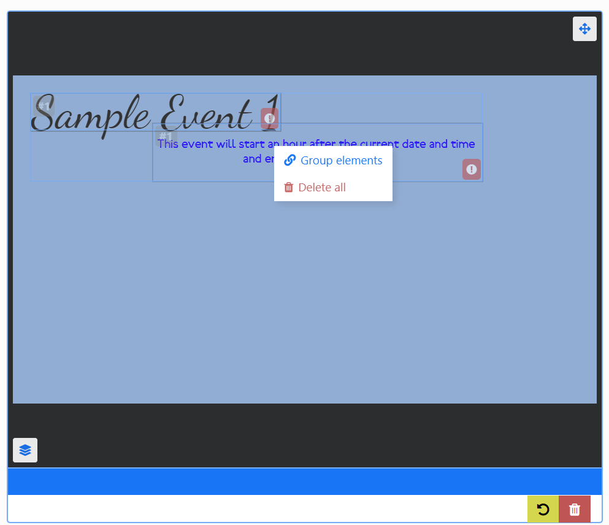
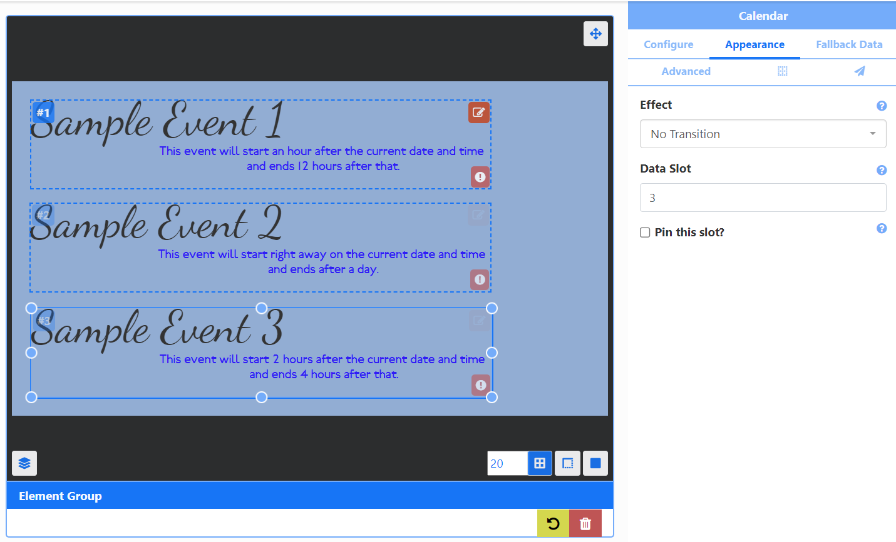

# Data Widgets

Data Widgets rely on an external data source to show information on Layouts by using **Elements**.

## Feature Overview

- Data source driven content.
- Separate Elements allow for flexibility.
- Provide fallback data to show.
- Control paging of data with Data Slots.
- Create Groups for easy duplication.
- Pull data from an alternative source on the same Layout.
- Utilise pre-made designs. 

Each Data Widget has a set of **Elements** which are fed by a data source which allow a User flexibility in the placement of returned data rather than being bound by a rigid **Static Template** design:

- Click on a **Data Widget** to show all available **Elements**.

{version}
**NOTE:** Data Elements are only available from the Layout Editor and are not available in the [Playlist Editor.](media_playlists.html#content-playlist-editor) Users can however add Data Widgets using Static Templates.
{/version}

### Configure

Each Element has a set of configurable options available from the **Properties Panel** once added:

{tip}
An exclamation icon will be shown to prompt a User as to what needs to be actioned. The above example has yet to have a URL entered for an ICS feed!
{/tip}

Options set from the **Configure** tab will apply to all Elements added to the Layout of the same Widget type. 

{tip}
Create a [New Configuration](layouts_data_widgets#content-new-configuration.html) to select data from alternative data sources associated with the Widget!
{/tip}

### Appearance

The **Appearance** tab includes options to configure how the data returned from the Element should look and includes transition effects and [Data Slot](layouts_data_widgets#content-data-slots.html) configuration.

### Fallback Data

Create **Fallback Data** for selected Data Widgets and specify under what conditions it should be shown:

- Click **Add New**.
- Complete the form fields with the required information.
- Save.

{tip}
Fallback Data options will vary dependent on the Data Widget selected!
{/tip}

### Advanced

The Advanced tab is used to set Naming, provide specific durations, set the collection level of proof of play stats and enable items to be repeated to fill all [Data Slots](layouts_data_widgets#content-data-slots.html).

### Positioning

Use the **Positioning** tab (grid icon) to set precise positioning and Layering.

{tip}
Elements have their own Canvas [Layer](layouts_editor#content-layering.html), which can be used to determine where they appear in relation to other natively rendered Elements such as Playlists and Videos!
{/tip}

## Data Slots

When adding more than one of the same **Element**, handle the paging of returned data by specifying a **Data Slot** to use for each Element:

{tip}
For example, the image above shows 2 **Description Elements** from the **Calendar Widget** have been added. One has a **Data Slot of 1** the other a **Data Slot of 2.** If 10 (Calendar Events) items were returned, Data Slot 1 would show items 1,3,5,7,9 with Data Slot 2 showing items 2,4,6,8,10.
{/tip}

Data Slots are set from the **Appearance** tab of the **Properties Panel** for the selected Element.

{tip}
Adding more than one of the same Element will automatically increase in **Data Slot** number!
{/tip}

In addition Elements have the option to **Pin this slot** so that the first data item to appear in that slot will remain for the entire duration of the Widget and won't cycle through data items.

{tip}
Users can set whether to **Repeat items** in order to fill all data slots to ensure there are no empty slots by using the checkbox on the **Advanced** tab of the Properties Panel!
{/tip}

## Grouping Elements

Group Elements of the same Data Widget together to make it easier to build designs:

- Add Elements to the Layout, position and style using the **Appearance** tab.
- Hold down the shift key and click into each Element you wish to group.
- Once selected, release the shift key and right click.
- Select **Group elements**.

{tip}
Groups can also include **Global Elements**. 
{/tip}

{version}
**NOTE:** All Data Elements need to share the same **Data Slot** and **Effect** when grouping!
{/version}

Groups can be easily duplicated:

- Right click and select **Duplicate**.

Edit **Data Slots** for each group to control data paging:

Make edits to the **Appearance** of each Element in a group:

- Click the pencil icon in the top right corner.

- Click in each Element and use the Appearance tab to make changes.
- Click out of the group or click the X to exit editing.

{tip}

Edits can be made to the **Configuration** but it will apply to all Elements added.

Ungroup elements from the right click menu!
{/tip}

## New Configurations 

New Configurations can be created in order to have alternative configuration options/different data source associated with the Widget:

- Right click an Element or Element Group and select **New Configuration** from the menu.
- Select an alternative data source / alternative configuration from the **Configure** tab.

## Stencils 

Selected Data Widgets include pre made designs of Element Groups called **Stencils** to assist Users with creating content simply and quickly:

- Stencils are added in exactly the same way, positioned and resized.
- Complete the fields to **Configure**.
- Edit the **Appearance** by clicking on the pencil icon in the top right of the group.
- Select an Element in the group to make edits.

{tip}
Right click to ungroup to customise further!
{/tip}

## Static Templates

Static Templates are included for specific Widgets. Templates can be configured to affect the behaviour of returned results as well as alter styling options.

{version}
For advanced use, **Module Templates** can be created to be used with Data Widgets using HTML/CSS and JavaScript from the **Developer** section of the main CMS menu!
{/version}

