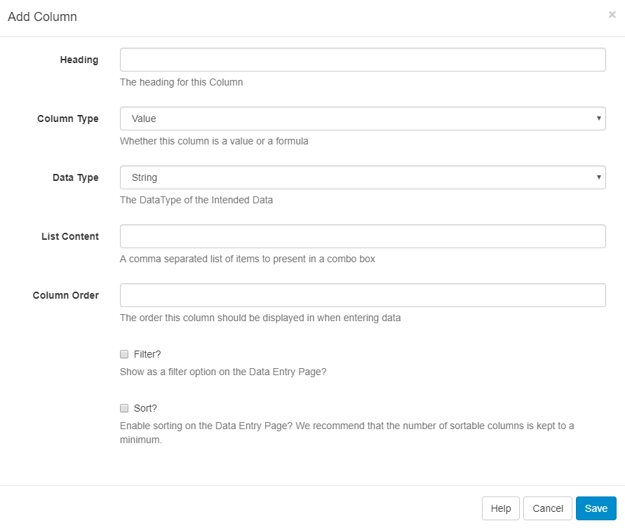
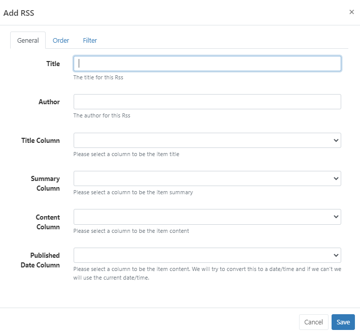

# DataSets

DataSets are used to design and store tabular data which are created and managed independently to [Layouts](https://xibosignage.com/manual/en/layouts.html) and [Playlists](media_playlists.html). Once created, DataSets are added to Layouts and Playlists using the [DataSet](media_module_dataset.html) Widget.

DataSets can also be used to create your own [RSS Feeds](media_datasets.html#content-view-rss) to add to the [Ticker](media_module_ticker.html) Widget.

## Feature Overview:

- Define the data structure.
- Data can be manually added.
- Import data from a CSV file.
- Use a JSON formatted data source via the API.
- Sync from a 3rd party data source remotely on a schedule.
- Maintain content without accessing Layouts/Playlists.
- Re-use across multiple Widgets/Layouts/Playlists.
- Create an RSS feed from a DataSet.

DataSets have been designed to be versatile so that they can be configured in a number of ways with the DataSet Widget as well as a source of data for a custom Module. A DataSet provides a convenient way to import and display data from other systems in [[PRODUCTNAME]].

Examples of where DataSets could be utilised:

- A drinks menu at a bar
- Tee times at a golf club
- Meeting room bookings
- Bus timetables

DataSets are created and managed independently to Layouts and Playlists and therefore do not require user access to Layouts the Layout Editor or Playlists to add or manage the data held within a DataSet.


## Creating a DataSet

DataSets are created and managed by selecting  **DataSets** under the **Library** section of the main CMS menu:


- Select the **Add DataSet** button and complete the form fields to create a new record:


[Folders](tour_folders.html) are used to organise, search and easily [Share](users_features_and_sharing.html#content-share) User objects with other Users/User Groups. DataSets saved to a Folder will inherit the access options applied to that Folder.

- Give your DataSet a **Name** for easy identification in the CMS. Provide an optional internal **Description** and enter a **Code** if referencing this DataSet via the API.

If the DataSet is going to be connected to sync with a **Remote** data source, tick to enable and continue with the [Creating Remote DataSets](media_datasets.html#content-creating-remote-datasets) configuration.

If the DataSet is **not Remote**, click to Save the DataSet record and continue from the [Create and Configure Columns](media_datasets.html#content-create-and-configure-columns) section.

### Creating Remote DataSets

Remote DataSets are a special type of DataSet which will periodically sync from a 3rd party data source. [[PRODUCTNAME]] will call the URL at a chosen time period and parse the data according to instructions set on the DataSet record and any Columns that have been defined as **Remote**.

On selecting Remote, additional tabbed fields are made available so that the Remote DataSet record can be fully completed:


- #### Remote

  Set the type of request method and enter the URL for the remote data source.

- #### Authentication

  Provide authentication information. Custom Headers are available to provide an optional string of custom HTTP headers.

- #### Data

  Set the remote data source: 

### JSON Source

JSON data is populated according to the Columns defined as Remote types. When specifying a **Remote Column** a 'data path' needs to be entered which is the JSON syntax path to the data for that column, in respect to the **Data Root** specified.

{tip}
Consider an example JSON data source:

```json
{
    "base": "EUR",
    "date": "2017-12-22",
    "rates": {
        "GBP": 0.88568,
        "THB": 38.83,
        "USD": 1.1853
    }
}
```

If we wanted two columns to capture the currency **Symbol** and **Value**, we would need to set the **Data Root** to `rates` and have Columns for:

- **Symbol** - data path = 0
- **Value** - data path = 1

{/tip}

Use the **Test data URL** to ensure that the desired structure is returned.

### CSV Source

The remote data source can be selected as a CSV.

If the CSV source contains headers, tick to ignore the first row.


Use the **Test data URL** to ensure that the desired structure is returned.

#### Advanced

- Set how often the remote data should be fetched and imported.

- Set a timescale to Truncate data.

- Use the drop down to select a DataSet if using dependants.

- Optionally set a row limit and what should happen if this limit is exceeded.

{nonwhite}

{noncloud}
If no **Row Limit** is set here, the Row Limit applied in the [CMS Settings](tour_cms_settings.html#content-defaults) will be used for non Cloud customers.
{/noncloud}

{cloud}
If no **Row Limit** is set here the default will apply which is 10,000 rows per DataSet for Cloud customers.
{/cloud}
{/nonwhite}

Click to **Save**.

## Create and Configure Columns

Columns define the structure of your data:

- Use the row menu for a DataSet record and select **View Columns**:


{tip}
By default, all new DataSets will have a **Col1** added. This should be edited or removed using the row menu for Col1!
{/tip}

- Delete Col1 from the row menu and click on the **Add Column** button to create a new column

​	or

- Use the row menu for Col1 and select **Edit**.



- Include a **Heading** to identify this Column.
- Use the drop down to select a **Type** of Column to use.

### Column Types:

#### Value

Enter a list of items to be presented in a combo box.

- Use the drop down to select the **Data Type**.
- Provide a comma-separated list of values that can be selected for this column.
- Set the position this Column should appear when viewing/editing Data.
- Provide an optional tooltip message to display when entering data for this column.

Use the additional options to enable **Filters**, **Sorting** and **Required Values** for this column.

#### Formula

Enter a MySQL statement.

- Use the drop down to select the Data Type.
- Set the position this Column should appear when viewing/editing Data.
- Provide a MySQL statement suitable to use in a 'SELECT' statement or a string to format a date field.

{tip}

`	$dateFormat(<col>,<format>,<language>)`
	Ensure that `<col>`has a date and time specified for the date format to work. If the language has not been set, it will default to English.

Two substitutions are available for Formula columns: `[DisplayId]` and `[DisplayGeoLocation]` which will be substituted at run time with the Display ID / Display Geo Location (MySQL GEOMETRY).

{/tip}

Use the additional options to enable **Filters** and **Sorting** for this column.

#### Remote

Provide a JSON syntax string.

- Use the drop down to select the Data Type.
- Enter a JSON syntax string showing how to access the data from a 3rd party data source.
- Set the position this Column should appear when viewing/editing Data.

Use the additional options to enable **Filters** and **Sorting** for this column.

Continue to add and configure Columns as required. There is no theoretical limit to the number of Columns [[PRODUCTNAME]] can support, although a smaller DataSet is often easier to manage and display.

{tip}

Columns can be viewed/added and edited by using the row menu for a DataSet record from the DataSets page.

The ordering and list content of Columns can be changed after Data has been collected.
{/tip}

## Adding Data to Columns

Once Columns have been defined, data needs to be added. This can be achieved a number of ways:

- Manually through the CMS User interface
- Imported via a CSV file
- Using the API
- Remotely Sync

### Manually 

Data is added using the **View Data** button on the Columns page.

{tip}
Data can be viewed/added and edited by using the row menu for a DataSet record from the DataSets page!
{/tip}

The data table will show each of the Columns added to the DataSet as they have been configured.


- Add a new row of data by clicking on the **Add Row** button and complete for each non-formula Column type.
- Click **Next** to continue adding data to add more rows.
- When all data has been completed, click **Save**

{tip}
Click in any row to Edit Data. Click on the cross at the end of a selected row to Delete.

Users can toggle to a **Multi Select Mode** using the button at the top of the grid. In this mode, Users can select multiple rows and click on **Delete Rows** to remove in bulk.

Once complete click on the **Edit Mode** button to come out of multi-select mode.
{/tip}

### Importing a CSV 

The CMS has a DataSet CSV importer that can be used to extract data from a **CSV file** and put it into a DataSet. The **Import CSV** function can be accessed through the row menu of any DataSet record (with the exception of DataSets configured for Remote data sources).


The importer has options to overwrite the existing data held in the import file as well as an option to ignore the first row of the CSV when importing if your file has headings.

The Remote Columns in the DataSet will be listed with a field next to them to indicate the column number in the CSV file that corresponds with the listed Column Header.  

{tip}
It is important to ensure that your CSV file has the correct file encoding if you are using non-ASCII characters. Non-ASCII characters are very common for languages outside of English. The file encoding most commonly used is UTF-8.

If you have edited your CSV file using Excel, you will need to make sure you select "Unicode (UTF-8)" from the Tools -> Web Options -> Encoding tab on the 'Save as' dialogue.
{/tip}

### Through the API

You can write your own application which syncs data into a DataSet using the [[PRODUCTNAME]] API. Data can be added row by row or by importing whole JSON structures.

{nonwhite}
Further discussion on the API can be viewed in the [Developer documentation](/docs/developer).
{/nonwhite}

### Remotely

Remote DataSets are kept in sync with a Task called **Fetch Remote DataSets**. This task is configured by default and runs once per minute.

- #### Dependents

  A remote DataSet can depend on another DataSet to formulate its request. Each row in the dependent DataSet will be used to create a request using the parent DataSet's request parameters.

## Row Menu

Each DataSet has a row menu where Users can access a list of actions/shortcuts.

- Notable settings are listed below:

### View RSS

Create your own RSS feed using the data held in a DataSet.

- Select **View RSS** from the row menu of a DataSet.
- Click on the **Add RSS** button.



- Complete the form fields, selecting the Columns to use.
- On Saving a URL will be generated which can be copied and added to the [Ticker](media_module_ticker.html) Widget.

### Delete

DataSets can only be deleted if they are not in use.

Multiple DataSets can be selected and deleted in bulk using the [With Selected](tour_cms_navigation.html#content-multi-select---with-selected) option at the bottom of the DataSets grid.

### Share

Set [Share](users_features_and_sharing.html#content-share) options for User/User Group access to individual DataSets.

