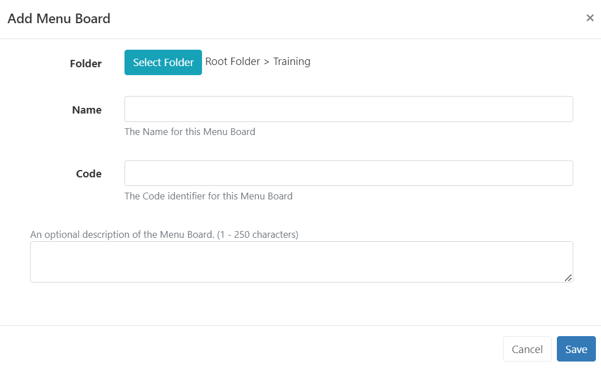
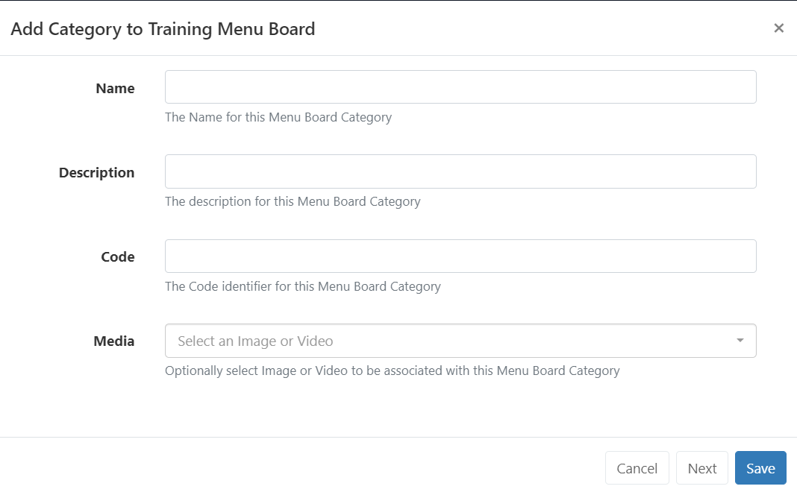
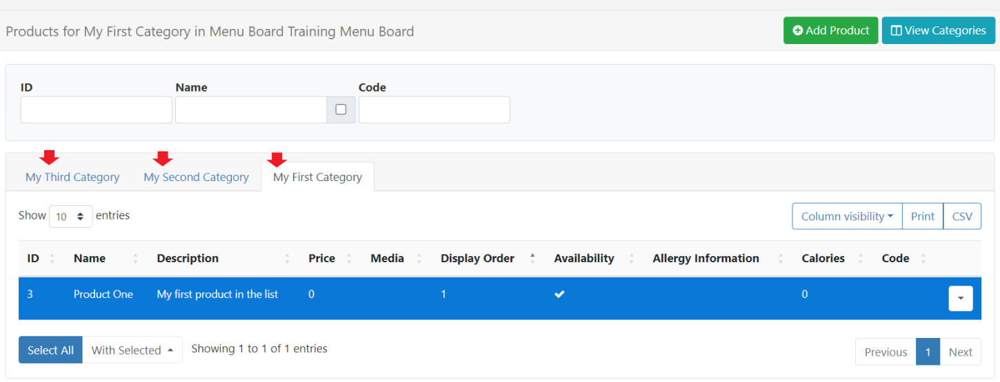

 # Menu Boards

The Menu Boards interface provides a simple way for users to create and manage 'categories' and 'product' information independently to Layouts. Once created, Menu Board data can be added anywhere on a Layout using [Elements](layouts_editor#content-data-widgets-and-elements) from the  [Menu Board: Category](media_modules_menuboards_category.html) and [Menu Board: Products](media_modules_menuboards_products.html) Widgets available in the [Layout Editor.](layouts_layout_editor.html)

{version}
**Note:** Menu Board Widgets are not available to add to a Playlist!
{/version}

## Feature Overview

- Create and define Categories.
- Include detailed product information.
- Select Images to use from your Library.
- Maintain content without accessing Layouts.
- Re-use across multiple Widgets/Layouts.

Menu Boards are created and managed independently to Layouts and therefore do not require user access to Layouts or the Layout Editor to add or manage categories/product data held within a Menu Board.

## Creating a Menu Board

Menu Boards are created and managed by selecting **Menu Boards** under the **Library** section of the main CMS menu: 

- Select the **Add Menu Board** button and complete the form fields to create a new record:

[Folders](tour_folders.html) are used to organise, search and easily [Share](https://test.xibo.org.uk/manual/en/users_features_and_sharing.html#content-share) User objects with other Users/User Groups. DataSets saved to a Folder will inherit the access options applied to that Folder.

- Give your Menu Board a **Name** for easy identification in the CMS. Provide an optional internal **Description** and enter a **Code** if referencing this Menu Board via the API.

- Click to **Save**.

## Create and Configure Categories

Categories define the structure of your data:

- Use the row menu for a Menu Board record and select **View Categories**.

Click on the **Add Category** button and complete the required form fields:

{tip}

Code is for advanced use when referencing the API.
{/tip}

- Click **Next** to repeat this process to add the required **Categories** for the Menu Board.
- Select **Save** when entering the last Category to use.

## Add Products

Product data is added to Categories to provide all key information which can be selected to be shown on Displays.

- Use the row menu for a Category and select **View Products**:

- Create new Product data by clicking the **Add Product** button and complete all relevant form fields:

{tip}
The [Menu Boards: Products](media_module_menuboards_products.html) Widget can be configured to dim products that are marked as unavailable to show on Displays!
{/tip}

### Product Options

Use this tab to provide further product options:

{tip}
Use Options to provide special offers, limited deals etc for this particular product.
{/tip}

- Repeat the process to add further Products/Product Options to the Category. 

{tip}
Each Category will be shown as a separate tab on the Product grid so you can easily switch between Categories to add and edit product information!
{/tip}

Click on **View Categories** to go back to the Categories grid to view and edit existing using the row menu or **Add Category**.

Menu Board data is added to Layouts using the [Menu Board: Category](media_module_menuboard_category.html) Widget which has data elements which are primarily used to add 'header' information and the [Menu Board: Products](media_module_menuboards_products.html) Widget which allows for precise placement of Product details on Layouts.

{tip}
Menu Boards are edited independently to Layouts, so there is no need to access or edit the Layout(s) the Menu Board has been added to. Changes will be available in the system straight away ready to be picked up by Players on their next collection, with no need to make any edits to Layouts!
{/tip}

#### Next...

[Add Layout](layouts.html#content-adding-layouts)

