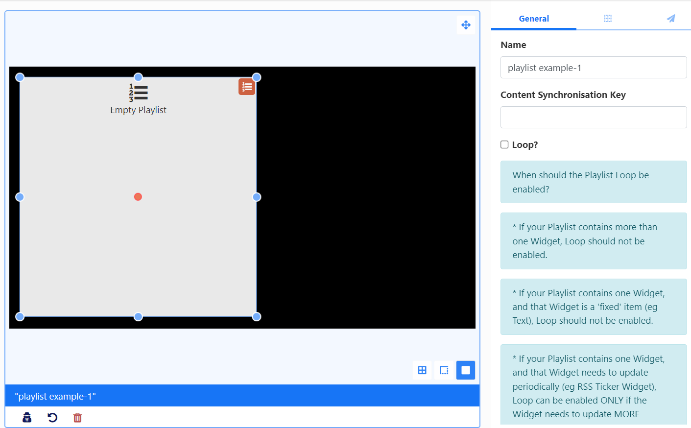
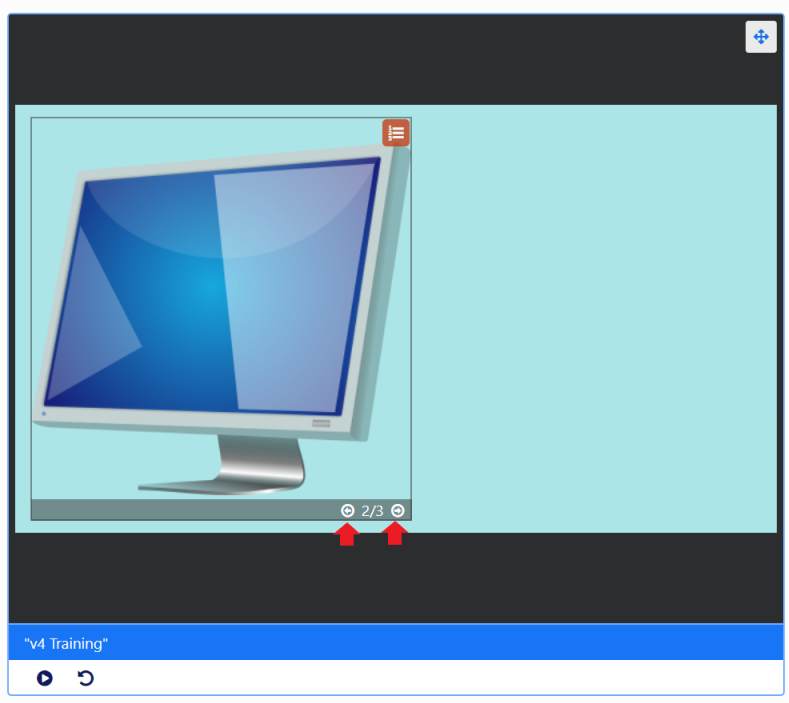

# Playlists

Use the Playlist Widget to create a timeline of content directly on a Layout.

Add the Playlist Widget to a Playlist Timeline to show content from one or multiple [Playlists](media_playlists.html) which have already been created.

{feat}Playlist|v4{/feat}
## Widget Overview:

- Create and configure directly on a Layout.
- Easily display a 'slide-show' of content held in one or more Playlists.
- Sync with Playlists on other Layouts which are part of a Synchronised Event.
- Combine content from a variety of Playlists to be shown.
- Set the maximum number of items to be shown from a Playlist.
- Control how long each item on a Playlist should show before moving onto the next item.
- Set a Playlist to use its content as 'filler' only.
- Control how multiple Playlists should be ordered to play content.
- Play one item per cycle for a specified Play Count.
- Cycle through items contained on a Playlist in the viewer to easily see the sequence.

{tip}
[Playlists](media_playlists.html) can also be created and managed independently to Layouts and would therefore not require further user access rights to Layouts or the Layout Editor to add and manage content. Edits made to a Playlist will update all Playlist Widgets that the Playlist has been added to.
{/tip}

## Add to Layout

Add the Playlist Widget to create a Playlist of content as a one time assignment:

- Use the **Content Synchronisation Key** to sync with Playlists on other Layouts. Playlists with the same key will be synchronised when the Layout is scheduled as a [Synchronised Event.](scheduling_events.html#content-synchronised-events)

{tip}
**Scenario:**

You have a Synchronised Event with 3 Displays and 3 different Layouts. Each Layout has some Text at the top and a Playlist in the middle which all 3 need to play in sync. 

You could also set two different Playlists to sync differently which you could set to `sync_1` and `sync-2` for example.
{/tip}

- Set to **Loop** only if the Playlist contains just one Widget and that Widget needs to update periodically (e.g. RSS Ticker) and it needs to update more frequently than the duration of the overall Layout.

- Click the icon in the right hand corner of the Playlist to open the [Playlist Editor](media_playlists.html#content-playlist-editor) to add and configure content.

## Add to Playlist

The Playlist Widget can be added to a Playlist using the [Playlist Editor](media_playlists.html#content-playlist-editor) to select from one or more [Playlists](media_playlists.html) which have already been created as well as define how much content should be shown and for how long as well as determine a play order.

Add the **Playlist Widget** to a **Playlist Timeline** to reveal further options in the properties panel for configuration:

Use the dropdown menu to select Playlists, using the `+` button to add and configure multiple Playlists if required.

**Spot** options are used to define how much content from Playlists should be shown and for how long.

Spots also have an option to use a Playlists content as filler only and add content from this Playlist to **Fill** or **Pad** other selected Playlists:

- This Playlist must be the **first** added Playlist in the list.
- Enter a **0** in the **Spots** field so that the entire Playlist will be ignored and omitted from the play order. Select how the content from this Playlist should be distributed with the other Playlists using **Spot Fill** options.

{version}
**Note:** Please be aware that by setting **Start Dates** to Widgets may cause fewer Spots to be shown than the total amount specified!
{/version}

Use the drop-down menu for the **Spot Fill** field to select how any remaining Spots should be filled in the event that there are not enough Widgets on the selected Playlist to fulfil the specified play spots. 

{tip}
**Spots**, **Spot Length** and **Spot Fill** are all optional and can be left blank if this functionality is not required!
{/tip}

Use the drop-down for **Playlist Ordering** to select how all Playlists should be ordered to play.

{tip}
**Auto** uses the total count of items in each list and divides it by the smallest list to determine how often to take items from each list to ensure an even play from each Playlist.
{/tip}

Select from the **Remaining Widgets** options to handle any content that is left unordered at the end of a Playlist.

### Cycle Based Playback

Once enabled all Playlists selected will be treated as one "list" and will only show one Widget each time the Layout is played, cycling through the content from all Playlists added.

{tip}
Use the **Play count** to determine how many plays each Widget should have before moving onto the next Widget in the list.
{/tip}

- Click the **Back** button to exit the Playlist Editor

See a preview of all content contained in the Playlist on the viewer, use the arrows at the bottom right of the Playlist to cycle through the order of content:

