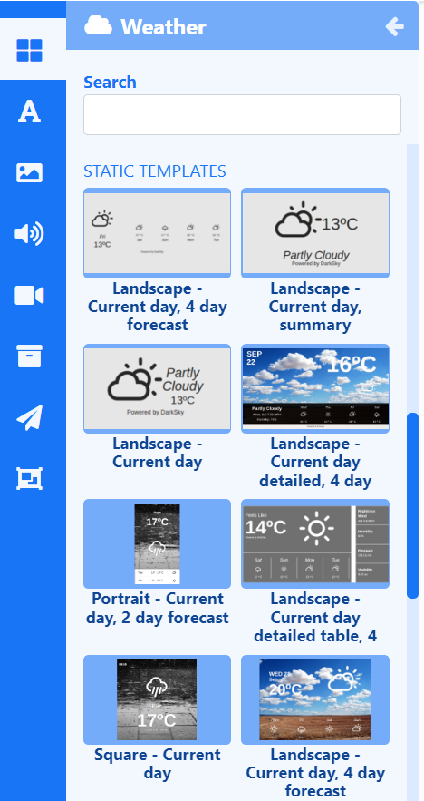

# Weather

Display daily weather forecast data anywhere on a Layout using **Elements** or select a **Static Template** to display results in Layouts/Playlists.

{feat}Weather|v3{/feat}

Weather data is provided by [OpenWeather](https://openweathermap.org/) which is provided under [CC-BY-SA](https://creativecommons.org/licenses/by-sa/4.0/) and [ODbL](https://opendatacommons.org/licenses/odbl/) which provides current worldwide daily weather forecasts which feed into configured Elements and Static Templates.

{tip}
Please visit [Open Weather Map](https://openweathermap.org/api) to create an account and obtain an API key to enter into the Open Weather [Connector.](media_modules.html#content-connectors)

**NOTE:** Since the release of Open Weather's One Call 3.0, new users must enter credit card details to use the free x number of calls Key or opt for a paid subscription!

Open Weather Map allows 1000 requests for a forecast, per day before charging a small fee for each subsequent request.

**Paid plans** unlock a 16 day forecast as well as other optimisations in the way the data is pulled through.

{/tip}

{nonwhite}
{cloud}
The Weather Module is configured for **Xibo Cloud** hosted customers with an API key provided as part of the service.
{/cloud}
{/nonwhite}

The Open Weather Map Terms of Service https://openweathermap.org/terms should be read and understood before using this Widget. 

## Weather Elements

[Elements](layouts_editor#content-data-widgets-and-elements) are available for selection when adding the Weather Widget to a [Layout](layouts_editor.html) to give Users more control over what components of the Weather Widget to use and where they can be placed.

Each Element has a set of configuration options in the Properties Panel.  Enter the geographical location and units to return results from the **Configure** tab.

Control how items should be cycled by specifying a [Data Slot](layouts_editor.html#content-data-slots) to use for each of the added Elements. Data Elements can be further complimented by adding [Global Elements](layouts_editor.html#content-global-elements) to add shapes and text which can all be put into an [Element Group](layouts_editor.html#content-grouping-elements) for easier configuration and positioning.

{tip}
All Layouts that use the Weather Widget need to include attribution, available by using the Attribution Element.  Static Templates contain this tag by default.
{/tip}

## Weather Static Templates

[Static Templates](layouts_editor.html#content-static-templates) define how returned results should be laid out and styled and are a simple way to show your data using pre-styled templates.

Templates can be configured to make changes to the design appearance using a range of options in the Properties Panel. Enter geographical locations and units to return results from the **Configure** tab for each Template added to the Layout/Playlist.

## Overview

- Return results based on the Display Location.
- Automatically set the unit of measurement to use to be based on the geographical location. 
- Automatically select weather forecasts based on Display Location.
- Specify which Language to use.
- Opt to show only daytime weather conditions.
- Replace Background Images with images from the [Library](media_library.html)
- Data for this media is cached by the Players for off-line playback.
