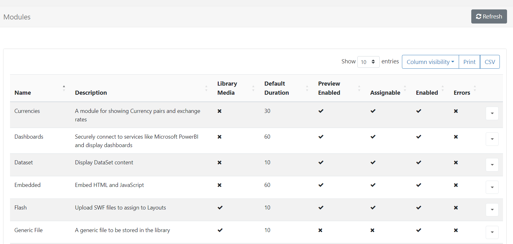
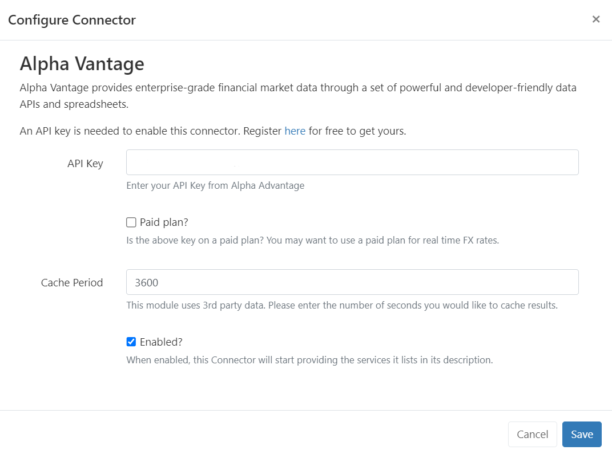

# Modules and Connectors Management

All content displayed in [[PRODUCTNAME]] is served by a **Media Module** managed from the **Modules** page under the **Administration** section of the main CMS menu:

- Use the row menu and click **Configure** to control if it should be accessible to Users to use.

{tip}

At times it may be necessary to add or remove the allowed extensions on a particular Library file based Module (Image, Video, Flash etc.) A typical use case would be if a Player is being used which does not support that particular type of file.
{/tip}

## Generic File

The Generic File Module is used to send **additional files** to the Player that can then be used for other purposes. 

{tip}
This could be useful for providing supplementary files to be used as relative paths (e.g. An up and down arrow that is dynamically shown in the embedded HTML based on the results of stock data) as an example.
{/tip}

## Caching and external access

The core Modules are designed to have their data cached and served from the CMS so that they can be played back without an active connection and/or without direct access to external resources that might be required. The CMS also uses this mechanism to be a _good citizen_ when requesting 3rd party data.
{tip}
For example, a Ticker Widget with the address `http://anexternal.com/feed` would only be accessed by the CMS and only once per `updateInterval`. The Players showing the Layout would not need to access that address directly.
{/tip}

All of the core Modules adopt this approach, exceptions noted below:

- The **Web Page Module** does not cache from the CMS and will always attempt to open the specified web page address using the browser on the Player. This means that the Player must have network access to the web address at all times.
- The **Embedded Module** can be cached using library references, however, the User that creates the Module is free to specify external resources should they require them.
- The **Local Video Module** is rendered by the video decoder on the Player and can reference an external stream.
- **Flash** Files have the capability to reference an external file and will be run on the Player.

## Connectors

Modules that rely on a third party service for data, [Stocks](media_modules_stocks.html) for example, need further configuration with API keys etc.

Once the Module has been enabled and you have the required API key, go to the **Applications** page under the **Administration** section of the main CMS menu and scroll down to the **Connectors** section of the page.

Here you can see all third party services which can be configured:

- Click the **Configure** button of the Connector to configure:

- Provide the **API key** you have been given and ensure that you tick the **Enabled** box to tell the Connector to start providing the service to the relevant Modules.

  

## Player Support table for Modules - v4 CMS

{feat_cat}Widgets and Modules{/feat_cat}