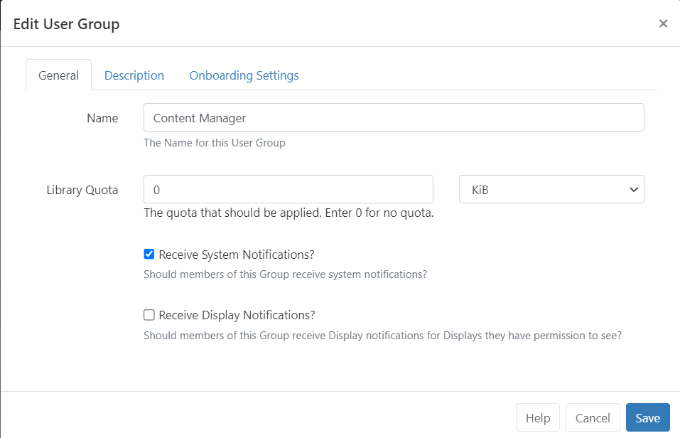
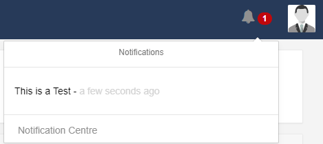

# Notifications

The [[PRODUCTNAME]] **Notification System** is used to keep other Users of the CMS informed of important system events and user-created notifications.

{tip}
Users with Notifications already enabled please go straight to the [Notification Drawer](users_notifications.html#content-notification-drawer) section below.
{/tip}

## Administrator Set up

Notifications need to be enabled for Users/User Groups using [Features](users_features_and_sharing.html).

- Click on the **Users** tab.
- Expand the **Notifications** Feature set, and tick to enable the appropriate access.

{version}
**NOTE:** Ensure a **Sending Email** address has been included on the Network tab for [CMS Settings](tour_cms_settings.html) page prior to enabling Notifications!
{/version}

## System Notifications

[[PRODUCTNAME]] raises various **System Notifications** to report on the health of the system as a whole. 

{tip}
Notifications are emailed to the **Admin** email address configured in [CMS Settings](tour_cms_settings.html) from the **Network** tab. 
{/tip}

Notifications will also be sent to Users who belong to User Groups configured to receive System Notifications or who have been configured to receive these Notifications themselves. System Notifications are managed from the User/User Group edit form:

{nonwhite}
{noncloud}

Further information for Administrators on **CMS Maintenance** can be found [here](/docs/setup/xibo-maintenance.html)
{/noncloud}
{/nonwhite}

## Notification Drawer

Notifications, for the logged in User, are shown in the Notification Drawer which is accessed from clicking the alarm bell icon in the top right of the screen.

{tip}
The number of unread Notifications will also be shown here in red!
{/tip}

The drawer will show the last 5 Notifications received. 

Unread Notifications are shown in black text with those that have already been read shown in a light grey text.

{tip}
Notifications will only show in the Notification Drawer if their release date has passed and if the logged in User has been assigned the notification, [Schedule Event Reminders](scheduling_events.html#content-reminders) for example.

- Click on the title of a **Notification** to open to read the full Notification message.

## Create Notifications

Notifications are created by Users by clicking **Notification Centre** from the Notification Drawer:

Click on the **Add Notification** action button at the top right of the grid:

- Include a **Subject** title.

- Select the **date** and time to publish the Notification.

- Tick to optionally send the Notification additionally as an **Email**.

{tip}
The email address entered on the User record will be used. Users who should receive this Notification are defined on the **Audience** tab!
{/tip}

- Use the **Interrupt** option to automatically redirect Users to a page that will show the Notification in full. 

{tip}
Useful for important User messages. Users would need to click on Continue to carry on navigating the CMS.

Ensure that **Enable Email Alerts** has been enabled from the **Maintenance** tab on the **Administration Settings** page. If you are unsure, speak to your Administrator.
{/tip}

- From the **Message** tab, use the text editor to create and format the message body of your Notification.

  {tip}
  If you intend to target your message to Display/Display Groups using the [Notification Widget](media_module_notifications.html), the formatting will applied from the Widget and not from the formatting used in the editor here.
  {/tip}

- From the **Audience** tab, select the **Users/User Groups** to receive this Notification.

- Enter the email addresses of Non Users of the CMS to send this Notification to.
- Select the **Display/Display Groups** that should show the notification. 

{tip}
Layouts need to already be in the schedule and contain the [Notification Widget](media_module_notifications.html) to target Display/Display Groups successfully!
{/tip}

- Use the Attachment tab should you need to upload a file to attach to the Notification.

{tip}
Attachments can be downloaded by Users from the Notification Centre.
{/tip}

{version}
**NOTE:** Edits that are made to a Notification will be reflected CMS side only. Generated emails which have already been sent will not be recalled.
{/version}

## Notification Widget

Add the [Notification Widget](media_module_notifications.html) to Layouts/Playlists to show messages on Displays created from the **Notification Centre**.

