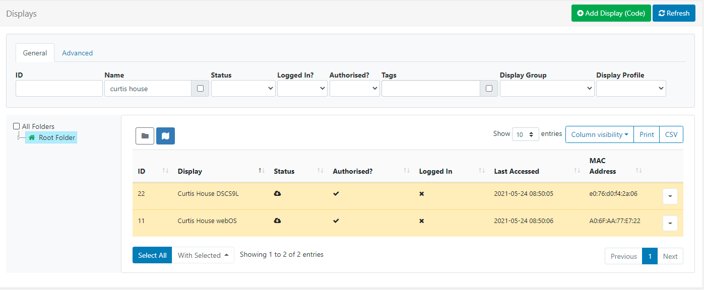
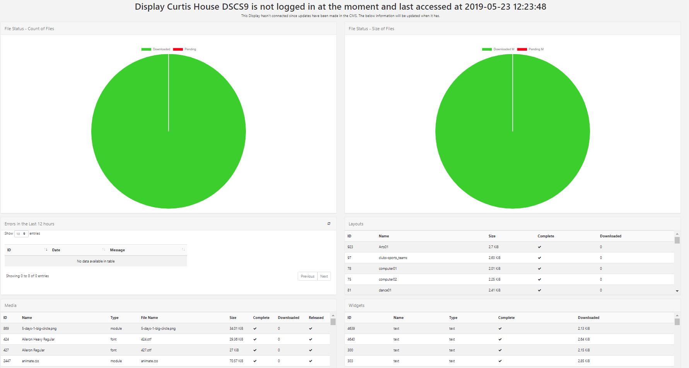
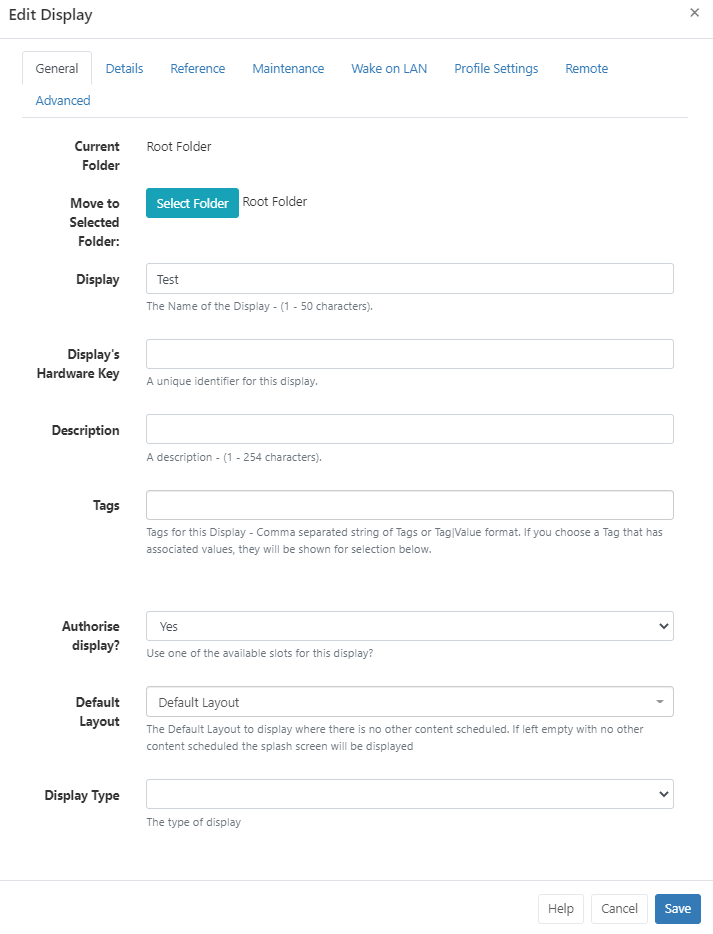
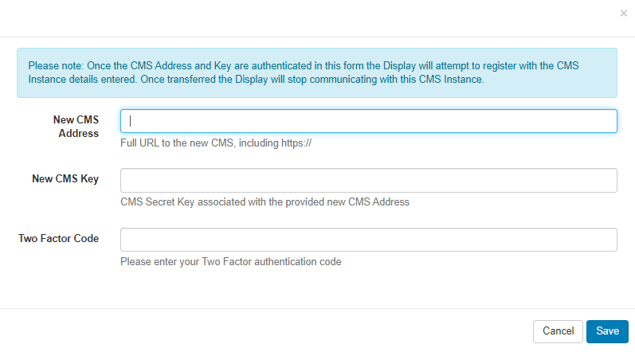

# ディスプレイ 

[[PRODUCTNAME]] の主な目的は、その目的のために存在するアプリケーション スイート全体を使用して、画面にコンテンツを表示することです。[[PRODUCTNAME]] は、画面にコンテンツを表示するタイミングと方法を管理するための **Displays** という概念を提供します。

{nonwhite}
プレーヤーのインストールに関する管理者のドキュメントは[管理マニュアル](/docs/setup/)にあります。選択したプレーヤーを選択し、**インストール**の説明と、**CMS**に接続するために必要な手順に従ってください。
{/nonwhite}

{tip}
新しいディスプレイがコンテンツの受信を開始できるように、CMSで**Authorized**としてマークされていることを確認してください。ディスプレイの行メニューで**Authorise**を選択してください。
{/tip}

## ディスプレイ管理 

ディスプレイはCMSのメインメニューの**ディスプレイ**セクションにある**ディスプレイ**をクリックすることで管理されます。ディスプレイは、プレーヤーソフトウェアのインストール時に生成される**ハードウェアキー**によって一意に識別されます。このハードウェア・キーは、CMSで一意のディスプレイ・レコードを作成するために使用されます。

{tip}
ディスプレイの追加 (コード) 機能は、プレーヤーをインストールした後、プレーヤーをCMSに簡単に接続するために使用できます。 プレーヤーは接続するためにフォームに入力する6文字のアクティベーションコードを表示します。
{/tip}

{feat}認証コードを使用して接続|v4{/feat}

ディスプレイを [フォルダ](/manual/en/tour_folders.html) に保存すると、ディスプレイのユーザー/ユーザー グループ インタラクション レベルを簡単に制御できるほか、整理方法も追加できます。

{tip}
フォルダに保存されたディスプレイは、ユーザー/ユーザー グループの宛先フォルダに適用されている表示、編集、削除 [共有](users_features_and_sharing.html#content-share) オプションを継承します。

グリッドの下部にある [**選択されたもの**] オプションを使用して、複数のディスプレイをフォルダに割り当てます。

{/tip}

グリッドは、選択するとフォルダ内のオブジェクトのみを表示するように更新されます。または、[すべてのフォルダ] を使用してルート フォルダ内の検索を含めます。

{tip}
フォルダ アイコンをクリックして、ビューのオン/オフを切り替えます。フォルダがビューから非表示になっている場合は、選択したフォルダのファイル パスが表示されます。
{/tip}

列の表示ボタンを使用して、管理に必要な情報を表示するための利用可能なオプションから選択します。

注目すべきオプションの一部を以下に示します:

**ID** - ディスプレイの内部識別。

**ディスプレイ** - CMS 内で簡単に識別できるようにディスプレイに付けられたフレンドリ名 (ディスプレイ自体には表示されません)。

**ステータス**:

- *チェック* = プレーヤーは最新です (緑色で表示される場合もあります)。
- *クラウド アイコン* = プレーヤーはログインしておらず、コンテンツのダウンロードを待機しています (上記のように、琥珀色で表示される場合もあります)。
- *クロス* = プレーヤーは現在新しいコンテンツをダウンロード中で、ダウンロードがまだ完了していません (赤色で表示される場合もあります)。

**承認済み** - チェックまたはクロスで、ディスプレイが CMS でライセンスを付与されているかどうかを示します。これにより、承認されていないディスプレイが CMS に追加されるのを防ぎます。

{tip}
**列の表示** ボタンを使用して **商用ライセンス** 列を含めると、ディスプレイの商用ライセンス ステータスを簡単に識別できます。
{/tip}

**ログイン** - ディスプレイが最近ログインしたかどうかを示すためにチェックマークを付けるか、×印を付けます。

**最終アクセス** - ディスプレイが最後にアクセスされた日時のスタンプ。

**MAC アドレス** - ディスプレイのメディア アクセス制御アドレス (プレーヤー ソフトウェアが送信可能な場合)。

## 行メニュー

各ディスプレイには、いくつかのアクション/ショートカットを含む行メニューがあります。

{tip}
選択したアクションにより、**承認** や **ライセンスの確認** などの特定の [フォームを自動的に送信](tour_cms_navigation.html#content-automatic-submission-of-forms) が可能になります。自動送信機能を持つアクションには、有効にするオプションが表示されます。
{/tip}

### 管理

各ディスプレイには独自の**ダッシュボード**があり、ディスプレイの現在のステータス、帯域幅の使用状況、ファイルのステータス、エラーが表示されます。

{tip}

このダッシュボードは、ディスプレイの問題をトラブルシューティングするときに最初に確認する手順として役立ちます。

{/tip}

### 編集

**編集** をクリックして、ディスプレイの構成オプションを管理します。

- **全般** タブを使用して、インストール中に生成される固有の**ディスプレイ ハードウェア キー** を表示し、**ディスプレイを承認** して使用可能なライセンス プール スロットを使用し、**デフォルト レイアウト** を設定します。

- ディスプレイの**緯度** や**経度** などのディスプレイの**詳細** を入力します。 [広告キャンペーン](layouts_campaigns.html#content-ad-campaigns)機能を使用している場合は、選択したすべてのディスプレイについて、このタブの**再生あたりのコスト**と**再生あたりのインプレッション数**のフィールドに必ず入力してください。

{tip}
広告のニーズを高めるために、次のような追加フィールドが含まれています:

- ディスプレイの物理アドレス
- ディスプレイはモバイルですか?
- 会場タイプ
- サポートされている言語

{/tip}

- 必要に応じて、選択したディスプレイの**参照**情報を入力します。追加すると、この情報はディスプレイ グリッドと API 経由で表示できます。

- **メンテナンス** タブから、**電子メール アラート**と**グローバル タイムアウト**設定を制御します。

- **設定** タブを使用して、個々のディスプレイの [ディスプレイ プロファイル設定](displays_settings.html) を上書きします。

- **詳細** タブを使用して、ディスプレイが消費できる **帯域幅** の量を決定するための制限を適用し、**キャッシュされたデータをクリア**します。

{tip}
ディスプレイ グリッドの下部にある **選択されたもの** オプションを使用して、複数のディスプレイの帯域幅制限を簡単に設定できます。

{/tip}

### 削除

**ディスプレイ** を削除すると、**CMS** から完全に削除されます。この操作を元に戻すことはできません。削除されたディスプレイは、**CMS への接続** 手順を繰り返すことで CMS に再接続できます。これにより、新しい一意のディスプレイ レコードが作成されます。

{tip}
ディスプレイを削除する代わりに **認証解除** して、必要に応じて後日再認証できるようにします。ディスプレイの行メニューを使用して、**認証** をクリックして **認証解除** に切り替えます。

これは、[全般] タブの [編集] フォームから [表示の承認] で [いいえ] を選択することで実行することもできます。

{/tip}

### デフォルト レイアウト

コンテンツがスケジュールされていない場合、またはスケジュールされたイベントが表示されないようにする問題がある場合は、何かが **常に** 表示されるように、ディスプレイに **デフォルト レイアウト** が表示されます。

ディスプレイには、[CMS 設定](tour_cms_settings#content-default-layout) で設定されたグローバル デフォルト レイアウトが表示されます。これは、必要に応じてディスプレイごとに上書きできます。

- 行メニューまたは **編集** フォームから選択して、ドロップダウン メニューから使用するレイアウトを選択します。
- このフィールドを空白のままにすると、グローバル デフォルト レイアウトが自動的に使用されます。

{tip}
選択する独自のレイアウトを作成しますが、デザインは複雑なメディアや Web コンテンツを使用せず、シンプルにしておく必要があることに注意してください。
{/tip}

{version}
**注意:** 他にスケジュールされているコンテンツがなく、デフォルト レイアウトがダウンロード中の場合、または選択したデフォルト レイアウトに問題がある場合は、スプラッシュ スクリーンが表示されます。

{/version}

### ファイル/レイアウトの割り当て

[ライブラリ ファイル](media_library.html) と [レイアウト](layouts.html) をディスプレイに直接割り当てることができるため、プレーヤーのローカル ライブラリで常に使用できます。これは、レイアウトが API 統合に使用される場合、たとえば変更をトリガーする場合に、事前にレイアウトをプリロードするのに便利です。

- 割り当てるファイル/レイアウトを選択し、[**保存**] をクリックします。

選択したファイル/レイアウトは、次の収集間隔でディスプレイにダウンロードされます。XMR がインストールされている場合は、すぐにダウンロードされます。

ただし、これはライブラリ ファイルとレイアウトが表示されることを意味するものではなく、引き続き [スケジュール](scheduling_events.html) する必要があります。

{tip}
同じ手順に従い、上部のステージング領域からアイテムの選択を解除することで、ファイル/レイアウトをディスプレイから割り当て解除できます。これらは、プレーヤーがスペースを必要とするとき、またはファイル/レイアウトが不要になってから 30 日後に「クリーンアップ」されます。

{/tip}

### コマンドの送信

**コマンドの送信** 機能は、定義済みのコマンドを選択することで、XMR 経由でプレーヤーに実行されます。これは、たとえばプレーヤーに「再起動」コマンドを送信する場合に便利です。

{tip}
このタイプの [コマンド](displays_command_ functionality.html) は、[コマンド イベント](scheduling_events.html#content-command) をスケジュールすることによっても実行できます。
{/tip}

### ディスプレイを別の CMS に転送

{feat}ディスプレイを別の CMS に転送|v4{/feat}
この機能を使用するには、まだ設定していない場合は、まず [2 要素認証](tour_user_access.html#content-two-factor-authentication) を使用して Google Authenticator をアクティブ化する必要があります。

アクティブ化したら、転送するディスプレイの行メニューを使用して、[**別の CMS に転送**] を選択します。

以下の説明に従って、すべてのフォーム フィールドが入力されていることを確認します。

- このディスプレイを転送する完全な **CMS URL** を入力します。

- 転送先の CMS アドレスの **CMS シークレット キー** を入力します。

- アプリに表示される**2要素認証コード**を入力します。

提供された詳細が認証されると、ディスプレイは「新しい」CMSへの登録を試みます。ディスプレイが正常に転送されると、ディスプレイは「古い」CMSとの通信を停止し、ディスプレイ グリッドの**承認済み**列のチェックマークが「チェック」から「X」に変わります。

{tip}
グリッドの下部にある**選択したもの**オプションを使用して、転送する複数のディスプレイを選択します。

{/tip}

## マップ ビュー

マップ ビューを使用して、ディスプレイの場所とステータスを確認します。

フォルダ切り替えの横にあるアイコンをクリックして、**マップ ビュー** に切り替えます:

マーカー クラスター内のディスプレイのステータスは、識別しやすいように円グラフで表示されます:

{tip}

ログインしたユーザーは、アクセスを許可されているディスプレイのステータスのみを表示できます。

リスト ビューのグリッドのフィルター フィールドを使用して、表示するディスプレイを分離します!

{/tip}

ステータス アイコンをクリックすると、選択したディスプレイに関する詳細情報が表示されます:

**リスト** アイコンをクリックすると、ディスプレイ グリッド ビューに戻ります。

#### 次へ...

[表示グループ](displays_groups.html)

