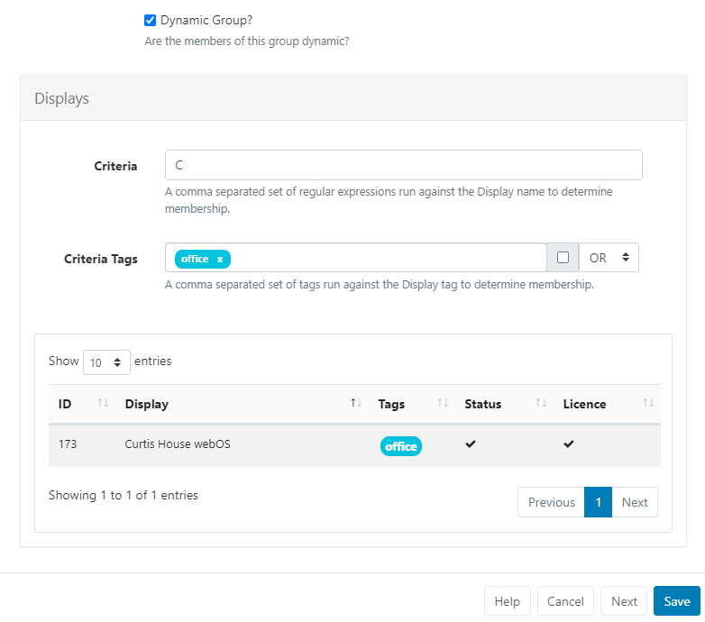
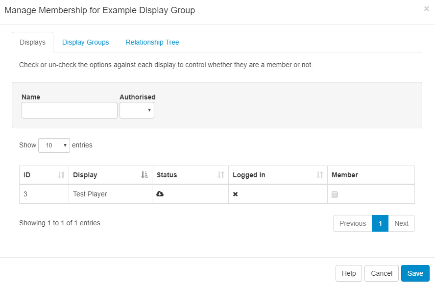

# ディスプレイ グループ

[[PRODUCTNAME]] システムの拡大に合わせて、特定の [ディスプレイ](displays.html) をグループ化してディスプレイ グループを作成し、スケジュールと管理を容易にします。

ディスプレイ グループには、単一の **ディスプレイ** と他の **ディスプレイ グループ** の両方を含めることができます。これにより、単純な [スケジュール](scheduling_events.html) だけで多数のディスプレイをターゲットにすることができます。

## ディスプレイ グループの管理

ディスプレイ グループは、CMS のメイン メニューのディスプレイ セクションの [**ディスプレイ グループ**] をクリックして CMS で管理されます。

[**ディスプレイ グループの追加**] ボタンを使用して新しいディスプレイ グループを作成し、必要なフォーム フィールドに入力します。

ディスプレイ グループは [フォルダー](/manual/en/tour_folders.html) に保存して、ディスプレイ グループのユーザー/ユーザー ユーザー グループ レベルのインタラクションを簡単に制御できるほか、整理するための追加の方法も提供されます。

{tip}
フォルダに保存されたディスプレイ グループは、ユーザー/ユーザー グループの宛先フォルダに適用された表示、編集、削除 [共有](users_features_and_sharing.html#content-share) オプションを継承します。

{/tip}

ディスプレイは、手動で追加するか、フィルター条件を使用して動的グループとして制御するかのいずれかの方法でディスプレイ グループに割り当てる必要があります。

### 動的グループ メンバーシップ

メンバーをこのグループに動的に割り当てるには:

- フォームの [動的グループ] チェックボックスをオンにして、追加のフォーム フィールドを表示します。
- 動的グループのフィルター条件は正規表現の形式ですが、単純な文字列比較にすることもできます。式はカンマで区切る必要があり、`-` プレフィックスで否定できます。

{tip}
たとえば、「a」を含み「b」を含まないすべてのディスプレイは `a,-b` になります。
{/tip}

{tip}
複数のタグが割り当てられているディスプレイでは、追加の OR/AND フィルターを使用して条件タグをフィルターできます。

{/tip}

- [**保存**] をクリックします。

{tip}
さらにディスプレイ グループを作成する場合は、[保存] をクリックする代わりに [**次へ**] をクリックしてフォームを開いたままにし、新しいディスプレイ グループの作成を続けます。

{/tip}

### 手動グループ メンバーシップ

このグループにメンバーを手動で割り当てるには:

- [動的グループ] チェックボックスをオフにしたまま、[**保存**] をクリックします。
- 新しいディスプレイ グループ レコードの行メニューを使用して、[**メンバー**] を選択します。
- 各ディスプレイのチェックボックスを使用して、グループのメンバーシップを制御します。

{tip}

**関係ツリー** タブを使用して、編集中の表示グループの祖先と子孫を表示します。現在の表示グループは太字で表示されます。親表示グループ (現在の表示グループより上) は、現在の表示グループと子表示グループにスケジュールを渡します。子表示グループ (現在の表示グループより下) は、親表示グループと現在の表示グループからスケジュール情報を継承します。

{/tip}

- クリックして **保存** します。

## ネストされたグループ

表示グループをネストして、複雑な構造とターゲットを絞ったスケジュールを作成できます。

{tip}
グループ構造の例

- サイト 1
- サイト 1 - 建物 A
- サイト 1 - 建物 A - レベル 1
- サイト 1 - 建物 A - レベル 2
- サイト 1 - 建物 B

ディスプレイ メンバーシップは最下位レベルのグループに設定され、それらのグループは次のレベルに属し、そのレベルは最上位レベルの親「サイト 1」に属します。
CMS では、循環参照 (ループを作成する割り当て、つまりサイト 1 にサイト 1 - 建物 A があり、サイト 1 - 建物 A にサイト 1 がある) の作成は許可されません。
{/tip}

ディスプレイ グループに設定された **スケジュール**、**メディア ファイル**、および **レイアウト割り当て** は、グループに割り当てられたすべてのメンバーに適用されます。

## 行メニュー

各ディスプレイ グループには、いくつかのアクション/ショートカットを含む行メニューがあります。

- ディスプレイが手動で割り当てられたディスプレイ グループのメンバーシップを管理するには、[**メンバー**] をクリックします。
- **編集** を使用して、動的メンバーシップに使用される基準を表示し、必要に応じて変更します。
- [ライブラリ ファイルとレイアウト](displays.html#content-assign-files--layouts)をディスプレイ グループに直接割り当てて、プレーヤーのローカル ライブラリで常に使用できるようにします。

{tip}
グリッドの下部にある**選択されたもの** オプションを使用すると、複数のディスプレイ グループに対して一括操作を簡単に実行できます。
{/tip}

#### 次へ...

[ディスプレイ同期グループ](displays_sync_groups.html)

