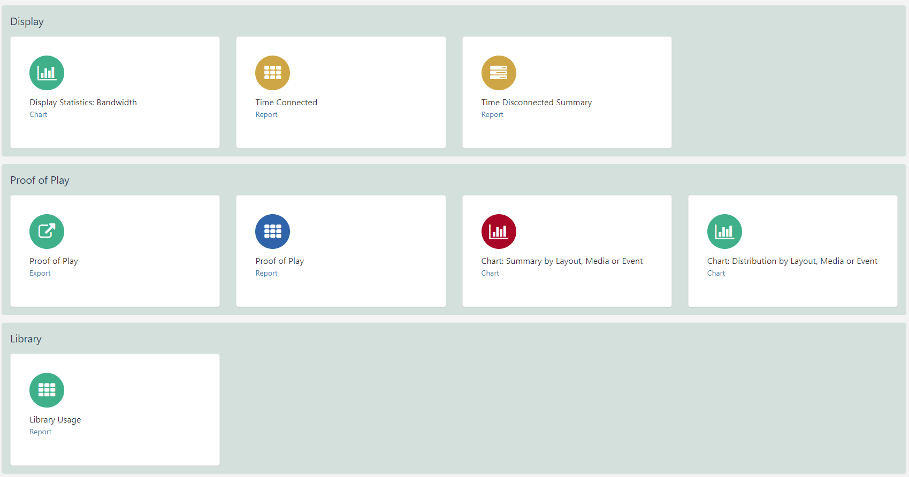
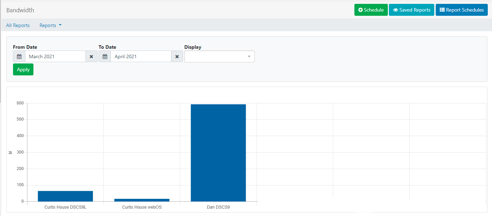
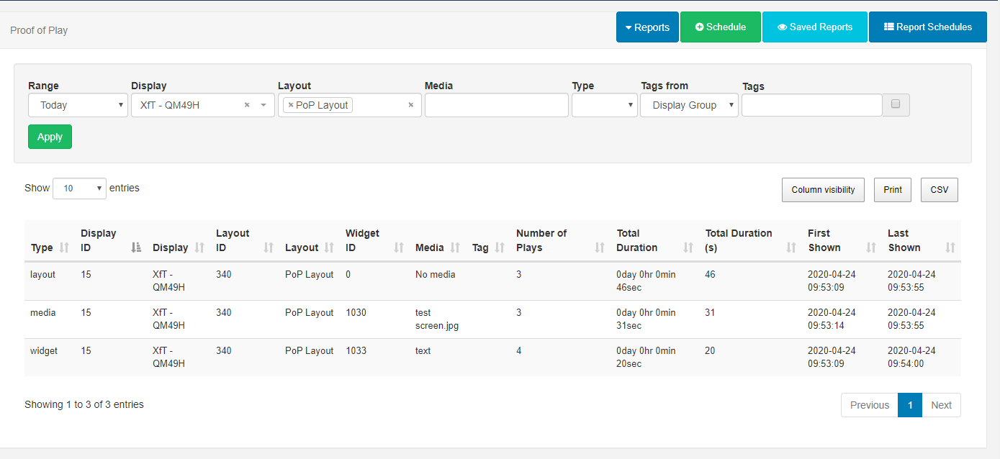
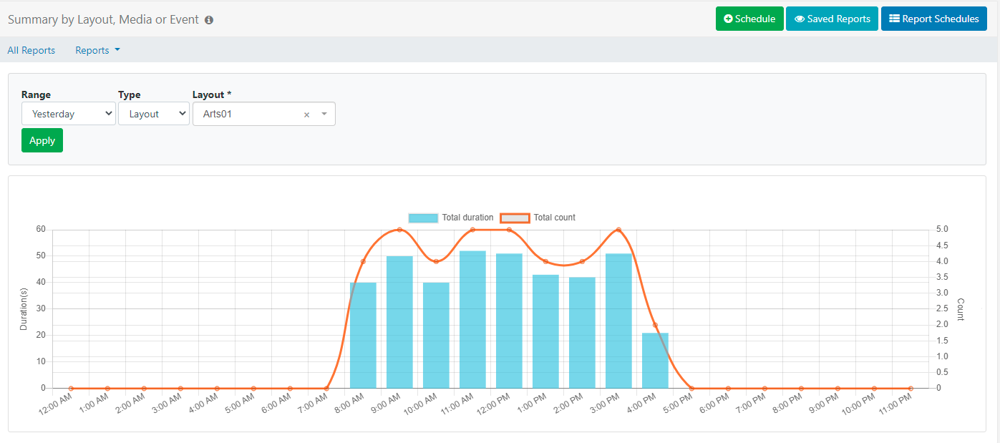

# レポート

[[PRODUCTNAME]] は、ユーザーが CMS 内でさまざまなレポートを表示できるように [機能](users_features_and_sharing.html) が有効になっている便利な **メトリック** を提供します。

レポートは、**ディスプレイ** のパフォーマンスと使用状況、および詳細な **再生証明** と **ライブラリ** の使用状況レポートを分析するための一元化された領域を提供します。これらのレポートは、メイン CMS メニューの [**レポート**] セクションの [**すべてのレポート**] から表示できます。

## ディスプレイ

**ディスプレイ** レポート:

### ディスプレイ統計: 帯域幅

CMS は、コンテンツのために XMDS に接続するとき、およびディスプレイ情報をレポートするときに、各ディスプレイが使用する **帯域幅** を記録します。

- 範囲を選択して [**適用**] をクリックします。ディスプレイ フィールドを空のままにすると、ディスプレイごとの帯域幅チャートの合計が表示されます。

- 1 つのディスプレイだけにフィルターして [**適用**] をクリックすると、プレーヤーが XMDS に対して行った各呼び出しが個別に表示されます。

{tip}
1 つのディスプレイだけにフィルターすると、帯域幅がどこで使用されたかをよりよく理解できます。

ご存知ですか...[ディスプレイ](displays.html)ごとに帯域幅制限を設定できます!

{/tip}

**すべてのレポート** ボタンを使用してレポートダッシュボードに戻るか、**レポート** ドロップダウンメニューを使用して別の「ディスプレイ」レポートを選択して表示します。

### 接続/切断時間

CMS は、すべてのディスプレイ/ディスプレイグループのオン/オフラインイベントを記録して、ディスプレイの可用性に関する内訳を提供します。

接続時間レポートには、接続率 (緑で表示) と切断率 (青で表示) の内訳が表示されます

- **範囲** と **グループ化** 時間または月日を選択します。

- すべてを表示するにはディスプレイ/ディスプレイグループフィールドを空のままにするか、表示するディスプレイ/ディスプレイグループを選択します。

- [**適用**] をクリックします

**概要** には、ディスプレイ/ディスプレイ グループの指定された日付間の詳細な内訳と、接続/切断された日数が表示されます:

## 再生証明

各 **ディスプレイ** は、表示内容に関する再生証明レポートを提供するために情報を収集できます:

**レイアウト** - 表示されている選択したレイアウトのすべてのインスタンスを表示します。

**メディア** - 表示されている選択したメディア ファイルのすべてのインスタンスを表示します。

**ウィジェット** - レイアウト内に含まれる選択したウィジェットに関するレポートを表示します。(テキストなどのライブラリ メディア ファイルを含まないウィジェットも含まれます)。

**イベント** - プレーヤーが外部センサーからの収集をサポートしている場合、イベント統計が記録され、レポートに表示されます。

プレイ証明レポートを収集するには、[ディスプレイ プロファイル設定](displays_settings.html) で [**統計レポートを有効にする**] が有効になっており、[集計レベル**] が設定されていることを確認してください。

- **個別** - 統計は各項目の開始時と終了時に個別に記録され、各収集間隔で CMS に返送されます。
- **時間ごと** - 各項目を 1 回記録し、1 時間中の再生回数と再生時間の合計を含め、1 時間の期間が経過した後の次の収集間隔で CMS に返送されます。
- **日次** - 各項目を 1 回記録し、その日のプレイ回数とプレイ時間の合計が記録され、その日の終了後の次の収集間隔で CMS に返されます。

{tip}
プレーヤーは「完了した記録」のみを集計し、ウィジェットの期間の終了時に収集が行われるため、ウィジェットの期間が 3 時間の場合、ウィジェットの有効期限が切れると統計が記録されます。

{/tip}

{version}
[CMS 設定](tour_cms_settings.html#content-proof-of-play-default-settings) で、プレイ証明の収集をデフォルトで有効にすることができます。

{/version}

**プレイ証明** レポート:

### プレイ証明: エクスポート

選択したディスプレイとタイムスケールの CSV にエクスポートされたプレイ証明データを表示します。

### 再生証明: レポート

- ドロップダウンから **範囲** を選択するか、独自の日付と時刻を指定して、必要に応じてフィルター フィールドを使用します。
- [適用] をクリックします

{tip}
[すべてのレポート] をクリックしてレポート ダッシュボードに戻るか、[レポート] ドロップダウンを使用して利用可能な再生証明レポートから選択します。
{/tip}

### チャート: レイアウト、メディア、またはイベント別の概要/分布

チャートには、選択したレイアウト、メディア、またはイベントの合計時間と再生回数が表示されます。

- [範囲] を選択します。
- [タイプ] を選択し、ドロップダウンを使用して選択したタイプをさらに指定します。
- [適用] をクリックします。

{tip}
タブを使用して、各レポートの **チャート** と **表形式** データを切り替えます。
表形式データは CSV としてエクスポートできます。
{/tip}

## ライブラリ

**ライブラリ** レポート:

### ライブラリの使用状況

CMS のすべてのユーザーのライブラリの使用状況を表示するか、フィルターを使用して個々のユーザー/ユーザー グループの使用状況の概要を表示します。

## スケジュール

レポートは、**日次**、**週次**、**月次**、または **年次** ベースで実行するようにスケジュールできます。

{tip}
**チャート: 分布** および **チャート: サマリー レポート** では、**スケジュール** ボタンをアクティブにするために、**タイプ** と名前付きレイアウト/メディア/イベントを選択する必要があります。
{/tip}

- **スケジュール** ボタンをクリックし、特定のレポート タイプに必要なフォーム フィールドに入力します。

- **メールを送信しますか?** チェックボックスをオンにすると、レポートの PDF をユーザーにメールで送信できます。

{version}
オプションで、メイン メニューの **管理** セクションの **設定** ページの **全般** タブを使用して、エクスポートされたレポートに表示される **ロゴ** を無効にできます。

{/version}

{tip}
スケジュールされたレポートは、**メール アドレス** フィールドに入力された追加のメール アドレスにメールで送信することもできます。CMS 設定の [ネットワーク](tour_cms_settings.html#content-network) タブで **送信メール アドレス** が設定されていることを確認してください。

{/tip}

## レポート スケジュール

- 所有者/タイプ別にすべてのスケジュールを表示するには、**レポート スケジュール** ボタンをクリックします。

{tip}
各レポートには、ショートカットと追加のアクションを含む行メニューがあります。

{/tip}

## 保存済みレポート

すべての実行レポートを表示するには、[**保存済みレポート**] をクリックします。

{tip}
自分の実行レポートのみを表示するには、チェックボックスを使用します。

{/tip}

行メニューを使用して、保存済みレポートの表示、スケジュール、PDF としてのエクスポート、または削除を行います。

{tip}
**レポート スケジュール** と **保存済みレポート** には、CMS メニューの [**レポート**] セクションから直接アクセスすることもできます。

{/tip}

