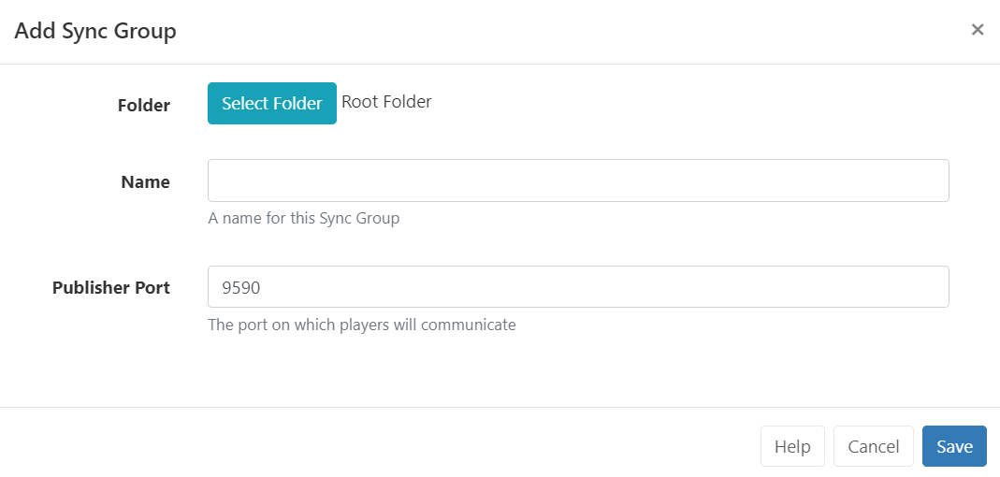

# 同期グループ

同期グループには、同期されたコンテンツを表示するディスプレイが含まれます。[同期イベント](scheduling_events.html#content-synchronised-events) をスケジュールするときに、コンテンツを同期して、ミラーリングまたはビデオ ウォール構成の 2 つ以上のディスプレイで再生できます。

{feat}Sync Groups|v4{/feat}

{tip}
**コンテンツ同期キー** を使用して、異なるレイアウトの [プレイリスト](layouts_editor_playlists.html) を同期します。

{/tip}

[ディスプレイ](displays.html) は、まず **同期グループ** に割り当てる必要があります。

- メイン CMS メニューの **ディスプレイ** セクションの **同期グループ** をクリックします。
- **同期グループの追加** ボタンを選択します。

同期グループは [フォルダー](tour_folders.html) に保存でき、ディスプレイのユーザー/ユーザー グループ レベルのインタラクションを簡単に制御できるほか、整理するための追加の方法も提供されます。

{tip}
同期グループ内のすべてのディスプレイは、指定されたパブリッシャー ポートで TCP 経由で LAN IP アドレスを使用して通信する必要があります。これはデフォルトで 9590 に設定されていますが、そのポートが予約されている場合は変更できます。

最適な同期のために、有線ネットワークと高性能の同様のデバイスを使用することをお勧めします。
{/tip}

- 保存時に、**メンバーシップの管理** フォームを使用して、このグループに含めるディスプレイを選択します。

{version}
**注意:** ディスプレイは、同時に 1 つの同期グループにしか属せません。

{/version}

- 保存時に、編集フォームのドロップダウンを使用して、同期グループの **リード ディスプレイ** にするディスプレイを選択します。

- **保存** をクリックして

{tip}
メインの CMS メニューから **スケジュール** をクリックし、[同期イベントの追加](scheduling_events.html#content-synchronised-events) を選択すると、コンテンツを同期グループにスケジュールできるようになりました。

{/tip}

## メンバーシップの編集/管理

行メニューを使用して同期グループを管理します。

- 代替リード ディスプレイを設定するには、**編集** を選択します
- グループのメンバーであるディスプレイを管理するには、**メンバー** を選択します。

#### 次へ...

[同期イベントのスケジュール設定](scheduling_events.html#content-synchronised-events)

