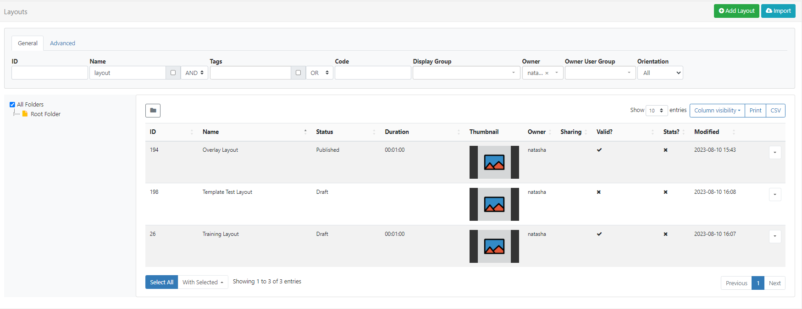

# レイアウト

レイアウトは、コンテンツで構成された完全な画面デザインであり、1 つまたは複数のディスプレイにスケジュールされます。レイアウトには、要素、ウィジェット、ライブラリ メディアの組み合わせを使用して表示する 1 つ以上のコンテンツ項目を含めることができます。

レイアウトで複数の項目のシーケンス (画像スライドショーなど) を表示するには、[プレイリスト](media_playlists.html) を使用します。

[[PRODUCTNAME]] では、システムで使用できるレイアウトの数や、ユーザーが使用できるレイアウトの数に制限はありません。

## レイアウトの追加

- メイン CMS メニューの [デザイン] セクションで [レイアウト] を選択します。

- グリッドの上部にある [レイアウトの追加] ボタンをクリックして、[レイアウト エディタ](layouts_editor.html) を使用してデザインの作成を開始します。

{tip}
ご存知ですか…**.Layouts** と **ライブラリ ファイル** は、**ディスプレイ** または **ディスプレイ グループ** に直接 [割り当て](displays.html#content-assign-files--layouts) できるため、プレーヤーのローカル ライブラリでいつでも使用できます。事前にレイアウトをプリロードして、スケジュールできるようにしておくのに便利です。
{/tip}

## 解像度

レイアウトは、意図したディスプレイ解像度に合わせて設計されており、一致する解像度のディスプレイで表示されると最適に機能します。異なる解像度のディスプレイに表示される場合は、動的にサイズが変更されるため、画面スペースが使用されない可能性があります。

{tip}
16:9 のテレビ画面に接続された 4:3 解像度で設計されたレイアウトをプレーヤーに送信すると、コンテンツの両側に 2 つの空のバーが表示されます。

{/tip}

レイアウトの解像度は、[レイアウト エディタ](layouts_editor.html) 内のプロパティ パネルから選択します。

[[PRODUCTNAME]] には、ほとんどのデジタル サイネージ アプリケーションに対応するデフォルトの解像度の選択肢が用意されています。

管理者は、メイン CMS メニューの [**デザイン**] セクションの [**解像度**] ページから解像度を追加/編集したり、有効/無効にしたりできます。

## テンプレートの使用

[テンプレート](layouts_templates.html) は、デザイン プロセスを高速化する簡単な方法であり、企業のイメージ/標準を維持するのに最適です。

テンプレートは、レイアウト エディター内の [ツールボックス](layouts_editor.html#content-toolbox) から選択されます。

{nonwhite}

### Xibo Exchange

Xibo Exchange から利用できる、弊社が設計したテンプレートの 1 つを選択します。

{cloud}

Xibo Exchange テンプレートは、Xibo Cloud Hosting の新規顧客に対してデフォルトで有効になっています。

管理者の皆さん、以前のバージョンからアップグレードする場合は、Xibo Exchange を有効にする必要があります。

- メイン CMS メニューの [**管理**] セクションで [**アプリケーション**] を選択します。
- ページの [コネクタ] セクションまで下にスクロールします。
- Xibo Exchange の [構成] をクリックし、有効にするためにチェックを入れます。
- 保存します。

{/cloud}

{noncloud}

オンプレミス インストールの場合、管理者は Xibo Exchange からテンプレートが表示されるようにできます。

- メイン CMS メニューの [**管理**] セクションで [**アプリケーション**] を選択します。
- ページの [コネクタ] セクションまで下にスクロールします。
- Xibo Exchange の [構成] をクリックし、有効にするにはチェックを入れます。
- 保存します。

{/noncloud}

{/nonwhite}

テンプレートを選択すると、現在作業中のレイアウトが選択したテンプレートに置き換えられます。(この操作は元に戻せないため、注意して使用する必要があります)

{tip}
[公開されたレイアウト](layouts_editor_publish_options.html) もテンプレートとして保存できます。

{/tip}

## レイアウト グリッド

作成されたレイアウトは、メイン CMS メニューの [**デザイン**] セクションの [**レイアウト**] から表示できます。

各レイアウトには、アクション/ショートカットのメニューにアクセスするための行メニューがあります。このリストは、レイアウトがドラフト状態か公開状態かによって異なります。以下に注目すべき設定を示します。

{tip}
[編集] をクリックすると、名前、フォルダ、タグなどを変更するためのフォームが開きます。
レイアウト [グリッド](tour_cms_navigation.html#content-grids) の下部にある [**選択済み**] オプションを使用して、タグの割り当てを一括編集します。

{/tip}

### ドラフト ステータスのレイアウト

**デザイン** - レイアウト エディタを開いてレイアウトを編集します。

**公開** - 今すぐ公開するか、将来の公開日時を選択します。

{tip}
管理者は、CMS **設定** ページのデフォルト設定を使用して、最後の編集から 30 分後にドラフト レイアウトを自動的に **公開** できます。

{/tip}

**破棄** - すべての変更が破棄され、レイアウトは以前の公開バージョンに戻ります。

**ドラフト レイアウトのプレビュー** - 現在の **ドラフト** ステータスのレイアウトのプレビューを再生します。

### 公開ステータスのレイアウト

**デザイン** - レイアウトを**読み取り専用モード**で開き、レイアウトをチェックアウトして編集を有効にします。

**チェックアウト** - レイアウトを編集するための下書きを作成します。

{tip}
ユーザーは「自動送信」チェックボックスをオンにして、**チェックアウト**が選択されるたびにこのフォームが[自動的に送信](tour_cms_navigation.html#content-automatic-submission-of-forms)されるようにすることができます。

{/tip}

**キャンペーンに割り当て** - レイアウトを既存の[キャンペーン](layouts_campaigns.html)に追加します。

**コピー** - 簡単に変更できるようにコピーを作成します。含まれるすべての**メディア**アイテムを含めるように選択して、新しいレイアウトを作成するためのベースとして使用し、時間を節約します。

{tip}
レイアウトをコピーすると、レイアウトが最後に公開された時点の正確なコピーが作成されます。変更内容を保存するには、コピーを作成する前にレイアウトを公開してください。

{/tip}

**廃止** - レイアウトを廃止しても、レイアウトに関連付けられている既存のキャンペーン/スケジュールには影響しません。廃止されたレイアウトは新しいスケジュール オプションからは非表示になりますが、既存のスケジュールには影響せず、ディスプレイには引き続き表示されます。

**エクスポート** - 関連するすべてのウィジェット/メディア/データセット構造を ZIP ファイルに含めて、簡単に共有できるようにします。

{tip}
レイアウトをエクスポートすると、割り当てられたすべての**レイアウト**、**プレイリスト**、および**メディア タグ**がエクスポートされます。レイアウトのインポート時にこれらのタグを追加するには、[タグのインポート] オプションを選択します。
'エクスポート' [機能](users_features_and_sharing.html) を追加すると、レイアウトとそのコンテンツに設定されている共有オプションに関係なく、ユーザー/ユーザー グループがエクスポートできるようになります。

{/tip}

## FAQ

**ユーザーはいつ新しいレイアウトを作成する必要がありますか? ユーザーはいつ既存のレイアウトに追加する必要がありますか?**
レイアウトは、システムで非常に柔軟に機能します。レイアウトの推奨される使用方法は、同時にスケジュールする必要がある一連の関連コンテンツに必要なデザインとメディアのみを含めることです。

{tip}
**シナリオ**:
火災安全のデモンストレーションを示すビデオと重要なテキスト、および今後の制作の広告を示すビデオと画像がある場合、これらに別々のレイアウトを用意するのが自然です。
{/tip}

**作成できるレイアウトの数に制限はありますか?**

[[PRODUCTNAME]] では、システムで使用できるレイアウトの数や、ユーザー/ユーザー グループが使用できるレイアウトの数に制限はありません。

**廃止されたレイアウトを表示するにはどうすればいいですか?**

レイアウト グリッドから、[詳細] タブの [廃止] フィルターを使用します。行メニューを使用して、レイアウトを廃止解除します。

#### 次へ...

[レイアウト エディター](layouts_editor.html)

