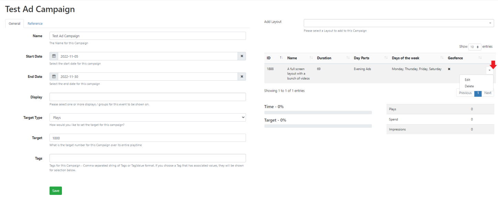

# 広告キャンペーン

[[PRODUCTNAME]] が入力した基準を満たすために必要な再生回数を計算し、自動的にスケジュール設定を処理する広告キャンペーンを作成します。

{tip}
この機能にフルアクセスできる各ユーザー/ユーザー グループに対して、**広告キャンペーンへのアクセス** [機能](users_features_and_sharing.html#content-features) を有効にします。

{/tip}

## 広告キャンペーンを作成する

メイン CMS メニューの **デザイン** セクションの **キャンペーン** をクリックします。

- グリッドの上部にある **キャンペーンの追加** ボタンをクリックします。

- ドロップダウン メニューから [**広告キャンペーン**] を選択し、フォーム フィールドに入力します:

[フォルダー](tour_folders.html) は、ユーザー オブジェクトを整理、検索し、他のユーザー/ユーザー グループと簡単に [共有](users_features_and_sharing.html#content-share) するために使用されます。フォルダーに保存された広告キャンペーンは、そのフォルダーに適用されたアクセス オプションを継承します。

{tip}
ユーザーがレイアウト/レイアウト コンテンツにもアクセスできるようにする場合は、これも同じフォルダーに保存してください。

{/tip}

- CMS で簡単に識別できるように、広告キャンペーンに [タグ](tour_tags.html) を含めた **名前** を付けます。

{tip}
タグとフォルダは、キャンペーン グリッドの下部にある [選択されたもの](tour_cms_navigation.html#content-Multi---select--with-selected) オプションを使用して、複数のキャンペーンに割り当てることもできます。
{/tip}

- ドロップダウンを使用して、この広告キャンペーンの **ターゲット タイプ** を **再生**、**予算**、または **インプレッション** に設定します。
- 選択したターゲット タイプに関連して、この広告キャンペーンの合計 **ターゲット** 数を含めます。

- [**保存**] をクリックします。

次に、[[PRODUCTNAME]] が再生頻度を計算できるように条件を設定する必要があります。

- グリッドから、**広告キャンペーン** の行メニューを使用して、[**編集**] を選択します:

- 広告キャンペーンの **開始** および **終了** の日付と時刻を入力します。(これは必須の情報であり、**空白のままにすることはできません**)

- この広告キャンペーンを再生する利用可能な **ディスプレイ** および **ディスプレイ グループ** を選択します。(これは必須の情報であり、**空白のままにすることはできません**)

{tip}
[ディスプレイ](displays.html) で、この広告キャンペーンを再生する選択したディスプレイの **ディスプレイの詳細** が正しく入力されていることを確認し、**再生あたりのコスト** および **再生あたりのインプレッション数** フィールドが入力されていることを確認してください。

{/tip}

- [**保存**] をクリックします。

{tip}
正確なレポートと再生を確実に行うには、ここで選択したすべてのディスプレイ/ディスプレイ グループで **再生の証明** を **オン** に設定する必要があります。
{/tip}

- **レイアウトの追加** ドロップダウン メニューを使用してレイアウトを割り当てます。

レイアウトを選択すると、さらにスケジュール オプションが利用可能になります:

- この広告キャンペーンでこのレイアウトをアクティブにする **曜日** を選択します。

- このレイアウトを特定の定義済みの時間にのみ表示する場合は、既存の [時間帯](scheduling_dayparting.html) から選択します。

{tip}
広告キャンペーンには、必要に応じて異なる時間帯が割り当てられた同じレイアウトの複数のインスタンスを含めることができます。

たとえば、定義済みの「午前」時間帯と定義済みの「夕方」時間帯に同じレイアウトを表示する必要がある場合は、レイアウトを 2 回追加し、それぞれに必要な時間帯を個別に定義します。
{/tip}

- マップ上にエリアを描画して、モバイル ディスプレイに **ジオフェンス** ベースの再生を提供し、定義されたエリアに入るとコンテンツが表示されます。

{tip}

同じマップに複数のエリアを定義できます。

{/{/tip}

- **保存** をクリックして。

レイアウトがキャンペーンに追加され、必要に応じて行メニューを使用して編集/削除できます。

レイアウトを選択し、スケジュール オプションを定義して、広告キャンペーンの作成を続けます。

{tip}
正確なレポートと再生を確実に行うには、広告キャンペーンに追加されるすべてのレイアウトで **再生の証明** を **オン** に設定する必要があります。

{/{/tip}

[[PRODUCTNAME]] は、入力されたターゲットを満たすために必要な再生基準を満たすように自動的にスケジュールします。

広告キャンペーンは、[スケジュール](scheduling_management.html#content-calendar-view) でロックされたエントリとして表示できます。このエントリは、スケジューラ自体からは編集できません。

[アジェンダ](scheduling_management.html#content-agenda) を使用すると、広告キャンペーンのより詳細な再生ビューを表示し、含まれるレイアウトをプレビューできます。

広告キャンペーンの進行状況は、キャンペーン グリッドと広告キャンペーンを開いたときに表示されます。ただし、キャンペーン用に選択されたすべてのディスプレイとレイアウトで再生証明がオンに設定されている必要があります。また、選択されたすべてのディスプレイで再生あたりのコストと再生あたりのインプレッションのフィールドが入力されています。

{version}
**注意**: 上記の情報が省略されている場合、レポートは再生、支出、インプレッション、ターゲットを反映するように更新できず、すべて 0 値が表示されます。広告キャンペーン自体もターゲットの増加に追いつこうとするため、レイアウトがますます頻繁に再生され、目標を達成するために表示されるコンテンツがレイアウトのみになります。
{/version}

{tip}
[参照] タブを使用すると、選択したキャンペーンの参照情報を提供できます。追加すると、この情報はキャンペーン グリッドと API 経由で表示できます。
{/tip}

