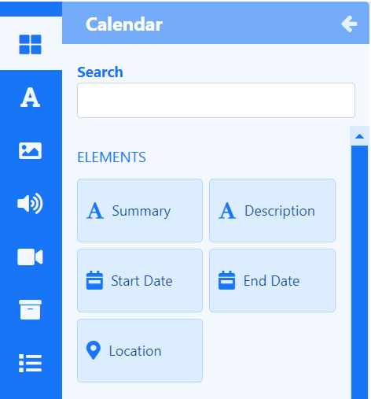
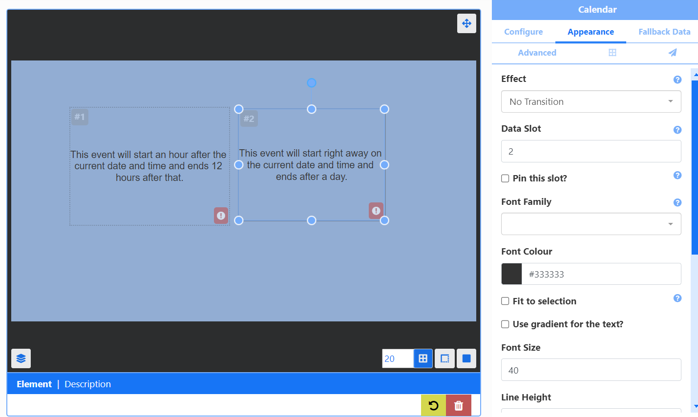
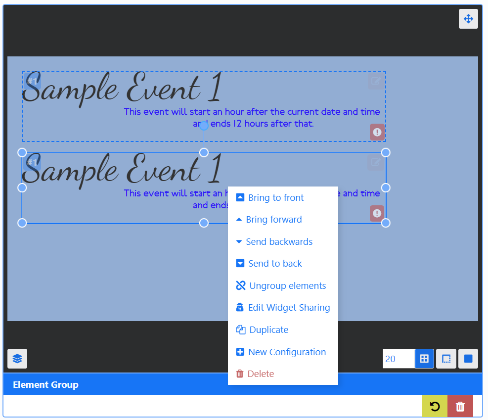

# データ ウィジェット

データ ウィジェットは、**要素** を使用してレイアウトに情報を表示するために外部データ ソースに依存します。

## 機能の概要

- データ ソース駆動型コンテンツ。
- 個別の要素により柔軟性が実現します。
- 表示するフォールバック データを提供します。
- データ スロットを使用してデータのページングを制御します。
- 簡単に複製できるようにグループを作成します。
- 同じレイアウト上の代替ソースからデータを取得します。
- 事前に作成されたデザインを活用します。

各データ ウィジェットには、データ ソースによって供給される一連の **要素** があり、ユーザーは、厳格な **静的テンプレート** 設計に縛られることなく、返されるデータの配置を柔軟に行うことができます。

- **データ ウィジェット** をクリックすると、使用可能なすべての **要素** が表示されます。

{version}
**注:** データ要素はレイアウト エディターからのみ使用でき、[プレイリスト エディター](media_playlists.html#content-playlist-editor) では使用できません。ただし、ユーザーは静的テンプレートを使用してデータ ウィジェットを追加できます。
}

### 構成

各要素には、追加された後に**プロパティ パネル**から利用できる構成可能なオプションのセットがあります:

{tip}
感嘆符アイコンが表示され、ユーザーに何をすべきかが示されます。上記の例では、ICS フィードの URL がまだ入力されていません!

{/tip}

**構成** タブから設定されたオプションは、同じウィジェット タイプのレイアウトに追加されたすべての要素に適用されます。

{tip}
ウィジェットに関連付けられた代替データ ソースからデータを選択するには、[新しい構成](layouts_data_widgets.html#content-new-configuration) を作成します!
ヒント}

### 外観

**外観** タブには、要素から返されるデータの外観を構成するオプション、およびトランジション効果と [データ スロット](layouts_data_widgets.html#content-data-slots) 構成が含まれています。

### フォールバック データ

選択したデータ ウィジェットの **フォールバック データ** を作成し、どのような条件でそれを表示するかを指定します:

- [**新規追加**] をクリックします。

- フォーム フィールドに必要な情報を入力します。

- 保存します。

{ヒント}
フォールバック データ オプションは、選択したデータ ウィジェットによって異なります。
ヒント}

### 詳細

[詳細] タブは、名前の設定、特定の期間の指定、再生証明統計の収集レベルの設定、アイテムを繰り返してすべての [データ スロット](layouts_data_widgets.html#content-data-slots) を埋めるために使用します。

### 配置

[**配置**] タブ (グリッド アイコン) を使用して、正確な配置とレイヤーを設定します。

{ヒント}
要素には独自のキャンバス [レイヤー](layouts_editor.html#content-layering) があり、これを使用して、プレイリストやビデオなどの他のネイティブにレンダリングされた要素との関係で要素が表示される場所を決定できます。
ヒント}

## データ スロット

同じ **要素** を複数追加する場合は、各要素に使用する **データ スロット** を指定して、返されるデータのページングを処理します。

{ヒント}

たとえば、上の画像では、**カレンダー ウィジェット** から 2 つの **説明要素** が追加されています。1 つの **データ スロットは 1** で、もう 1 つの **データ スロットは 2** です。10 個の (カレンダー イベント) 項目が返された場合、データ スロット 1 には項目 1、3、5、7、9 が表示され、データ スロット 2 には項目 2、4、6、8、10 が表示されます。

ヒント}

データ スロットは、選択した要素の **プロパティ パネル** の **外観** タブから設定されます。

{tip}
同じ要素を複数追加すると、**データ スロット** の数が自動的に増加します。

{/tip}

さらに、要素には **このスロットを固定** するオプションがあり、そのスロットに表示される最初のデータ項目がウィジェットの継続時間全体にわたって維持され、データ項目が循環することはありません。

{tip}
ユーザーは、プロパティ パネルの [**詳細**] タブのチェックボックスを使用して、すべてのデータ スロットを埋めて空のスロットがないようにするために **項目を繰り返す** かどうかを設定できます。

{/tip}

## 要素のグループ化

同じデータ ウィジェットの要素をグループ化して、デザインの構築を容易にします。

- [**外観**] タブを使用して、レイアウト、位置、スタイルに要素を追加します。
- Shift キーを押したまま、グループ化する各要素をクリックします。
- 選択したら、Shift キーを放して右クリックします。
- [**要素のグループ化**] を選択します。

{tip}
グループには**グローバル要素**を含めることもできます。

{/tip}

{version}
**注意:** グループ化する場合、すべてのデータ要素は同じ**データ スロット**と**効果**を共有する必要があります!

{/version}

グループは簡単に複製できます:

- 右クリックして**複製**を選択します。

各グループの**データ スロット**を編集して、データのページングを制御します:

グループ内の各要素の**外観**を編集します:

- 右上隅の鉛筆アイコンをクリックします。

- 各要素をクリックし、[外観] タブを使用して変更を行います。
- グループ外をクリックするか、[X] をクリックして編集を終了します。

{tip}

**構成** を編集できますが、追加されたすべての要素に適用されます。

右クリック メニューから要素をグループ解除します。

{/tip}

## 新しい構成

ウィジェットに別の構成オプション/別のデータ ソースを関連付けるために、新しい構成を作成できます。

- 要素または要素グループを右クリックし、メニューから [新しい構成] を選択します。
- [構成] タブから別のデータ ソース/別の構成を選択します。

## ステンシル

選択したデータ ウィジェットには、**ステンシル** と呼ばれる要素グループの既成のデザインが含まれており、ユーザーがコンテンツを簡単かつ迅速に作成するのに役立ちます。

- ステンシルはまったく同じ方法で追加され、配置およびサイズ変更されます。
- **構成** のフィールドに入力します。 - グループの右上にある鉛筆アイコンをクリックして、**外観** を編集します。
- グループ内の要素を選択して編集します。

{tip}
さらにカスタマイズするには、右クリックしてグループを解除します。

{/tip}

## 静的テンプレート

静的テンプレートは特定のウィジェットに含まれています。テンプレートは、返される結果の動作に影響を与えたり、スタイル オプションを変更したりするように構成できます。

{version}
高度な使用方法として、メイン CMS メニューの **開発者** セクションから HTML/CSS と JavaScript を使用して、データ ウィジェットで使用するための **モジュール テンプレート** を作成できます。

{/version}

