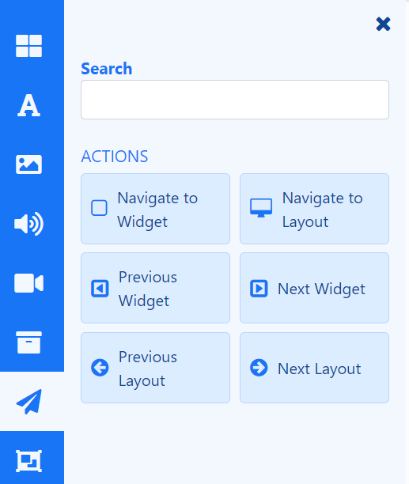
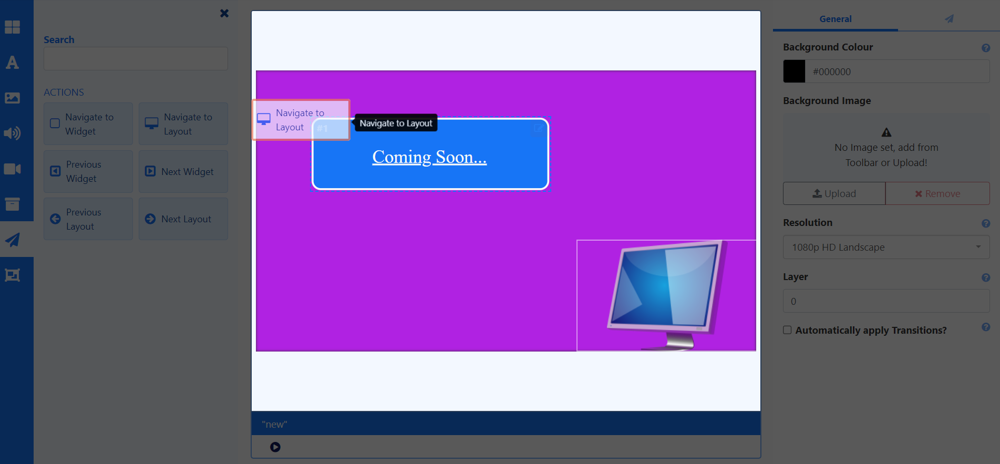

# インタラクティブ アクション

{version}
**注意:** インタラクティブ アクションに関するいくつかの問題を認識しており、現在、ワークフローと付随するドキュメントの改善に取り組んでいます。

{/version}

## ドキュメントはレビュー中です...

アクションは、レイアウト全体またはレイアウトに変更を加えるために使用できるウィジェットに添付できます。これらは、**タッチまたはクリック** によってトリガーするか、**webhook** によってプログラム的にトリガーできます。

{feat}インタラクティブ アクション レイアウト/領域|v4{/feat}

{tip}
**シナリオ**:
製品ディスプレイには、顧客が手に取ることができる製品があります。光センサーなどの「モノのインターネット」デバイスを使用して、[[PRODUCTNAME]] への webhook をトリガーし、特定の製品情報をレイアウトにロードして表示することができます。
{/tip}

{nonwhite}
Webhook の詳細については、開発者向けドキュメント [こちら](/docs/developer/player-control/webhooks) をご覧ください。

{/nonwhite}

## アクションの追加

ウィジェットには、タッチ、クリック、または Webhook によってトリガーされるレイアウトの変更を実行するアクションを添付できます。

アクションは、[レイアウト エディター](layouts_editor.html#content-toolbox) 内のツールボックスから作成および管理され、選択したアイテムのプロパティ パネルの [**アクション**] タブに表示されます。

- 必要な **アクション** を選択し、ターゲットにドラッグします。

- 追加したら、プロパティ パネルを使用して **トリガー タイプ** と **ターゲット** を設定します。

**トリガー タイプ** を設定します:

- レイアウトまたは特定のウィジェットの任意の場所をタッチまたはクリックしてトリガーします。

または

- Web フックのトリガー コードを含めます。これは、URL ``trigger=` パラメータに存在する必要があります。

{tip}
Android を使用してタッチでトリガーする場合は、[ディスプレイ設定](display_settings.html) の **詳細** タブを使用して、デバイスの **タッチ** 機能が有効になっていることを確認してください。

{/tip}

**トリガー ターゲット** を構成します。ここで使用できるオプションは、追加されたアクションのタイプによって異なります:

- **レイアウトに移動** は、**レイアウト コード** を使用して、使用するレイアウトを識別します。したがって、ターゲット レイアウトがこのリストに選択対象として含まれるようにするには、レイアウト編集フォームからターゲット レイアウトに **コード識別子** が割り当てられていることを確認してください。
- **次のウィジェット** および **前のウィジェット** アクションは、プレイリスト タイムラインの「次」および「前」の項目をターゲットにするために **プレイリスト** に追加する場合にのみ適用されます。
