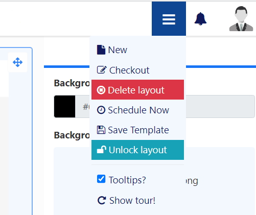

# テンプレート

テンプレートを使用して設計プロセスをスピードアップし、企業標準が維持されるようにします。

## 機能の概要:

- 既存の公開済みレイアウト デザインを使用して、テンプレートとして簡単に保存します。
- 管理を容易にするために、専用ページからテンプレートを作成および管理します。
- レイアウト上のコンテンツ プレースホルダーとして機能するゾーンをテンプレートに追加します。
- 共有オプションを設定して、テンプレート上の選択したゾーンへのユーザー アクセスを制限します。
- レイアウト エディターで選択できるように、公開済みテンプレートを表示します。
- すべてのユーザーのレイアウト設計プロセス全体をスピードアップします。
- すべてのレイアウトに標準化された外観を適用します。

新しい [テンプレート](layouts_templates.html#content-create-template) を作成するか、既存の [レイアウト](layouts_templates.html#content-save-layout-as-template) デザインを保存して、将来のレイアウトのテンプレートとして使用します。

{nonwhite}
[Xibo Exchange.](layouts.html#content-xibo-exchange) からデザインされたテンプレートの 1 つを選択するには、ツールボックスのテンプレートの下にあるボタンをクリックします。

{/nonwhite}

{version}
テンプレートを選択すると、現在のレイアウト デザインが選択したテンプレートに置き換えられます。この操作は元に戻せないため、注意して使用する必要があります。

{/version}

## テンプレートの作成

テンプレートは、メインの CMS メニューの [**デザイン**] セクションで [**テンプレート**] を選択して作成します。

- [**テンプレートの追加**] ボタンを選択し、フォーム フィールドに入力します。

[フォルダ](tour_folders.html) は、ユーザー オブジェクトを整理、検索し、他のユーザー/ユーザー グループと簡単に [共有](users_features_and_sharing.html#content-share) するために使用されます。フォルダに保存されたテンプレートは、そのフォルダに適用されているアクセス オプションを継承します。

{tip}
ユーザーがテンプレートのコンテンツ (画像メディア ファイルなど) にもアクセスできるようにする場合は、これらも同じフォルダに保存されていることを確認してください。

{/tip}

- CMS で簡単に識別できるように、テンプレートに **名前** を付け、オプションで [タグ](tour_tags.html) を含めます。

- [解像度](layouts#content-resolutions) を選択します。

**保存** すると、[レイアウト エディタ](layouts_editor.html) が 1 つのフル サイズの **ゾーン** とともに自動的に開きます。

ゾーンは、コンテンツを追加できるレイアウト上の領域を定義するために使用されます。

{tip}
ゾーンを含めずにテンプレートに直接コンテンツを追加する場合は、右クリックして [**削除**] を選択し、キャンバスからゾーンを削除します。[レイアウト](layouts.html) を作成するのと同じ方法でコンテンツを追加します。

{/tip}

### ゾーンの追加

{tip}
ゾーンはテンプレートでのみ使用できます。

{/tip}

- ゾーンの任意の場所をクリックして、サイズを変更し、配置します。

{tip}
右下のボタンを使用して、[**グリッドにスナップ**]、[**境界線にスナップ**]、または [**要素にスナップ**] を選択すると、アイテムを追加するときに簡単に配置できます。

{/tip}

**ゾーン** はツールバーから追加できます。

- 上部の [**ウィジェット**] ボタンをクリックします。

- ゾーンを選択し、ドラッグ アンド ドロップまたはクリックして追加します。
- サイズ変更と配置。

{tip}
ゾーンに定期的に更新する必要があるウィジェット (RSS ティッカーなど) が含まれており、レイアウト全体の継続時間よりも頻繁に更新する必要がある場合のみ、**ループ** に設定します。

{/tip}

### レイヤー化

プロパティ パネルから [配置] タブを選択し、重複するゾーン/追加コンテンツの [レイヤー化](layouts_editor.html#content-layering) を設定します。

{tip}
右クリックすると [コンテキスト メニュー](layouts_editor.html#content-context-menu) が表示され、アイテムを簡単に前後に移動できます。

[共有](users_features_and_sharing.html#content-share) オプションは、ユーザーが管理するレイアウトのセクションのみにアクセスできるようにする場合に特に便利です。

{/tip}

ツールボックスとゾーンの両方の [コンテンツ](layouts_editor.html#content-toolbox) を追加して、テンプレート デザインを構築します。

{tip}
1 つのゾーンに複数のメディア アイテムを追加すると、[プレイリスト](layouts_editor_playlists.html) が自動的に作成されます。

{/tip}

テンプレートが完成したら、エディターの上部にあるメニューを使用して **公開** します。

公開された **テンプレート** は、レイアウト エディターのツールボックスから選択できます。

## レイアウトをテンプレートとして保存

公開されたレイアウトは、次の 2 つの場所から **テンプレート** として保存できます。

- [レイアウト エディター](layouts_editor.html) から:
- **公開** 後、メニューに戻って **テンプレートの保存** を選択します:

- [レイアウト](layouts.html#content-layout-grid) グリッドから:
- **公開** されたレイアウトの行メニューを使用して、**テンプレートの保存** を選択します。

関連するすべてのフォーム フィールドに入力して、選択したレイアウトをテンプレートとして保存します。

{tip}
オプションで、チェックボックスを使用して、追加されたすべての **ウィジェット** もテンプレートに含めることができます。

{/tip}

- **保存**

{tip}
テンプレートとして保存されたレイアウトは、メインの CMS メニューの **デザイン** セクションの **テンプレート** グリッドから表示および編集できます。

レイアウトを「テンプレート」として **タグ付け** すると、デザインがテンプレート リストに追加されます。

{/tip}

## 行メニュー

すべてのテンプレートには行メニューがあり、ユーザーはそこからアクション/ショートカットのリストにアクセスできます。

- 注目すべき設定を以下に示します:

#### テンプレートの変更

レイアウト エディターでテンプレートのデザインを変更する場合に選択します。

#### チェックアウト

公開済みのテンプレートを編集するには、**チェックアウト** をクリックして下書きを作成します。編集したら、テンプレートを公開して、既存のテンプレートを上書きして変更を永続化できます。破棄すると、テンプレートは元の公開状態に戻ります。

{tip}
**チェックアウト** を使用すると、公開バージョンに変更が加えられたり、スケジュールされた **ディスプレイ** に表示されたりすることがなくなるため、編集には時間をかけてください。**公開** は変更が行われたことを確認し、公開バージョンを上書きします。**破棄** は下書きを削除しますが、公開バージョンはそのまま残ります。
{/tip}

#### 公開

公開すると、テンプレートがツールボックスから選択可能になります。

#### 破棄

下書きに加えられたすべての変更を破棄し、以前の公開バージョンに戻します。

#### 共有

ユーザー/ユーザー グループが個々のテンプレートにアクセスできるように、[共有](users_features_and_sharing.html#content-share) オプションを設定します。

#### エクスポート

関連するすべてのウィジェット/メディア/データセット構造を含むテンプレートを ZIP ファイルにエクスポートして、簡単に共有できるようにします。

{tip}
テンプレートをエクスポートすると、割り当てられたすべての**レイアウト**、**プレイリスト**、**メディア タグ**がエクスポートされます。レイアウトのインポート時にこれらのタグを追加するには、[タグのインポート] オプションを選択します。

テンプレート グリッドの下部にある [選択したものを含む] オプションを使用して、複数のテンプレートに対して一括操作を実行します。

{/tip}

#### 次へ...

[オーバーレイ レイアウト](layouts_overlay.html)

