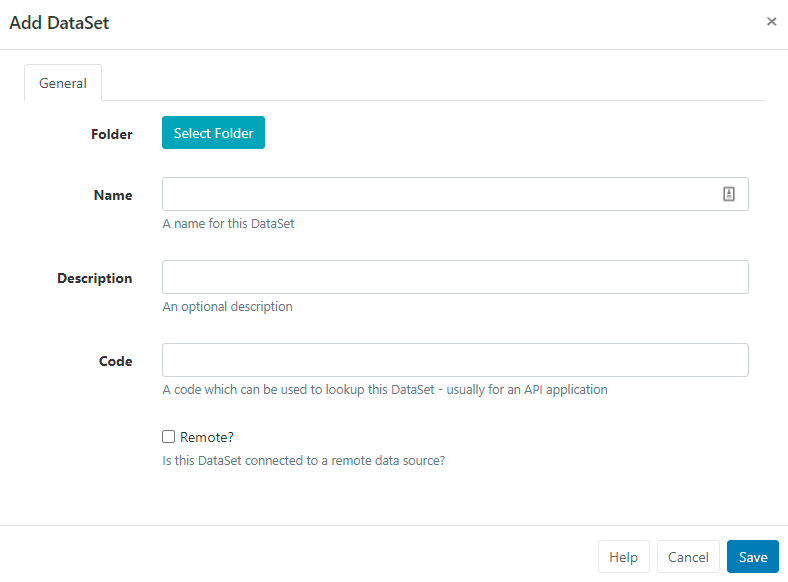
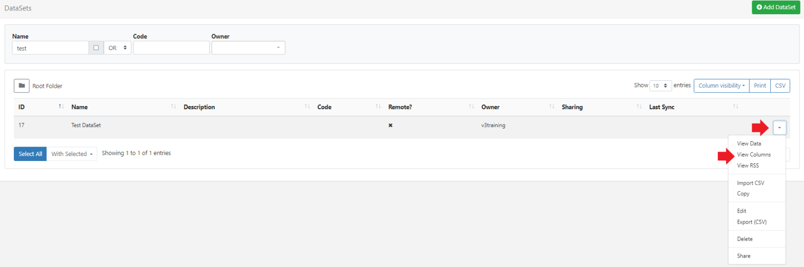
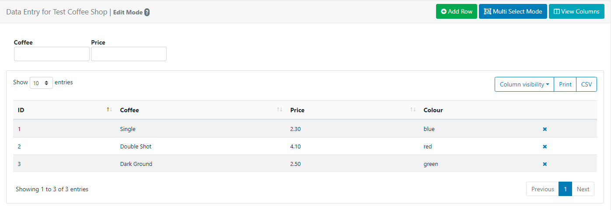

# DataSets

DataSet は、[レイアウト](layouts.html) および [プレイリスト](media_playlists.html) とは独立して作成および管理される表形式のデータを設計および保存するために使用されます。作成された DataSet は、[DataSet](media_module_dataset.html) ウィジェットを使用してレイアウトおよびプレイリストに追加されます。

DataSet は、[Ticker](media_module_ticker.html) ウィジェットに追加する独自の [RSS フィード](media_datasets.html#content-view-rss) を作成するためにも使用できます。

## 機能の概要:

- データ構造を定義します。
- データを手動で追加できます。
- CSV ファイルからデータをインポートします。
- API 経由で JSON 形式のデータ ソースを使用します。
- スケジュールに従って、サードパーティのデータ ソースからリモートで同期します。
- レイアウト/プレイリストにアクセスせずにコンテンツを維持します。
- 複数のウィジェット/レイアウト/プレイリストで再利用します。
- DataSet から RSS フィードを作成します。

DataSet は汎用性を考慮して設計されているため、DataSet ウィジェットやカスタム モジュールのデータ ソースを使用してさまざまな方法で構成できます。DataSet を使用すると、[[PRODUCTNAME]] で他のシステムからデータをインポートして表示できます。

DataSet を活用できる例:

- バーのドリンク メニュー
- ゴルフ クラブのティー タイム
- 会議室の予約
- バスの時刻表

DataSet はレイアウトやプレイリストとは独立して作成および管理されるため、DataSet 内に保持されているデータを追加または管理するために、レイアウト、レイアウト エディター、またはプレイリストにユーザーがアクセスする必要はありません。


## データセットの作成

データセットは、メイン CMS メニューの [ライブラリ] セクションで [データセット] を選択して作成および管理します。


- [データセットの追加] ボタンを選択し、フォーム フィールドに入力して新しいレコードを作成します。



[フォルダー](tour_folders.html) は、ユーザー オブジェクトを整理、検索し、他のユーザー/ユーザー グループと簡単に [共有](users_features_and_sharing.html#content-share) するために使用されます。フォルダーに保存されたデータセットは、そのフォルダーに適用されたアクセス オプションを継承します。

- CMS で簡単に識別できるように、データセットに [名前] を付けます。オプションの内部**説明**を提供し、API経由でこのデータセットを参照する場合は**コード**を入力します。

データセットが**リモート**データソースと同期するように接続される場合は、有効にするためにチェックを入れ、[リモートデータセットの作成](media_datasets.html#content-creating-remote-datasets)構成に進みます。

データセットが**リモート**でない場合は、データセットレコードを保存して、[列の作成と構成](media_datasets.html#content-create-and-configure-columns)セクションから続行します。

### リモートデータセットの作成

リモートデータセットは、サードパーティのデータソースから定期的に同期される特別なタイプのデータセットです。[[PRODUCTNAME]]は、選択された期間にURLを呼び出し、データセットレコードと**リモート**として定義されている列に設定された指示に従ってデータを解析します。

リモートを選択すると、追加のタブ付きフィールドが利用可能になり、リモートデータセットレコードを完全に入力できるようになります:


- #### リモート

リクエストメソッドのタイプを設定し、リモートデータソースの URL を入力します。

- #### 認証

認証情報を提供します。カスタムヘッダーは、カスタム HTTP ヘッダーのオプション文字列を提供するために使用できます。

- #### データ

リモートデータソースを設定します:

### JSON ソース

JSON データは、リモートタイプとして定義された列に従って入力されます。**リモート列** を指定する場合は、指定された **データルート** に関して、その列のデータへの JSON 構文パスである「データパス」を入力する必要があります。

{tip}
JSON データ ソースの例を考えてみましょう:

```json
{
"base": "EUR",
"date": "2017-12-22",
"rates": {
"GBP": 0.88568,
"THB": 38.83,
"USD": 1.1853
}
}
```

通貨の **Symbol** と **Value** を 2 つの列で取得したい場合は、**Data Root** を `rates` に設定し、次の列を用意する必要があります:

- **Symbol** - データ パス = 0
- **Value** - データ パス = 1

{/tip}

**Test data URL** を使用して、目的の構造が返されることを確認します。

### CSV ソース

リモート データ ソースは CSV として選択できます。

CSV ソースにヘッダーが含まれている場合は、最初の行を無視するようにチェックします。

**テスト データ URL** を使用して、目的の構造が返されることを確認します。

#### 詳細

- リモート データの取得とインポートの頻度を設定します。

{tip}
リモート データセットの取得タスクは、デフォルトでは 1 時間ごとに実行されます。リモート データセットは、リアルタイムではなく、頻繁に更新されないデータを対象としています。

{/tip}

- データの切り捨てにタイムスケールを設定します。

- 依存関係を使用する場合は、ドロップダウンを使用してデータセットを選択します。

- オプションで、行制限と、この制限を超えた場合の動作を設定します。

{nonwhite}

{noncloud}
ここで **行制限** が設定されていない場合、非クラウド カスタマーには [CMS 設定](tour_cms_settings.html#content-defaults) で適用された行制限が使用されます。
{/noncloud}

{cloud}

ここで**行制限**が設定されていない場合は、デフォルトが適用されます。これは、クラウド ユーザーの場合、データセットごとに 10,000 行です。

{/cloud}

{/nonwhite}

- **保存**をクリックします。

## 列の作成と構成

列はデータの構造を定義します。

- データセット レコードの行メニューを使用して、**列の表示**を選択します。



{tip}

デフォルトでは、すべての新しいデータセットに**Col1**が追加されます。これは、Col1 の行メニューを使用して編集または削除する必要があります。

{/tip}

- 行メニューから Col1 を削除し、**列の追加** ボタンをクリックして新しい列を作成します

​ または

- Col1 の行メニューを使用して、**編集**を選択します。


- この列を識別するための**見出し**を含めます。
- ドロップダウンを使用して、使用する列の**タイプ**を選択します。

### 列タイプ:

#### 値

コンボ ボックスに表示される項目のリストを入力します。

- ドロップダウンを使用して**データ タイプ**を選択します。
- この列に選択できる値のコンマ区切りリストを提供します。
- データを表示/編集するときにこの列が表示される位置を設定します。
- この列にデータを入力するときに表示するオプションのツールヒント メッセージを提供します。

追加のオプションを使用して、この列の**フィルター**、**並べ替え**、および**必須値**を有効にします。

#### 数式

MySQL ステートメントを入力します。

- ドロップダウンを使用してデータ タイプを選択します。 - データを表示/編集するときにこの列が表示される位置を設定します。
- 'SELECT' ステートメントで使用するのに適した MySQL ステートメント、または日付フィールドをフォーマットする文字列を指定します。

{tip}

` $dateFormat(<col>,<format>,<language>)`
日付フォーマットが機能するには、`<col>` に日付と時刻が指定されていることを確認してください。言語が設定されていない場合は、デフォルトで英語になります。

数式列には 2 つの置換が使用できます: `[DisplayId]` と `[DisplayGeoLocation]` は、実行時に表示 ID / 表示ジオロケーション (MySQL GEOMETRY) に置換されます。

{/tip}

追加オプションを使用して、この列の **フィルター** と **並べ替え** を有効にします。

#### リモート

JSON 構文文字列を指定します。

- ドロップダウンを使用してデータ型を選択します。

- サードパーティのデータ ソースからデータにアクセスする方法を示す JSON 構文文字列を入力します。
- データを表示/編集するときにこの列が表示される位置を設定します。

追加オプションを使用して、この列の **フィルター** と **並べ替え** を有効にします。

必要に応じて列の追加と構成を続けます。[[PRODUCTNAME]] がサポートできる列の数に理論上の制限はありませんが、多くの場合、DataSet が小さいほど管理と表示が簡単になります。

{tip}

列は、DataSet ページから DataSet レコードの行メニューを使用して表示/追加および編集できます。

列の順序とリストの内容は、データが収集された後に変更できます。

{/tip}

## 列へのデータの追加

列を定義したら、データを追加する必要があります。これは、いくつかの方法で実現できます。

- CMS ユーザー インターフェースから手動で
- CSV ファイルからインポート
- API を使用する
- リモートで同期

### 手動で

データは、列ページの **データの表示** ボタンを使用して追加されます。

{tip}
データは、データセット ページのデータセット レコードの行メニューを使用して表示/追加および編集できます。
{/tip}

データ テーブルには、データセットに追加された各列が、構成されたとおりに表示されます。



- **行の追加** ボタンをクリックして新しいデータ行を追加し、数式以外の各列タイプを完了します。
- **次へ** をクリックしてデータの追加を続行し、さらに行を追加します。
- すべてのデータが完了したら、**保存** をクリックします。

{tip}
任意の行をクリックしてデータを編集します。選択した行の末尾の十字をクリックすると、削除されます。

ユーザーは、グリッドの上部にあるボタンを使用して、**複数選択モード** に切り替えることができます。このモードでは、ユーザーは複数の行を選択し、**行の削除** をクリックして一括で削除できます。

完了したら、**編集モード** ボタンをクリックして、複数選択モードを終了します。

{/tip}

### CSV のインポート

CMS には、**CSV ファイル** からデータを抽出して DataSet に入れるために使用できる DataSet CSV インポーターがあります。**CSV のインポート** 機能は、任意の DataSet レコードの行メニューからアクセスできます (リモート データ ソース用に構成された DataSet を除く)。


インポーターには、インポート ファイルに保存されている既存のデータを上書きするオプションと、ファイルに見出しがある場合にインポート時に CSV の最初の行を無視するオプションがあります。

DataSet 内のリモート列は、その横に、リストされた列ヘッダーに対応する CSV ファイル内の列番号を示すフィールドとともにリストされます。

{tip}
非 ASCII 文字を使用している場合は、CSV ファイルのファイル エンコーディングが正しいことを確認することが重要です。非 ASCII 文字は、英語以外の言語では非常に一般的です。最も一般的に使用されるファイル エンコーディングは UTF-8 です。

Excel を使用して CSV ファイルを編集した場合は、[名前を付けて保存] ダイアログの [ツール] -> [Web オプション] -> [エンコーディング] タブで [Unicode (UTF-8)] を選択する必要があります。

{/tip}

### API 経由

[[PRODUCTNAME]] API を使用して、DataSet にデータを同期する独自のアプリケーションを作成できます。データは、行ごとに追加することも、JSON 構造全体をインポートすることもできます。

{nonwhite}
API に関する詳細な説明は、[開発者向けドキュメント](/docs/developer) で確認できます。
{/nonwhite}

### リモート

リモート DataSet は、**Fetch Remote DataSets** というタスクと同期されます。このタスクはデフォルトで設定されており、1 分ごとに 1 回実行されます。

- #### 依存関係

リモート DataSet は、別の DataSet に依存してリクエストを作成できます。依存 DataSet の各行は、親 DataSet のリクエスト パラメータを使用してリクエストを作成するために使用されます。

## 行メニュー

各 DataSet には、ユーザーがアクション/ショートカットのリストにアクセスできる行メニューがあります。

- 注目すべき設定を以下に示します。

### RSS の表示

DataSet に保持されているデータを使用して、独自の RSS フィードを作成します。

- DataSet の行メニューから **View RSS** を選択します。
- **Add RSS** ボタンをクリックします。


- フォーム フィールドに入力し、使用する列を選択します。

- 保存すると URL が生成され、コピーして [Ticker](media_module_ticker.html) ウィジェットに追加できます。

### 削除

データセットは、使用されていない場合にのみ削除できます。

データセット グリッドの下部にある [選択済み](tour_cms_navigation.html#content-multi-select---with-selected) オプションを使用して、複数のデータセットを一括で選択して削除できます。

### 共有

ユーザー/ユーザー グループが個々のデータセットにアクセスできるように、[共有](users_features_and_sharing.html#content-share) オプションを設定します。

{nonwhite}
ディスプレイに DataSet を活用する方法の例については、ガイドをご覧ください: [DataSet を使用して今後の誕生日を表示する](https://community.xibo.org.uk/t/using-datasets-to-show-upcoming-birthdays/31617)
{/nonwhite}

#### 次へ...

[DataSet ウィジェット](media_module_dataset.html)

