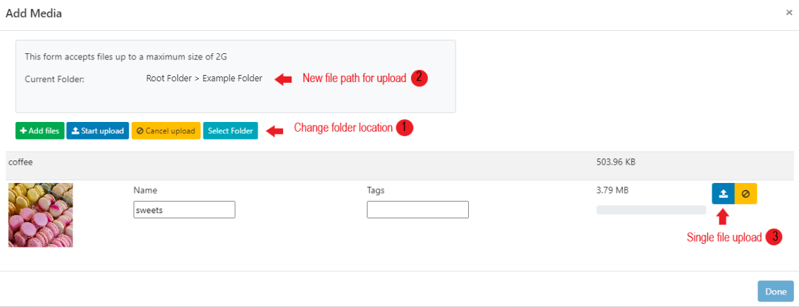
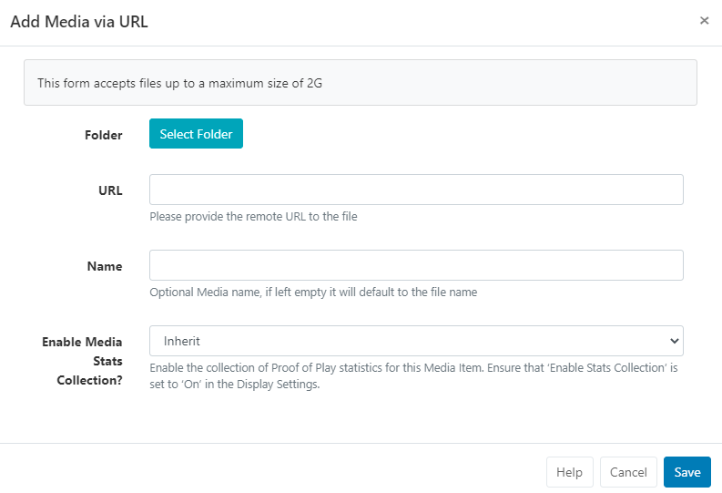
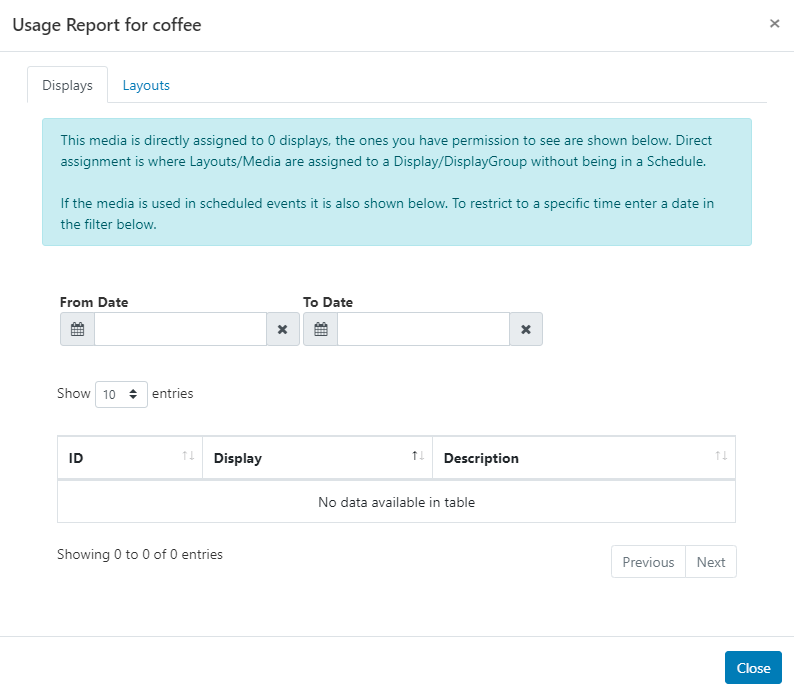

# メディア ライブラリ

[[PRODUCTNAME]] は、レイアウトやプレイリストに直接作成および保存されるウィジェットから、CMS ライブラリにアップロードおよび保存され、複数のレイアウトやプレイリストで再利用できるファイルベースのメディアまで、さまざまなメディア タイプをサポートしています。

{version}
**注意:** [[PRODUCTNAME]] は、ディスプレイに表示されるコンテンツを制御する手段を講じません。コンテンツが対象ユーザーにとって適切な素材であることを確認するのは、お客様の責任です。コンテンツの権利を所有していない場合は、コンテンツに適切な帰属表示を行う必要があります。
{/version}

すべてのファイルベースのメディアを管理するには、メインの CMS メニューの [**ライブラリ**] セクションで [**メディア**] を選択します。

[グリッド](tour_cms_navigation.html#content-grids) の上部にある複数のフィルター フィールドを使用して、返される結果の条件を制限します。

{tip}
**名前** および複数の **タグ** が割り当てられているアイテムをフィルターするには、**OR/AND** オプションを使用します。

サムネイルが設定されている画像や動画は、設定後、**方向** でフィルタリングすることもできます。

- アイテムの行メニューを使用して、画像/動画ファイルの **編集** を選択します。

- フォームの一番下までスクロールし、目的の **方向** を設定します。

{/tip}

[フォルダー](tour_folders.html) は、ユーザー オブジェクトを整理、検索し、他のユーザー/ユーザー グループと簡単に [共有](users_features_and_sharing.html) するために使用されます。

- フォルダー/サブフォルダーをクリックすると、選択したフォルダーの内容のみが検索され、適用されているフィルターに基づいて結果が返されます。

または

- ルート フォルダーで検索を含めるには、**すべてのフォルダー** にチェックを入れ、適用されているフィルターに基づいて結果が返されます。

{tip}
[フォルダー] メニューをクリックして、表示のオン/オフを切り替えます。フォルダー ツリーが非表示になっている場合は、選択したフォルダーのファイル パスが表示されます。
{/tip}

## ライブラリ メディアの追加

ライブラリ メディアは、[**メディアの追加**] ボタンを使用して直接アップロードするか、[**メディアの追加 (URL)] ボタンを使用して URL を指定してアップロードできます。

{tip}
CMS ライブラリにメディアを追加して [フォルダー](tour_folders.html) に保存すると、適切な [ユーザー](users_administration.html)/[ユーザー グループ](users_groups.html) がメディアを使用できるようになります。

CMS ライブラリに追加されたファイルは、[ライブラリ検索](layouts_editor.html#content-library-search) を使用してレイアウトやプレイリストに簡単に追加できます。

{/tip}

### メディアの追加 (アップロード)

- [**メディアの追加**] ボタンを選択します

- [**ファイルの追加**] をクリックし、アップロードするファイルを選択します。

{tip}
デフォルトのしきい値と制限を指定できます。これは、たとえば画像をアップロードするときに [画像](media_module_image.html) のサイズを変更する必要がある場合に考慮されます。詳細については、[CMS 設定](tour_cms_settings.html#content-resizing-images) を参照してください。
{/tip}

- CMS で簡単に識別できるようにファイルに **名前** を付け、オプションで [タグ](tour_tags.html) を付けます。

{tip}
名前フィールドが空白の場合、ファイルはアップロード時に元のファイル名に従って名前が付けられます。
{/tip}

ファイルを指定したフォルダの場所にアップロードすると、宛先フォルダに適用されている表示、編集、共有の削除オプションが継承され、ユーザー/ユーザー グループが簡単にアクセスできるようになります。

- **フォルダの選択** ボタンをクリックし、展開して保存先のフォルダを選択します。

{tip}
ユーザーは、フォルダを右クリックして、ユーザー/ユーザー グループの [機能と共有](users_features_and_sharing.html) オプションで有効になっているその他のオプションにアクセスすることもできます。

{/tip}

- ファイルをアップロードするフォルダをクリックし、**完了** をクリックします。

- **現在のフォルダ** に、選択したファイル パスが表示されます。

- **アップロードの開始** ボタンをクリックして、すべてのファイルのアップロードを開始します。フォルダが選択されていて、複数のファイルを追加している場合は、すべてのファイルがその場所にアップロードされます。

ファイルを個別にアップロードして、異なるフォルダの場所を指定することもできます。

- [アップロードを開始] ボタンをクリックする代わりに、追加したファイルの行の末尾に表示される **青いアップロード** ボタンをクリックします。

- 以前と同じように **フォルダを選択** ボタンを使用してフォルダの場所を変更し、行の末尾にある青いボタンをクリックして、その 1 つのファイルだけをアップロードします。

- すべてのファイルが正常にアップロードされたら、[完了] をクリックします。

{tip}
メディア ファイルは、[ライブラリ検索](layouts_editor.html#content-library-search) からアップロード ツールを使用して、レイアウト/プレイリストに直接アップロードすることもできます。プレイリストにアップロードされたメディアには、[ウィジェットの有効期限](media_playlists.html#content-widget-expiry-dates) を設定するための追加オプションがあります。

アップロードされ、レイアウト/プレイリストに直接追加されたメディア ファイルも、デフォルトで CMS メディア ライブラリに保存されます。

{/tip}

### URL 経由でメディアを追加

- [**メディアの追加 (URL)**] ボタンを選択します:

- [フォルダー](tour_folders.html) に保存すると、宛先フォルダーに適用されている表示、編集、削除、共有オプションが継承され、ユーザー/ユーザー グループが簡単にアクセスできるようになります。
- ファイルのリモート URL を指定します。
- CMS で簡単に識別できるように、ファイルに **名前** を付けます。

{tip}
[名前] フィールドが空白の場合、ファイルは元のファイル名と同じ名前になります。

{/tip}

- [保存] をクリックします。

## 行メニュー

**ライブラリ** の各項目には行メニューがあり、ユーザーはそこからアクション/ショートカットのリストにアクセスできます

## 編集

**編集** を選択して、**フォルダ** の場所、**期間**、**タグ** などの設定を変更します。

- 注目すべき設定を以下に示します:

### 有効期限

ライブラリ メディアの有効期限を設定すると、そのファイルが使用されているレイアウト/プレイリストからそのファイルが削除されます。

### メディアを廃止

**このメディアを廃止** にチェックを入れると、メディア ファイルは既存のレイアウト/プレイリストに割り当てられたままになりますが、レイアウト/プレイリストに追加するための選択はできなくなります。

### メディア統計収集を有効にする

- 選択したメディア ファイルの [Proof of Play](displays_metrics.html#proof_of_play) 統計の収集をオン/オフ/継承に設定します。

{tip}
Proof of Play 統計を収集するには、[表示設定](displays_settings.html) で **統計レポートを有効にする** にチェックが入っていることを確認してください。

{/tip}

### メディアの更新

**割り当てられているすべてのレイアウトでこのメディアを更新する** チェックボックスを使用して、このメディア ファイルが現在割り当てられているレイアウト/プレイリストに編集が反映されるようにします。

{tip}
編集は、編集するための [アクセス権](users_features_and_sharing.html#content-share) があるレイアウト/プレイリストでのみ更新されます。

{/tip}

### メディアの置き換え

フォームの下部にある **置き換え** ボタンを使用して、既存のファイルの新しいリビジョンをアップロードする必要がある場合があります。

- [メディアの追加 (アップロード)] と同じ手順で、代替ファイルをアップロードします。(media_library.html#content-add-media-upload)
- 現在割り当てられているすべてのレイアウト/プレイリストに代替ファイルを **更新** するには、チェックを入れます。
- CMS から古いファイル バージョンを完全に **削除** するには、チェックを入れます。

## 削除

メディア ファイルは、既存の **レイアウト/プレイリスト** で **使用されていない** 場合にのみ、CMS から削除できます。

{version}
ファイルの削除は元に戻せないため、強制削除オプションは注意して使用する必要があります。

{/version}

{tip}
[コンテンツの廃止](media_library.html#content-retire-media) は削除ではなく、割り当てられている既存のレイアウト/プレイリストにメディア ファイルを保持し、スケジュールされたコンテンツには影響しません。メディアは、新しいレイアウト/プレイリストに追加できなくなります。
{/tip}

{feat}Purge List|v4{/feat}

- ボックスにチェックを入れると、XMDS を使用してハード プッシュが有効になり、プレーヤーのローカル ストレージからファイルが完全に削除されます。

### 使用状況レポート

{tip}
このレポートは、メディア ファイルを整理する前の最終チェックに最適です。

{/tip}

選択した **メディア ファイル** が **ディスプレイ** に直接割り当てられているか、スケジュールされているかが表示されます。

- レイアウト タブを使用して、メディア ファイルが現在どの **レイアウト** に含まれているかを確認します。

{tip}
ライブラリ グリッドの下部にある [選択済み](tour_cms_navigation.html#content-multi-select---with-selected) オプションを使用して行を複数選択し、一括操作を簡単に実行できます。
{/tip}

### スケジュール

画像およびビデオ ライブラリのメディア ファイルは、行メニューからフル スクリーン コンテンツとして直接表示するようにスケジュールできます。

- [**スケジュール**] をクリックします

- アイテムの [**期間**] を設定して、このメディア ファイルがスケジュールに表示されるたびに表示される時間を決定します。このフィールドを空白のままにしておくと、メディア ライブラリで設定されている期間が使用されます。
- 必要に応じて、使用する [**解像度**] を選択します。空白のままにしておくと、選択したメディア ファイルのサイズに最も近い解像度が使用されます。
- メディアが画面全体を埋めない場合、オプションの [背景色**] を設定してギャップを埋めることができます。
- [**保存**]
- フォームの残りのフィールドに入力して、新しい [スケジュール](scheduling_events.html) を完了します。

## ライブラリの整理

CMS が使用され、レイアウト/プレイリストやメディアが追加されると、時間の経過とともに、ライブラリは使用されなくなった古いコンテンツで乱雑になります。

ライブラリは、ユーザーまたはスーパー管理者が *整理* して、すっきりと小さく保つことができます。

**アクションを元に戻すことはできないため、注意して使用する必要があります。**

{tip}
これは、クォータのある Web サーバーに CMS がインストールされている場合や、ユーザーに独自のクォータが割り当てられている場合に特に便利です。

{/tip}

ライブラリを整理できる場所は 2 つあります。

1. [CMS 設定](tour_cms_settings.html#content-tidy-library-(global)) - すべてのスーパー管理者のみが使用できます。
2. **ライブラリ** から - [ライブラリ整理を有効にする](tour_cms_settings.html#content-tidy-from-user-library) がオンになっている場合、すべてのユーザーに対して。

{nonwhite}
{cloud}
**Xibo Cloud Hosting** のお客様の場合、ライブラリ整理機能はデフォルトでオフになっています。オプションを完全に理解していないと、潜在的に破壊的になる可能性があるためです。必要に応じて、チェックボックスを使用して [ライブラリ整理を有効にする](tour_cms_settings.html#content-tidy-from-user-library) してください。

{/cloud}
{/nonwhite}

有効にすると、ユーザーはライブラリ ページの上部にある **ライブラリ整理** ボタンをクリックできます。

フォームには、削除されるファイルの数と、それらのファイルが占めるスペースが表示されます。

{tip}
これにより、ログインしているユーザーが所有し、レイアウトで使用されなくなった、またはディスプレイ グループ/ディスプレイに割り当てられていないファイルのみが削除されます。
{/tip}

#### 次へ...

[モジュールとコネクタ](media_modules.html)
