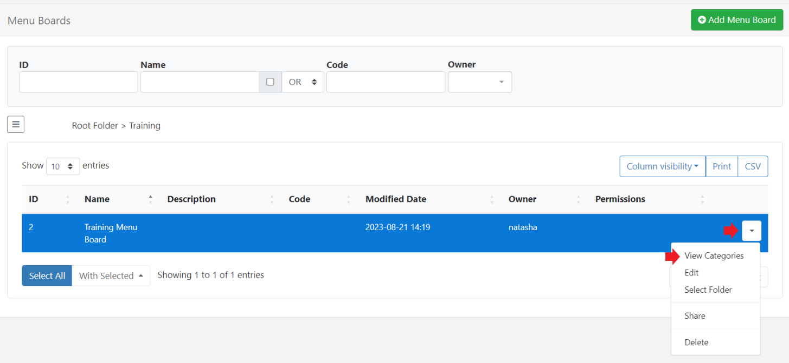
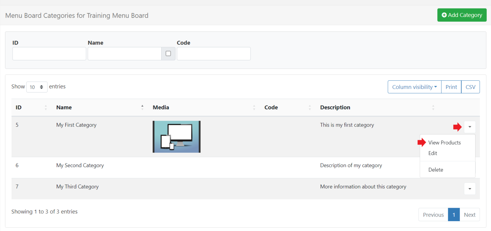
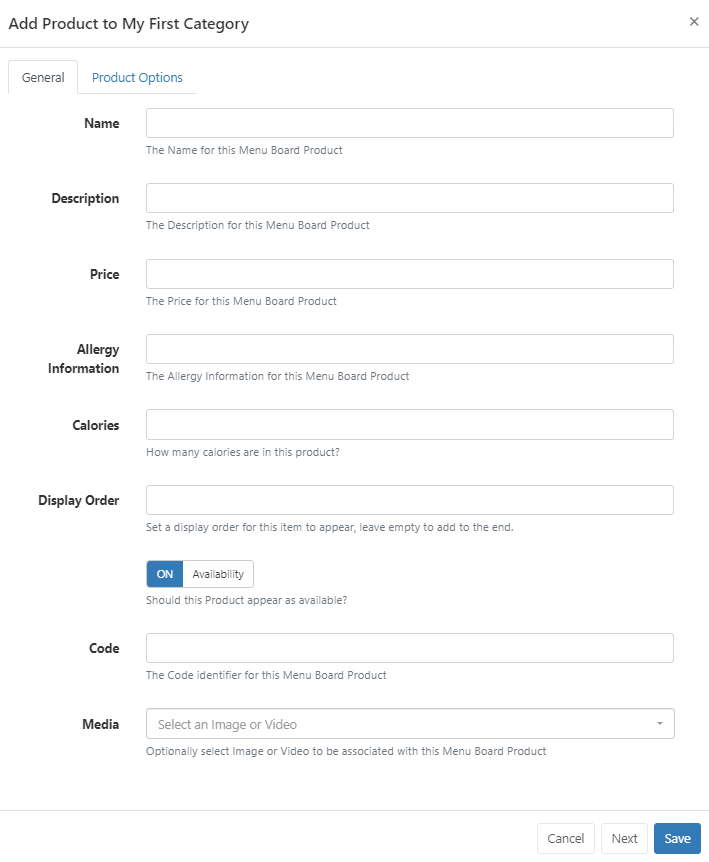
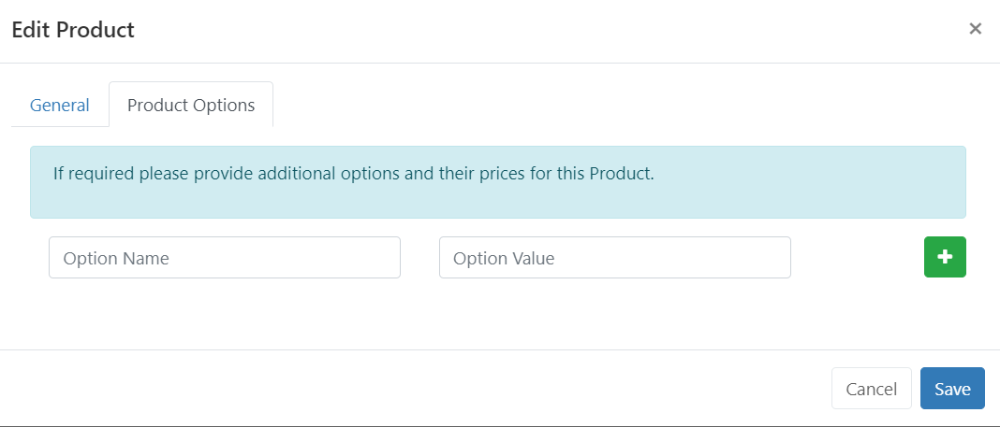

# メニュー ボード

メニュー ボード インターフェイスは、ユーザーがレイアウトとは独立して「カテゴリ」と「製品」情報を簡単に作成および管理できる方法を提供します。メニュー ボード データは、作成後、[レイアウト エディター](layouts_editor.html) で使用可能な [メニュー ボード: カテゴリ](media_module_menuboards_category.html) および [メニュー ボード: 製品](media_module_menuboards_products.html) ウィジェットの [要素](layouts_editor#content-data-widgets-and-elements) を使用して、レイアウトの任意の場所に追加できます。

{version}
**注:** メニュー ボード ウィジェットはプレイリストに追加できません!

{/version}

## 機能の概要

- カテゴリを作成して定義します。
- 詳細な製品情報を含めます。
- ライブラリから使用する画像を選択します。
- レイアウトにアクセスせずにコンテンツを維持します。
- 複数のウィジェット/レイアウトで再利用します。

メニュー ボードはレイアウトとは独立して作成および管理されるため、メニュー ボード内のカテゴリ/製品データを追加または管理するために、レイアウトまたはレイアウト エディターへのユーザー アクセスは必要ありません。

## メニュー ボードの作成

メニュー ボードは、メイン CMS メニューの [ライブラリ] セクションで [メニュー ボード] を選択して作成および管理します。

- [メニュー ボードの追加] ボタンを選択し、フォーム フィールドに入力して新しいレコードを作成します。

[フォルダー](tour_folders.html) は、ユーザー オブジェクトを整理、検索し、他のユーザー/ユーザー グループと簡単に [共有](https://test.xibo.org.uk/manual/en/users_features_and_sharing.html#content-share) するために使用されます。フォルダーに保存されたデータセットは、そのフォルダーに適用されたアクセス オプションを継承します。

- CMS で簡単に識別できるように、メニュー ボードに **名前** を付けます。オプションの内部 **説明** を提供し、API 経由でこのメニュー ボードを参照する場合は **コード** を入力します。

- **保存** をクリックして下さい。

## カテゴリの作成と構成

カテゴリはデータの構造を定義します:

- メニュー ボード レコードの行メニューを使用し、**カテゴリの表示** を選択します。

**カテゴリの追加** ボタンをクリックし、必要なフォーム フィールドに入力します:

{tip}

**コード** は、API を参照する場合の高度な使用を目的としています。
{/tip}

- **次へ** をクリックしてこのプロセスを繰り返し、メニュー ボードに必要な **カテゴリ** を追加します。

- 使用する最後のカテゴリを入力するときに **保存** を選択します。

## 製品の追加

製品データはカテゴリに追加され、ディスプレイに表示するように選択できるすべての重要な情報を提供します。

- カテゴリの行メニューを使用して、**製品の表示** を選択します:

- **製品の追加** ボタンをクリックして新しい製品データを作成し、関連するすべてのフォーム フィールドに入力します:

{tip}
[メニュー ボード: 製品](media_module_menuboards_products.html) ウィジェットは、ディスプレイに表示できないとマークされた製品を暗くするように構成できます。
{/tip}

### 製品オプション

このタブを使用して、さらに製品オプションを提供します:

{tip}
オプションを使用して、この特定の製品に特別オファーや限定特典などを提供します。

{/tip}

- このプロセスを繰り返して、カテゴリにさらに製品/製品オプションを追加します。

{tip}
各カテゴリは製品グリッドに個別のタブとして表示されるため、カテゴリを簡単に切り替えて製品情報を追加および編集できます。

{/tip}

**カテゴリの表示** をクリックしてカテゴリ グリッドに戻り、行メニューまたは **カテゴリの追加** を使用して既存のカテゴリを表示および編集します。

メニュー ボードのデータは、[メニュー ボード: カテゴリ](media_module_menuboards_category.html) ウィジェットを使用してレイアウトに追加されます。このウィジェットには、主に「ヘッダー」情報の追加に使用されるデータ要素と、レイアウトに製品の詳細を正確に配置できる [メニュー ボード: 製品](media_module_menuboards_products.html) ウィジェットがあります。

{tip}
メニュー ボードはレイアウトとは独立して編集されるため、メニュー ボードが追加されたレイアウトにアクセスしたり編集したりする必要はありません。変更はすぐにシステムで利用可能になり、プレイヤーは次のコレクションですぐに使用できます。レイアウトを編集する必要はありません。
{/tip}

{nonwhite}
ディスプレイにメニュー ボードを活用する方法の例については、ガイドをご覧ください: [メニュー ボードの使用](https://community.xibo.org.uk/t/utilising-menu-boards-in-v4/30749)
{/nonwhite}

#### 次へ...

[レイアウトの追加](layouts.html#content-adding-layouts)

