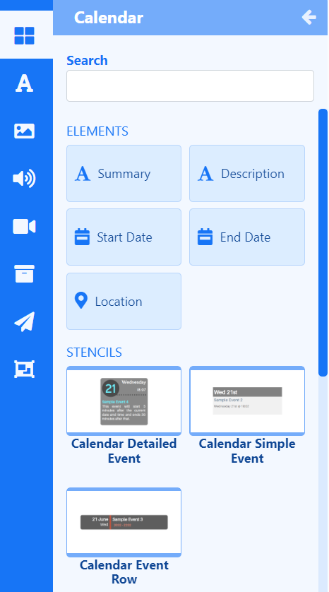
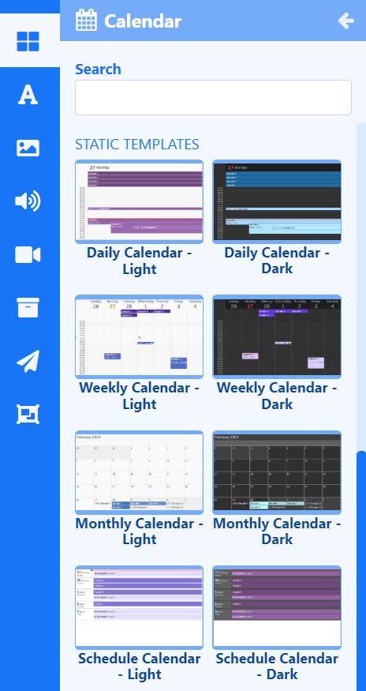

# カレンダー

**Elements** を使用してレイアウト上の任意の場所に iCal フィードから取得したカレンダー イベントを表示するか、**Static Template** を選択してレイアウト/プレイリストに結果を表示します。

{feat}Calendar View|v4{/feat}

カレンダー データは、構成された要素と Static Templates にフィードされる iCal フィードによって提供されます。

{tip}
ICS フィード URL が CMS で使用できることを確認します。認証なしでブラウザにフィードが読み込まれる場合、フィードは問題なく CMS に表示されます。

アプリケーションで Google カレンダーを表示する方法の詳細については、次のリンクを使用して [**カレンダーを取得 (表示のみ)**] オプションを選択してください: https://support.google.com/calendar/answer/37648?hl=en
{/tip}

## カレンダー要素

[レイアウト](layouts_editor.html) にカレンダー ウィジェットを追加するときに [要素](layouts_editor#content-data-widgets-and-elements) を選択できます。これにより、ユーザーはカレンダー ウィジェットのどのコンポーネントを使用するか、どこに配置できるかをより細かく制御できます。

各要素には、プロパティ パネルに一連の構成オプションがあります。**構成** タブから結果を返すために使用する iCal フィードを入力します。

追加された各要素に使用する [データ スロット](https://test.xibo.org.uk/manual/en/layouts_editor.html#content-data-slots) を指定して、アイテムの循環方法を制御します。[グローバル要素](layouts_editor.html#content-global-elements) を追加して図形やテキストを追加することで、データ要素をさらに補完できます。これらはすべて [要素グループ](layouts_editor.html#content-grouping-elements) にまとめられるため、構成や配置が簡単になります。

[ステンシル](layouts_editor.html#content-stencils) を利用して、事前にデザインされた要素のグループをレイアウトに追加します。

{tip}
ステンシル内のすべての要素は、構成時に「1 つ」として扱われ、右クリックで簡単に複製できます。
ヒント}

## カレンダーの静的テンプレート

[静的テンプレート](layouts_editor.html#content-static-templates) は、返される結果のレイアウトとスタイル設定方法を定義し、事前にスタイル設定されたテンプレートを使用してデータを表示する簡単な方法です。

テンプレートは、プロパティ パネルのさまざまなオプションを使用して、デザインの外観を変更するように構成できます。レイアウト/プレイリストに追加された各テンプレートの [**構成**] タブから結果を返すには、iCal を入力します。

## 概要

- 指定された日付範囲内のイベントを返します。
- 終日イベントと現在のイベントをフィードから除外して、表示されないようにするオプション。
- イベントとカレンダーのタイムゾーンを使用します。
- アイテムごとに期間を設定します。
- 表示するイベントの数を指定します。
- 特定の条件が検出されたときに Web フック トリガーを実行します。 - このメディアのデータは、オフライン再生用にプレーヤーによってキャッシュされます。

### Web フック トリガー

トリガー タブから **現在のイベント** または **イベントなし** がある場合に、Web フック [アクション](layouts_interactive_actions.html) をトリガーします。

{tip}
**シナリオ例**:

ユーザーは、レイアウト上のカレンダー ウィジェットを使用して会議室カレンダーを構成しており、部屋の現在の占有状況を表示し、空いているか使用中かを示すように LED ライトを変更したいと考えています。

- ユーザーはまず、LED IoT デバイスまたは一部の Philips Commercial Displays に組み込まれている LED にコマンドを発行する [シェル コマンド](displays_command_ functionality.html#content-shell-commands) を作成する必要があります。
- 次に、[シェル コマンド ウィジェット](media_module_shellcommand.html) を使用して、**ウィジェットに移動** し、**画面をターゲット** する [インタラクティブ アクション](layouts_interactive_actions.html) を**レイアウト**に定義する必要があります。
- [トリガー] タブから、**現在のイベント** と **イベントなし** の **Web フック** をトリガーするコードを割り当てます。

{/tip}

