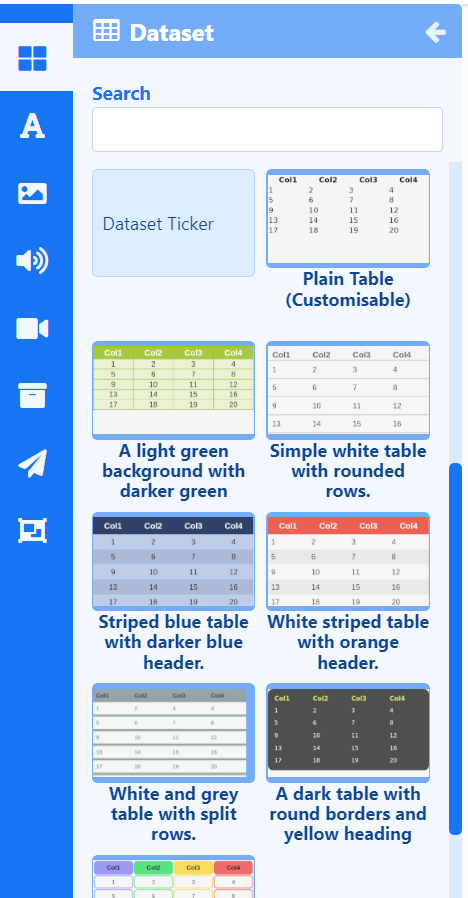

# DataSet

**Elements** を使用してレイアウト上の任意の場所に DataSet に保持されているデータを表示するか、**Static Templates** を含めてレイアウト/プレイリストにデータのティッカーとテーブルを表示します。

{feat}DataSets|v4{/feat}

DataSet ウィジェットは主に、構成されたエレメントと Static Templates にフィードする DataSet ソースで構成されます。

{tip}
[DataSet](media_datasets.html) は、レイアウト/プレイリストに DataSet ウィジェットを追加する前に作成して定義する必要があります。

{/tip}

## DataSet 要素

[Element](layouts_editor#content-data-widgets-and-elements) は、DataSet ウィジェットを [Layout](layouts_editor.html) に追加するときに選択できます。これにより、ユーザーは DataSet ウィジェットのどのコンポーネントを使用するか、どこに配置できるかをより細かく制御できます。

{tip}
DataSet に一致するフィールド タイプがない要素を使用しようとすると、プロパティ パネルにメッセージが表示されます。

{/tip}

各要素には、プロパティ パネルに一連の構成オプションがあります。レイアウトで使用される各要素の**構成**タブから、データ ソースとして使用するデータセットを選択する必要があります。追加された各要素に使用する [データ スロット](layouts_editor.html#content-data-slots) を指定して、アイテムの循環方法を制御します。[グローバル要素](layouts_editor.html#content-global-elements) を追加して図形やテキストを追加することで、データ要素をさらに補完できます。これらはすべて [要素グループ](layouts_editor.html#content-grouping-elements) にまとめることができ、構成と配置が簡単になります。

## データセットの静的テンプレート

[静的テンプレート](layouts_editor.html#content-static-templates) は、返されるデータのレイアウトとスタイル設定方法を定義し、事前にスタイル設定されたテンプレートを使用してデータを表示する簡単な方法です。

テンプレートは、返される結果の動作に影響を与えるように構成できるほか、プロパティ パネルのさまざまなオプションを使用してデザインの外観を変更することもできます。レイアウト/プレイリストに追加された各テンプレートの [構成] タブから、データ ソースとして使用するデータセットを選択する必要があります。

## 概要

- 基礎となる [データセット](media_datasets.html#content-adding-data-to-columns) データを編集して、新しいデータで要素とテンプレートを更新します。

- レイアウトやプレイリストにアクセスせずに、データセット ウィジェットのコンテンツを更新します。

- 任意の列で結果を並べ替えてフィルターします。

- アイテムをシャッフルして、ランダムな順序で再生します。

- このメディアのコンテンツは、オフライン再生用にプレーヤーによってキャッシュされます。

- プレーヤーがオフラインのときに「データなし」メッセージに切り替えるタイミングを決定するために、「鮮度チェック」を設定します。

