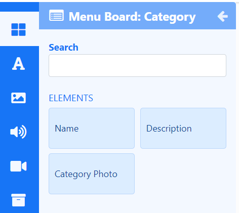

# メニュー ボード: カテゴリ

**要素** を使用して、レイアウト上の任意の場所にメニュー ボードに保持されているカテゴリのデータを表示します。

{feat}メニュー ボード: カテゴリ|v4{/feat}

メニュー ボード: カテゴリ ウィジェットは、主に、構成された要素にフィードするメニュー ボード ソースで構成されます。

{tip}
[メニュー ボード](media_menuboards.html) は、メニュー ボード: カテゴリ ウィジェットをレイアウトに追加する前に、定義済みのカテゴリを使用して作成する必要があります。
{/tip}

## カテゴリ要素

[レイアウト](layouts_editor.html) にメニュー ボード: カテゴリ ウィジェットを追加するときに [要素](layouts_editor#content-data-widgets-and-elements) を選択でき、ユーザーはメニュー ボード カテゴリのどのコンポーネントを使用するか、どこに配置できるかをより細かく制御できます。

各要素には、プロパティ パネルに一連の構成オプションがあります。レイアウトで使用される各要素の [構成] タブから、データ ソースとして使用するメニュー ボードを選択する必要があります。追加された各要素に使用する [データ スロット](layouts_editor.html#content-data-slots) を指定して、アイテムの循環方法を制御します。データ要素は、[グローバル要素](layouts_editor.html#content-global-elements) を追加して図形やテキストを追加することでさらに補完できます。これらはすべて [要素グループ](layouts_editor.html#content-grouping-elements) にまとめられ、構成や配置が簡単になります。

## 概要

- 基礎となる [メニュー ボード](media_menuboards.html#content-create-and-configure-categories) データを編集して、新しいカテゴリ データで要素を更新します。
- レイアウトにアクセスせずに、メニュー ボード: カテゴリ ウィジェット コンテンツを更新します。
- このメディアのコンテンツは、オフライン再生用にプレーヤーによってキャッシュされます。
- [メニュー ボード: 製品](media_module_menuboards_products.html) ウィジェットとともに使用して、ディスプレイに表示するカテゴリのアイテムのメニュー/カタログを簡単に作成します。

#### 次へ...

[メニューボード: 製品](media_module_menuboards_products.html)