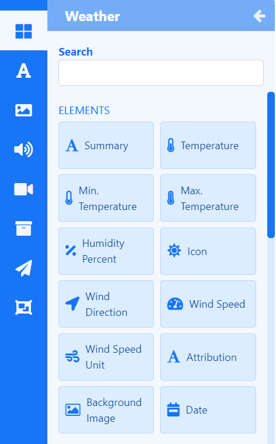

# 天気

**Element** を使用してレイアウトの任意の場所に毎日の天気予報データを表示するか、**Static Template** を選択してレイアウト/プレイリストに結果を表示します。

{feat}Weather|v4{/feat}

天気データは [OpenWeather](https://openweathermap.org/) によって提供され、[CC-BY-SA](https://creativecommons.org/licenses/by-sa/4.0/) および [ODbL](https://opendatacommons.org/licenses/odbl/) に基づいて提供されます。これらは、構成された要素と静的テンプレートに取り込まれる、現在の世界中の毎日の天気予報を提供します。

{tip}

API の変更に対応するため、v3.2.1 以降の CMS を使用していることを確認してください。

[Open Weather Map](https://openweathermap.org/api) にアクセスしてアカウントを作成し、Open Weather [Connector](media_modules.html#content-connectors) に入力するための API キーを取得してください。

**注:** Open Weather の One Call 3.0 のリリース以降、新規ユーザーは、無料の x 回の呼び出しキーを使用するためにクレジットカードの詳細を入力するか、有料サブスクリプションを選択する必要があります。

Open Weather Map では、1 日あたり 1,000 件の予報リクエストが許可され、それ以降のリクエストには少額の料金が課金されます。

**有料プラン** では、16 日間の予報が利用できるほか、データの取得方法も最適化されます。

{/tip}

{noncloud}
{version}
現在 One Call API 2.5 を使用している既存のユーザーは、このサービスを引き続き使用するには One Call API 3.0 に移行する必要があります。 One Call 2.5 へのアクセスは、2024 年 6 月以降はできなくなります。移行方法の詳細については、[こちら](https://openweathermap.org/one-call-transfer) をご覧ください。

新しいキーに移行した後は、**モジュール** ページの行メニューを使用して、天気のキャッシュを必ずクリアしてください。

{/version}
{/noncloud}

{nonwhite}
{cloud}
天気モジュールは、サービスの一部として提供される API キーを使用して、**Xibo Cloud** ホストの顧客向けに構成されています。

{/cloud}
{/nonwhite}

このウィジェットを使用する前に、Open Weather Map の利用規約 (https://openweathermap.org/terms) を読んで理解する必要があります。

## 天気要素

[レイアウト](layouts_editor#content-data-widgets-and-elements) は、天気ウィジェットを [レイアウト](layouts_editor.html) に追加するときに選択できます。これにより、ユーザーは天気ウィジェットのどのコンポーネントを使用するか、どこに配置できるかをより細かく制御できます。

各要素には、プロパティ パネルに構成オプションのセットがあります。地理的な場所と単位を入力すると、[**構成**] タブから結果が返されます。

追加された各要素に使用する [データ スロット](layouts_editor.html#content-data-slots) を指定して、アイテムの循環方法を制御します。データ要素は、[グローバル要素](layouts_editor.html#content-global-elements)を追加して図形やテキストを追加することでさらに補完できます。これらはすべて[要素グループ](layouts_editor.html#content-grouping-elements)にまとめられ、構成や配置が簡単になります。

{tip}
天気ウィジェットを使用するすべてのレイアウトには、属性を含める必要があります。属性は、属性要素を使用して利用できます。静的テンプレートには、デフォルトでこのタグが含まれています。
{/tip}

## 天気静的テンプレート

[静的テンプレート](layouts_editor.html#content-static-templates)は、返される結果のレイアウトとスタイルを定義するもので、事前にスタイル設定されたテンプレートを使用してデータを表示する簡単な方法です。

プロパティ パネルのさまざまなオプションを使用して、テンプレートを構成してデザインの外観を変更できます。レイアウト/プレイリストに追加された各テンプレートの**構成**タブから結果を返すには、地理的な場所と単位を入力します。

## 概要

- 表示場所に基づいて結果を返します。
- 使用する測定単位を地理的な場所に基づいて自動的に設定します。
- 表示場所に基づいて天気予報を自動的に選択します。
- 使用する言語を指定します。
- 日中の天気状況のみを表示するように選択します。
- 背景画像を[ライブラリ](media_library.html)の画像に置き換えます。
- このメディアのデータは、オフライン再生用にプレーヤーによってキャッシュされます。
