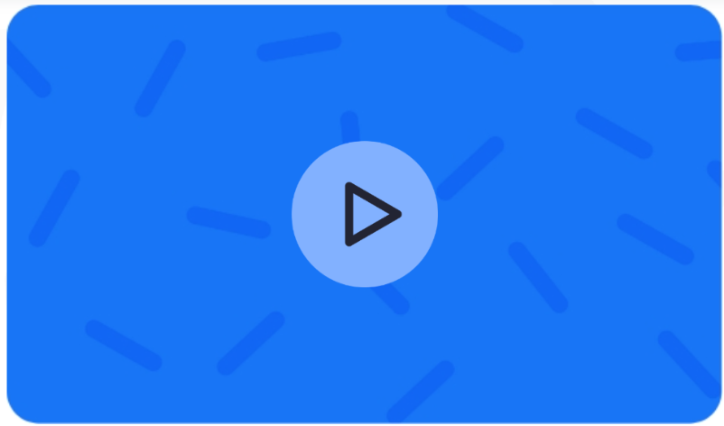
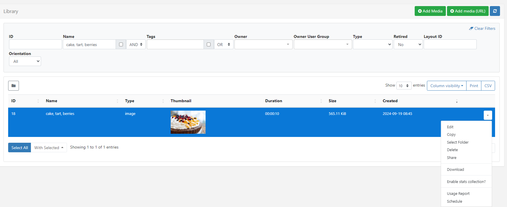

# 画面に画像/ビデオを表示する

## はじめに

**メディア ライブラリ** を使用すると、**画像** および **ビデオ** ファイルを簡単にアップロードして、画面に表示するようにスケジュール設定できます。

Xibo 以外で作成された画像/ビデオ コンテンツ (代理店、マーケティング チームなどによって作成されたもの) があり、すぐに表示できる状態になっている場合があります。以下のガイダンスに従って、画像/ビデオ ファイルをディスプレイに **アップロード**、**構成**、**スケジュール** する方法を、わずか数ステップで確認してください。

{nonwhite}
この短い動画で、プロセスについてご説明します:

{/nonwhite}

### アップロード

- メイン CMS メニューの [**ライブラリ**] セクションの [**メディア**] をクリックします。
- [**メディアの追加**] ボタンをクリックします。
- [**ファイルの追加**] を選択し、アップロードする画像/ビデオ ファイルを選択します。
- 元のファイル名を使用しない場合は、ここで [**名前**] を追加します。
- [**アップロードを開始**] をクリックします。

- アップロードが完了したら、[**完了**] をクリックします。

### 構成

- 必要に応じて、[**メディア**] グリッドからフィルターを使用して、アップロードしたファイルを見つけやすくします。
- 行メニューを使用して、**スケジュール** を選択します:

**メディアの選択** フォームが開き、必要に応じてさらにオプションの構成を行うことができます:

**ループ内の期間** は、**スケジュール ループ** に表示されるたびにこのメディアが表示される時間を決定します。

- メディア ファイルの期間を上書きするには、**期間** を指定します。

- 使用する特定の **解像度** を選択します。
- メディア ファイルが画面に収まらない場合は、背景のギャップを埋めるために **色** を設定します。
- **保存** をクリックして、**メディアの選択フォーム** を閉じ、スケジュール設定を続行します。

### スケジュール

**イベントのスケジュール** フォームのフィールドに入力します:

- 完全なスケジュール リストを見るときに簡単に識別できる **名前** をイベントに付けます。

- このメディアを表示する **ディスプレイ** を選択します。

- 特定の開始日時と終了日時を設定するには **カスタム** を選択し、メディアを常にディスプレイに表示するには **常時** を選択します。

- **保存** をクリックします。

CMS はプレーヤーのスケジュール変更を更新し、スケジュールで設定されたタイミングでメディア コンテンツが画面に表示されます。

## 詳細情報 

[シンプルなスケジュール設定](scheduling_events.html) 

[レイアウト エディターを使用して独自のコンテンツを作成する](layouts_editor.html) 

## FAQ

**スケジュール ループ** とは何ですか? 

スケジュール ループとは、他のメディア コンテンツとスケジュールを組んだときにメディア コンテンツが再生される方法です。たとえば、それぞれ 10 秒間の再生時間を持つ 2 つのメディア アイテムを 1 時間同時に表示するようにスケジュールした場合、スケジュールされた時間に両方のアイテムが 10 秒間公平にローテーションして再生されます。

スケジュールから **常時イベント** を削除するにはどうすればよいですか?

スケジュールから、グリッド ビューのイベントの行メニューを使用して [削除] を選択するか、カレンダーからイベント アイコンをクリックして [イベント編集] フォームを開き、[削除] を選択します。