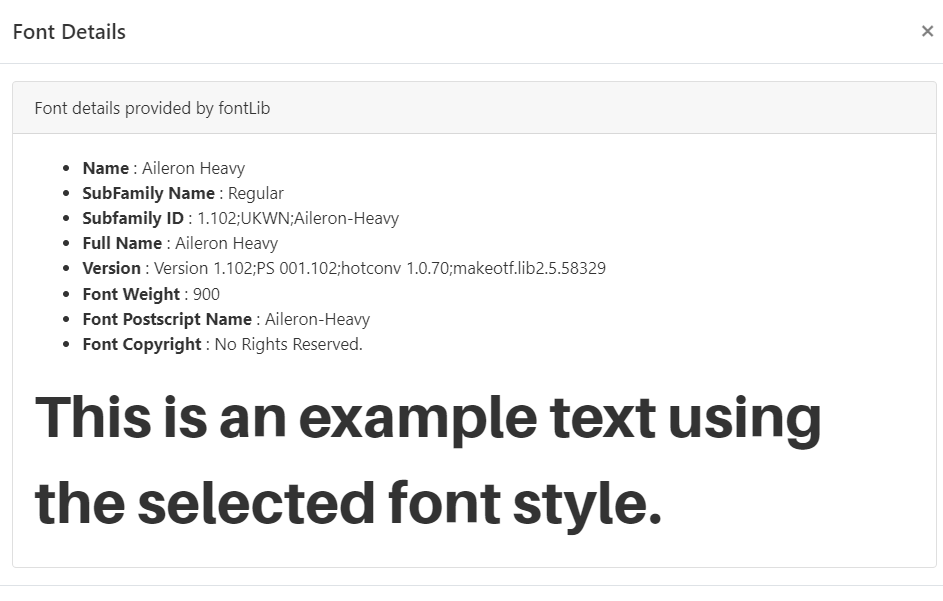

# CMS 管理者設定

{nonwhite}
CMS をインストールしたら、すべての機能を有効にするために追加の設定が必要です。次のガイダンスを参照してください: [CMS インストール後の設定](/docs/setup/xibo-cms-post-installation-setup-guide.html)
{/nonwhite}

他の複雑なアプリケーションと同様に、[[PRODUCTNAME]] CMS には多数の構成可能なオプションが付属しています。これらは、メイン CMS メニューの **管理** セクションの **設定** ページにあります。

{nonwhite}
{cloud}
**Xibo Cloud** でホストされているお客様の場合、これらのフィールドの一部はサービスの一部として事前に入力されています。一部は変更できますが、他のフィールドは編集できないようにロックされています。詳細については、次のページを参照してください: [Xibo Cloud CMS のデフォルトと制限](/docs/setup/xibo-in-the-cloud.html#content-xibo-cloud-cms-defaults-and-restrictions)。
設定は関連するカテゴリのタブに分かれています:
{/cloud}
{/nonwhite}

設定は関連するカテゴリのタブに分割されています。

## 構成

このタブでは、**CMS シークレット キー** を表示します。これは、CMS でプレーヤーを認証し、ページに **テーマ** を適用 (該当する場合) するために使用されるほか、[ナビゲーション メニュー](tour_cms_navigation.html) のデフォルトの位置を設定します。

## デフォルト

このタブを使用して、すべての [メディア](media_library.html) ファイルにデフォルトを適用し、デフォルトの [トランジション](tour_transitions.html) を設定します。

また、この設定のチェックボックスをオンにすると、最後に記録された編集から 30 分後にレイアウトを **自動的に公開** するように設定できます。

### 画像のサイズ変更

デフォルトのしきい値と制限を指定でき、画像のサイズを変更する必要があるときに考慮されます。これは、画像をアップロードする場合や、ウィジェットによってダウンロードされる画像 (ティッカー ウィジェット内の NASA RSS など) の場合に発生することがあります。

- #### サイズ変更しきい値

画像のサイズ変更に考慮する最大しきい値 (最長辺に基づく) を設定します。

{tip}
サイズ変更しきい値を 1920 に設定し、800 の画像をアップロード/ダウンロードした場合、この画像はサイズ変更の必要がありません。2400 の画像をアップロード/ダウンロードした場合、1920 にサイズ変更されます。
{/tip}

- #### サイズ変更制限

アップロード/ダウンロードされる画像の制限 (最長辺に基づく) を設定します。この制限を超える画像は処理されず、制限内の別の画像に置き換えられます。

この設定により、画像ファイルが処理するには大きすぎるかどうかが決定されます。

- #### DataSet の最大行数

ユーザーが DataSet に作成できる最大行数を設定します。

{nonwhite}
{cloud}

クラウド カスタマーのデフォルトは、DataSet あたり 10,000 行に設定されています。

{/cloud}
{/nonwhite}

## **ディスプレイ**

CMS 全体のすべての地理認識プレビューの **緯度** と **経度** のデフォルトを設定します。

### デフォルト レイアウト

ここで設定したデフォルト レイアウトは、他のコンテンツがスケジュールされていない場合、またはスケジュールされたイベントが表示されない場合に表示されるすべてのディスプレイに自動的に割り当てられます。

{nonwhite}
{tip}
独自のレイアウトを作成して、事前設定されたデフォルトを置き換えることができますが、複雑なメディアや Web コンテンツを使用せず、デザインをシンプルに保つ必要があることに注意してください。
{/tip}
{/nonwhite}

このグローバル デフォルト レイアウトは、別の [デフォルト レイアウト](displays.html#content-default-layout) を選択して、個々のディスプレイで上書きできます。

### 再生証明のデフォルト設定

すべての **レイアウト** / **メディア** および **ウィジェット アイテム** にデフォルトで適用される [再生証明](displays_metrics.html) 統計の収集の **集約レベル** を設定します。

- **個別** - 統計は各アイテムの開始時と終了時に個別に記録され、各収集間隔で CMS に返されます。

- **時間ごと** - 各アイテムを 1 回記録し、1 時間中の再生回数と再生時間の合計を含め、1 時間の期間が経過した後の次の収集間隔で CMS に返されます。
- **毎日** - 各アイテムを 1 回記録し、その日のプレイ回数とプレイ時間の合計が記録され、その日の終了後の次の収集間隔で CMS に返されます。

{tip}
プレーヤーは「完了した記録」のみを集計し、ウィジェットの有効期間の終了時に収集が行われるため、ウィジェットの有効期間が 3 時間の場合、ウィジェットの有効期間が切れると統計が記録されます。

{/tip}

- このボックスを使用して、デフォルトですべての **ディスプレイ** への Proof of Play 統計の収集を **有効** にします。

{tip}
[ディスプレイ設定プロファイル](displays_settings.html#content-editing-profiles) を編集することで、オン/オフを切り替えることができます。

{/tip}

- 新しく追加されたすべての **レイアウト** の Proof of Play 統計の収集をデフォルトでオンに設定するには、ボックスにチェックを入れます。

{tip}
**レイアウトの追加/編集** フォームのボックスのチェックを外すと、収集を無効にすることができます。
{/tip}

設定を使用して、再生証明統計の収集をすべての **メディア**、**プレイリスト**、**ウィジェット** (オフ/オン/継承) に適用できるようにします。

{tip}
**ウィジェット** は常に継承に設定して、レイアウトとメディアのオプションで収集を制御するように意図されています。
{/tip}

## 全般

**ユーザー マニュアル** のアドレスを表示/設定し、ソフトウェアの改善に役立つ **匿名統計** を送信するようにチェックを入れます。

### 整理されたライブラリ (グローバル)

ライブラリは、スーパー管理者またはユーザーが *整理* して、すっきりと小さく保つことができます。
**アクションを元に戻すことはできないため、注意して使用する必要があります。**

{tip}
これは、クォータのある Web サーバーに CMS がインストールされている場合、またはユーザーに独自のクォータが割り当てられている場合に特に重要です。
{/tip}

管理者は、設定ページの右隅にある **ライブラリの整理** ボタンをクリックして、システム全体のライブラリ整理操作を開始できます。

この機能はシステム全体に適用され、**すべての** ユーザー ファイルに対して実行されるため、未使用のリビジョンや古いリビジョンを削除するには確認が必要です。

このオプションはより包括的で、次のものを削除します:

- 一時ファイル
- 孤立ファイル
- サムネイル
- どこでも使用されていないメディア リビジョン
- どこでも使用されていないメディア (レイアウト / 表示グループ / 表示)
- CMS にアップロードされた汎用ファイル

#### 孤立ファイル

孤立ファイルはまれに発生するもので、メディア アイテムがライブラリから削除されたときに、ライブラリ フォルダー内のディスクに保存されているファイルが削除されません。つまり、ファイルは存在しますが、CMS はそれについて何も認識していません。

### ユーザー ライブラリからの整理

{nonwhite}
{cloud}
**Xibo Cloud Hosting** のお客様では、オプションを完全に理解していないと破壊的な結果になる可能性があるため、整理ライブラリ機能はデフォルトでオフになっています。
{/cloud}
{/nonwhite}

**ライブラリ整理を有効にする**チェックボックスを使用して、ユーザーが[ライブラリ](media_library.html#content-tidy-library)ページからファイルを整理できるようにします。

## メンテナンス

ここから**メンテナンスを有効にする**と**メールアラート**を送信し、**ログ**と**統計**の最大保存期間を設定します。

## ネットワーク

[ネットワーク]タブで、全体のCMS管理者の**管理者メール アドレス**を入力します。CMSによって生成されたすべてのメール通知はこのアドレスに送信されます。

CMS全体でさらにメール通知を設定する前に、**送信メール アドレス**と**名前**が入力されていることを確認してください。

{nonwhite}
{noncloud}
プロキシ サーバー情報を指定し（CMSがプロキシの背後にある場合）、**HTTPS**を強制し、毎月の**帯域幅**と**ライブラリ**のサイズ制限を設定することもできます。
{/noncloud}
{/nonwhite}

## 共有

ドロップダウンを使用して、ユーザーのプレイリストでウィジェットの色がどのように表示されるかを変更します。

- **メディアの色付け** では、各ウィジェットの **テーマ** の色が使用されます。

- **共有の色付け** では、**共有** オプションの **ユーザー アクセス** に基づいてウィジェットの色が表示されます。(緑 = 編集可能)

ここから、ユーザーが [共有](users_features_and_sharing.html#content-2-share) オプションがユーザーの [表示] に設定されている場合に表示をスケジュールできるかどうかを設定できます。また、ユーザーが共有されていないスケジュールのレイアウトの名前を表示できるかどうかも設定できます。

ユーザーがコンテンツを最上位の [ルート フォルダー](tour_folders.html) に保存できるようにするにはチェックを入れ、保存先のフォルダーをユーザーが選択するようにするには無効にします。

## 地域

このタブから、CMS 全体で使用する **言語** とデフォルトの **タイムゾーン** および **日付形式** を設定します。

{tip}
タイムゾーン内の最も近い主要都市を選択してください。

{/tip}

チェックボックスを使用して、CMS で使用する **ブラウザ言語** を検出し、使用する **カレンダー** の種類を選択します。

## トラブルシューティング

このタブは、php エラーや環境の問題をキャプチャするのに役立つログ レベルを設定するために使用されます。

## ユーザー

新しいユーザーをオンボーディングするときに、システム ユーザーを選択し、デフォルトのユーザー グループとユーザー タイプを設定します。

{tip}
**デフォルトのユーザー タイプ** は **ユーザー** に設定することをお勧めします。

{/tip}

### パスワード ポリシー

**パスワード ポリシーの正規表現** フィールドに有効な正規表現を入力すると、すべてのパスワード変更リクエストと新しく作成されたパスワードがこれに対してテストされます。

{tip}
パスワードが必要なポリシーを満たしていない場合、プロンプトとしてテキストの説明が表示されます。

{/tip}

{nonwhite}
{cloud}
[Xibo Cloud Hosting](/hosting) のお客様には、少なくとも 10 文字のパスワードを必要とする **デフォルト ポリシー** が設定されています。

{/cloud}
{/nonwhite}

### パスワード リマインダー

**ユーザー**がログイン時に **パスワードを忘れた場合** のリセット リンクを提供できるようにすると、CMS へのアクセスを簡単に回復できます。

{tip}
この機能を有効にする前に、**ネットワーク** タブに有効な **送信メール アドレス** が入力されていることを確認してください。

{/tip}

ユーザーにはリンクが表示され、それをクリックすると、ユーザー プロファイルに記録されているメール アドレスに **パスワード リセット通知** が送信されます。

{tip}
**ユーザー**は、CMSにログインしたら、[ユーザー プロファイル](tour_user_access.html#content-edit-profile)から自分のパスワードを変更することもできます。
{/tip}

## 2要素認証

[2要素認証](tour_user_access.html#content-two-factor-authentication)は、ログイン後のセキュリティを強化するためにユーザーが設定できます。

設定が完了すると、ユーザーは、CMSにアクセスするためにログインを完了するために、メールで送信されたコードまたはGoogle Authenticatorアプリに表示されたコードを入力する必要があります。

{tip}
生成されたメールを受信するために、ユーザーがメール アドレスを提供していることを確認してください。
{/tip}

有効な**送信メール アドレス**が**ネットワーク**タブに入力され、**2要素発行者**フィールドに名前が入力されていることを設定して、CMSへのログイン用に認証コードが生成されたときにGoogle Authenticatorアプリとメールで明確にわかるようにします。

ユーザーのユーザー プロファイルから [2 要素認証をリセット](users_administration.html#content-reset-two-factor-authentication) します。

## アプリケーション

[[PRODUCTNAME]] には、サードパーティ アプリケーションが接続してデータを使用できる API が含まれています。

アプリケーションは、メイン CMS メニューの [**管理**] セクションの [**アプリケーション**] から追加および構成されます。

{tip}

アプリケーションを使用する前に、各ユーザーは CMS 内でアプリケーションがユーザーに代わって動作することを承認する必要があります。

ユーザーは、**ユーザー プロファイル** の [マイ アプリケーション](tour_user_access.html#content-my-applications) セクションから承認されたアプリケーションを表示できます。
{/tip}

現時点では、CMS は個々のユーザーにアプリケーションへのアクセスを取り消す方法を提供していません。管理者だけがアプリケーションを完全に削除できます。

## フォント

[[PRODUCTNAME]] には、多くのウィジェットに設定できる標準フォントのセットが付属しています:

- Aileron Heavy Regular (Aileron-Heavy.otf)
- Aileron Regular (Aileron-Regular.otf)
- Dancing Script Regular (DancingScript-Regular.ttf)
- Railway Regular (Railway.ttf)
- Linear Regular (linear-by-braydon-fuller.otf)

{version}
**重要:** 多くのウィジェットで、**Font Family** というプロパティまたはビジュアル エディターの **Font** 選択リストを使用して、カスタム フォントを設定できます。フォントが選択されていない場合、プレーヤーはシステム フォントと呼ばれる独自のデフォルトの「サンセリフ」フォントを表示します。たとえば、Android では通常 Roboto です。

プレーヤーに異なるフォントが表示されないように、利用可能なフォントを常に選択することをお勧めします。{/version}

メイン CMS メニューの [**管理**] セクションの [**フォント**] ページから管理します。

- 行メニューを使用してフォントの **詳細** を表示し、フォント スタイルの例を確認します:

追加のフォントは、[**フォントのアップロード**] ボタンをクリックし、ファイル アップローダー ツールを使用して追加できます。

{tip}
アップロード後に新しいフォントがテキスト エディターに表示されない場合は、ブラウザーのキャッシュをクリアしてみてください。

{/tip}

{version}
**注:** フォントには、**OS/2 タグ** と呼ばれる設定が組み込まれています。[[PRODUCTNAME]] は OS/2 設定をチェックし、**OS/2 タグ 0 または 8 のフォント** を使用できます。

他の OS/2 タグのフォントはアップロード時にエラーが発生し、正しく表示されない場合があります。

{/version}

#### 次へ...

### 管理設定の詳細

**管理** 設定の詳細については、次のページを参照してください:

- [ユーザー管理](users_administration.html)
- [ユーザー グループ](users_groups.html)
- [モジュール](media_modules.html)
- [トランジション](tour_transitions.html)
- [タグ](tour_tags.html)
- [フォルダー](tour_folders.html#content-folder-management)

