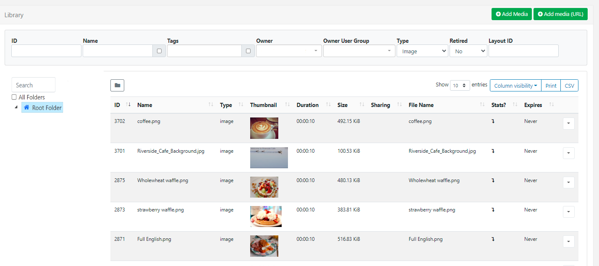
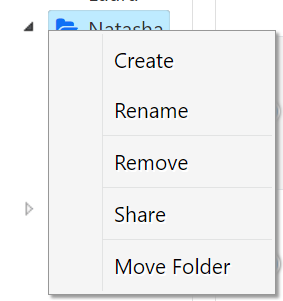
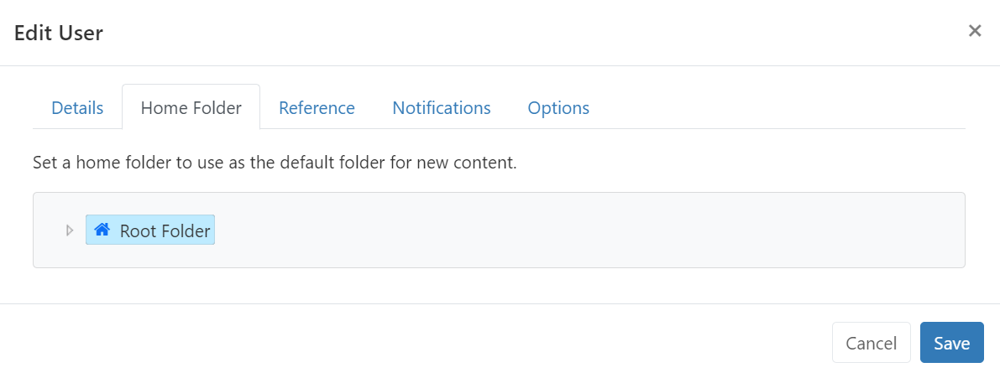
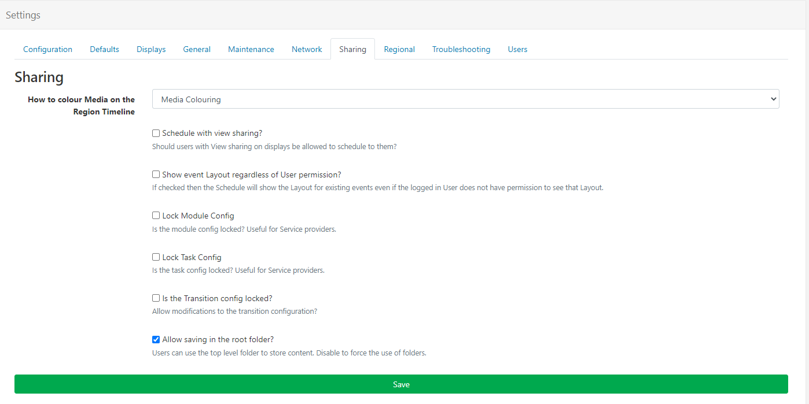
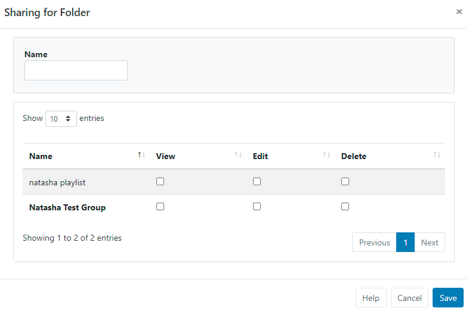
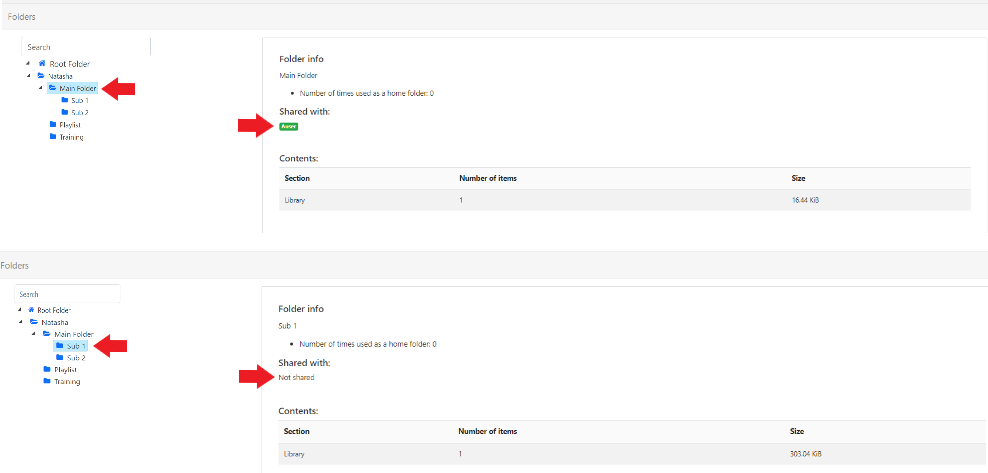
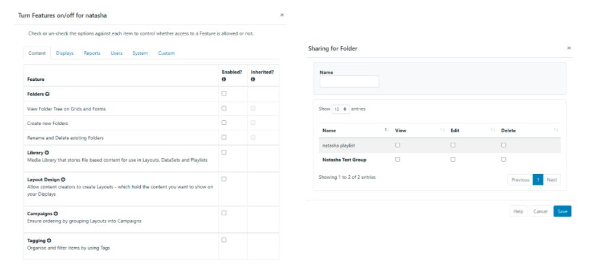

# フォルダー

**フォルダー** は CMS 全体で使用でき、特定のフォルダー内に保持されているすべてのアイテムのユーザー/ユーザー グループの [共有](users_features_and_sharing.html) オプションを簡単に制御できます。フォルダーは、CMS 内でユーザー オブジェクトを整理および検索するための追加の方法も提供します。

## 機能の概要

- フォルダーに保存されているすべてのユーザー オブジェクトの表示/編集/削除アクセスを簡単に制御および維持します。
- CMS 全体で使用されます。
- オンボーディング ウィザードから新しいユーザーにフォルダーを割り当てます。
- ユーザーのホーム フォルダーを設定します。
- 選択したフォルダーに強制的に保存します。
- フォルダ オプションへのユーザー アクセスを制御します。
- 管理を容易にする専用のフォルダ ページ。

### フォルダ検索

CMS 全体の複数のグリッドから利用できます。フォルダ ツリーはデフォルトで最初に開き、フォルダ アイコンをクリックして表示をオフにできます。

フォルダが選択されると、グリッドが更新され、フォルダ内のオブジェクトのみが表示されます。

{tip}
ルート フォルダで検索を含めるには、[**すべてのフォルダ**] チェック ボックスを使用します。

{/tip}

ユーザーは [ホーム フォルダ](/manual/en/tour_folders.html#content-home-folder) (家のアイコンで示されます) を設定できます。これにより、自分のメディア、レイアウト、スケジュールなどに完全にアクセスでき、他のすべての「共有」フォルダ コンテンツにもアクセスできます。

{tip} 
フォルダーの表示をオフにすると、選択したフォルダーのファイル パスが表示されるので、どこを見ているのか常に把握できます。

{/tip}

### フォルダーへの保存

アイテムは、**追加**/**編集** フォームから、またはアイテム行メニューから **フォルダーの選択** を使用してフォルダー ツリーを開くことで、フォルダーに保存できます。

{tip}
すでにフォルダーが選択されている場合は、追加フォームで追加されたユーザー オブジェクト (レイアウト、キャンペーン、メディア ファイルなど) は、その選択したフォルダーに保存されます。

{/tip}

### フォルダーの移動と結合

フォルダーを別のフォルダーの場所に移動して、サブフォルダーとして追加できます。

- **フォルダー** を選択します。
- 右クリックして **移動** を選択します。
- 移動先のフォルダーの宛先を強調表示します。
- **保存**

フォルダーとそれに含まれるサブフォルダーは、元のフォルダー構造を維持しながら、新しいフォルダーの場所内で新しいサブフォルダーとして移動されます。

また、**マージ** オプションを選択して、元のフォルダの内容をメインのフォルダの場所に追加し、元のフォルダをフォルダ ツリーから削除することもできます。

{version}
**注意:** 共有オプションが設定されていないフォルダを移動すると、移動先のフォルダに適用されている共有オプションが継承されます。

{/version}

## フォルダ管理

**フォルダ** ページは、メインの CMS メニューの **管理** セクションにあり、スーパー管理者はフォルダのすべての側面を管理できます (フォルダを右クリックしてコンテキスト メニューにアクセスします)。また、共有相手やその内容の内訳など、フォルダに関する詳細情報を表示できます。

### フォルダの作成

**ライブラリ メディア**、**データセット**、**プレイリスト**、**レイアウト**、**キャンペーン**、**テンプレート**、**ディスプレイ**、**ディスプレイ グループ** を格納するフォルダを作成します。これらのフォルダは、**フォルダ** アイコンをクリックしてフォルダ ツリーを開き、複数の [グリッド](tour_cms_navigation.html#content-grids) からアクセスできます。

- **ルート フォルダ** を右クリックし、[作成] を選択してツリーに新しいフォルダを追加します。

{tip}
ルート フォルダの下にフォルダを作成できるのは、スーパー管理者ユーザーのみです。ユーザーには、[機能](/manual/en/users_features_and_sharing.html) アクセス権を付与して、アクセス権が付与されている親フォルダの下にサブフォルダを作成できます。

{/tip}

- サブフォルダの**作成**、**名前の変更**、**削除**、**共有**、[フォルダの移動](/manual/en/tour_folders.html#content-move-and-merge-folders) などのメニュー オプションも用意されています:

{tip}
削除できるのは空のフォルダのみです! 

{/tip}

### ホーム フォルダ

管理者は、ユーザーにユーザー グループを割り当て、フォルダ共有を使用してこれらのユーザーに互いのコンテンツへの適切なアクセス権を付与することをお勧めします (表示/編集/削除オプションを設定できます)。

{tip}
ホーム フォルダは、[新しいユーザーのオンボーディング](/manual/en/users_administration.html#content-adding-users-to-the-cms) 時に割り当てることができます。
{/tip}

ユーザーは、フォルダ ツリーからいつでもホーム フォルダとルート フォルダを選択できます。

{tip}
ユーザーは、**すべてのフォルダ** を選択することで、自分が所有するオブジェクトを表示/編集および削除できます。表示できないフォルダにいる場合でも同様です。
逆に、直接/フォルダ共有によって共有されていない限り、ユーザーは他のユーザーのオブジェクトを表示/編集または削除できません。
{/tip}

ユーザーのホーム フォルダは、フォルダ ツリーに家のアイコンで表示されます。フォルダが選択されていない場合、またはフォルダ機能が無効になっている場合、新しいコンテンツは自動的にホーム フォルダに保存されます。

{tip}
グループ管理者にユーザーのホーム フォルダの設定を義務付ける場合は、適切な [機能](/manual/en/users_features_and_sharing.html) が有効になっていることを確認してください。
{/tip}

#### ユーザーにホーム フォルダを割り当てる (管理者 / グループ管理者)

既存のユーザーの場合:

- メイン CMS メニューの [**管理**] セクションの [**ユーザー**] に移動します。
- ユーザーの行メニューを使用して [**編集**] を選択します。
- [**ホーム フォルダ**] タブをクリックします:

- 使用するフォルダを選択するか、ルート フォルダを右クリックして新しいフォルダを作成します。

{tip}
新しいフォルダを作成する場合は、[フォルダ](tour_folders.html#content-folder-management) ページから正しい共有の表示/編集/削除オプションが適用されていることを確認してください。
{/tip}

ホーム フォルダが割り当てられたユーザーは、自分のメディア、レイアウト、スケジュールなどに完全にアクセスでき、ホーム フォルダに設定された共有オプションに従って他のすべてのフォルダ コンテンツにアクセスできます。

{tip}
ユーザーにホーム フォルダを割り当て、フォルダを [機能](/manual/en/users_features_and_sharing.html) として無効にすることができます。その場合、ユーザーは CMS でフォルダを表示したり操作したりしなくても、デフォルトのホーム フォルダの場所に自動的に保存します。
{/tip}

### フォルダへの強制保存

スーパー管理者は、ユーザーがルート フォルダに保存できないようにして、保存前にフォルダを選択するように強制できます。
まず、ルート フォルダをデフォルトで使用しないようにします。

- メイン CMS メニューの [**管理**] セクションの [**設定**] に移動します。
- [**共有**] タブをクリックします。

- [**ルート フォルダへの保存を許可する**] オプションのチェックを外します。
- 下部の [**保存**] ボタンをクリックします。

### 共有オプション

ユーザーが他のユーザーのコンテンツを表示するには、そのコンテンツが共有されている必要があります (直接共有 - 個々のアイテムを共有する必要があります)。また、フォルダーが共有されている場合は、他のユーザーのコンテンツも表示できます (フォルダー共有 - 複数のアイテムが共有オプションを継承します)。

各フォルダーでは、メニューから [**共有**] をクリックすることで、ユーザー/ユーザー グループに対して [共有オプション](users_features_and_sharing.html#content-set-share-options-on-objects) を設定できます。

{tip}
フォルダの**共有**オプションは、スーパー管理者ユーザーのみが設定できます。

{/tip}

- ユーザーとユーザー グループの一覧から選択し (ユーザー グループは**太字**で表示されます)、選択したフォルダに必要な**表示**、**編集**、**削除**オプションを割り当てます。

フォルダの共有オプションが設定されると、そのフォルダに含まれるか、そのフォルダに移動されたすべてのオブジェクトは、ユーザー/ユーザー グループに対して有効になっている表示、編集、削除オプションを継承します。

{tip}
新規ユーザーは、オンボーディング ウィザードに従って [ユーザーの追加](users_administration.html#content-onboarding-wizard) を行うことで、最初から**フォルダ**を割り当てることができます。

{/tip}

**注意:** メイン フォルダに追加されたサブフォルダは、メイン フォルダから適用された共有オプションを継承します。サブフォルダを表示すると、直接割り当てられた共有オプションのみが表示され、継承されたオプションは表示されません。

上記のように:

- メインフォルダは `Auser` と共有されます。
- サブ 1 はメインフォルダから継承されるため、`Auser` とも共有されます。
- サブ 1 には直接適用された共有オプションがないため、`Not Shared` が表示されます。

### フォルダ メニュー オプション
[機能と共有](users_features_and_sharing.html) オプションを使用して、他のユーザー/ユーザー グループに必要なフォルダ メニューのアクセスを制御します。

**フォルダ メニューで作成にアクセスする必要があるユーザーの場合:**

1. フォルダ機能セットのコンテンツ タブから、**ユーザーにサブフォルダの作成を許可する...** を有効にします。

1. ユーザー/ユーザー グループによってサブフォルダを作成できる親フォルダの **共有オプション** から **表示** を有効にします。

{tip}
ルート フォルダの下にフォルダを作成できるのは、スーパー管理者ユーザーのみです。

{/tip}

**フォルダ メニューで名前の変更にアクセスする必要があるユーザーの場合:**

1. フォルダ機能セットのコンテンツ タブから、**既存のフォルダの名前の変更と削除** を有効にします。
2. ユーザー/ユーザー グループが名前を変更できるフォルダーの **共有オプション** から **編集** を有効にします。

**フォルダー メニューの削除にアクセスする必要があるユーザーの場合:**
1. フォルダー機能セットのコンテンツ タブから **既存のフォルダーの名前変更と削除** を有効にします。
2. ユーザー/ユーザー グループが削除できるフォルダーの **共有オプション** から **削除** を有効にします。
