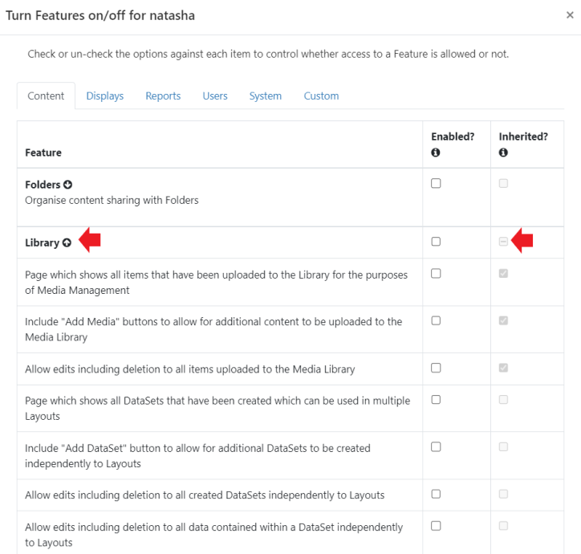

# 機能と共有

すべてのシステム オブジェクトとユーザー オブジェクトの CMS へのアクセスは、次の 2 つの概念を使用してユーザー/ユーザー グループに対して制御されます:

- **機能** - CMS 内でユーザーが表示および実行できる内容を制御します (システム オブジェクト)
- **共有** - フォルダー、メディア、レイアウト、ディスプレイ/ディスプレイ グループなどのユーザー オブジェクトの表示、編集、および削除オプションを制御します (ユーザー オブジェクト)

これらの概念を組み合わせて使用すると、適切なレベルのユーザー インタラクションが適用され、CMS の関連部分のみがユーザー/ユーザー グループに表示されるようになります。

## 機能

機能は、ページとページ機能を制限して (ユーザーが CMS で表示および実行できる内容を制御して)、CMS 内でユーザーに必要なアクセスを設定するために使用されます。

{tip}
**推奨** : CMS 内の複数のユーザーに必要な機能アクセスを設定するには、ユーザー グループを利用し、その後、このグループにユーザーを追加して、有効な機能を継承することで、エラーが少なく、より簡単で安全なワークフローを実現します。

ユーザー グループ内の特定のユーザーにさらにアクセスを許可する必要がある場合は、これらをユーザーに直接割り当てます。
ヒント}

- 機能は、[ユーザー](users_administration.html) または [ユーザー グループ](users_groups.html) の行メニューから構成されます:

機能は論理タブにグループ化されており、適切なアクセス領域を簡単に制御できます:

**ユーザー** を表示すると、機能が既存の **ユーザー グループ** メンバーシップから継承されているかどうかを示す **継承済み** 列が表示されます。

機能の列に表示される `-` は、その機能セット内の選択された機能のみが有効になっていることを示します。矢印を使用して機能を展開すると、セット内で利用可能なすべての機能が表示されます。

チェックマークは、そのセット内のすべての機能が有効になっていることを示します。

- ユーザー/ユーザー グループに必要な機能をオンにするには、[有効] 列をクリックします。

{tip}
定義済みの [ユーザー グループ](users_groups.html) を使用すると、新しいユーザーのオンボードが容易になります。このグループには、ユーザーのタイプに適した機能アクセスがすでに含まれています。

{/tip}

## 共有

共有オプションは、ユーザー用の CMS 内のユーザー オブジェクトの表示/編集/削除オプションを設定するために使用されます (ユーザー用のレイアウトやメディア ファイルなどのアイテムの操作レベルを制御します)。

### フォルダーの共有オプションを設定する (推奨)

最も簡単で迅速な方法は、[フォルダー](tour_folders.html) を作成して使用し、フォルダーに必要なアクセス権を直接設定することです。これにより、複数のアイテムに対して複数のオプションを個別に設定する必要がなくなります。フォルダーに含まれる、または後でフォルダーに移動されるすべてのオブジェクトは、ユーザー/ユーザー グループに設定された表示/編集/削除オプションを自動的に継承します。

- [フォルダー](tour_folders.html#content-creating-folders) を作成します
- フォルダーに含まれるすべてのオブジェクトに適用するユーザーの **共有** アクセスを設定します。

- 選択したアイテムの行メニューを使用してユーザーがアクセスする必要があるオブジェクトをフォルダーに移動/保存し、**フォルダーの選択** をクリックするか、アイテムの作成/アップロード時にフォルダーを選択します。

{tip}
**注:** フォルダーの共有オプションは、スーパー管理者のみが設定できます。
ヒント}

{version}
**重要:** 共有する必要があるアイテムのすべての要素もフォルダーに移動する必要があります。これには、レイアウトに含まれるメディア ファイルやキャンペーン内のレイアウトの移動も含まれます。たとえば、ユーザーがそれらにアクセスする必要がある場合は、これらの移動も対象となります。

{/version}

### オブジェクトの共有オプションを設定する

ユーザーのアクセス権は、オブジェクト自体から直接割り当てることもできます。

- オブジェクトの行メニューを使用して、[共有] を選択します。

- フォームを使用して、ユーザーの [表示]、[編集]、[削除] オプションを有効/無効にします (ユーザー グループは太字で表示されます)。

{version}
**注:** ユーザーがシステムの他のユーザーとアイテムを **共有** できるようにするには、まず、**ユーザー** 機能の **ユーザー機能** サブセット内にある [すべてのユーザー オブジェクトの共有機能を許可する] 機能を有効にする必要があります。

{/version}

{tip}
ログインすると、**ユーザー** は [共有] をクリックすると、自分のユーザー グループの他のユーザーのリストのみが表示されます。**スーパー管理者ユーザー** は、システム内のすべてのユーザーを表示します。

**ウィジェット** の共有オプションは、レイアウト エディターの [コンテキスト メニュー](layouts_editor.html#content-context-menu) を使用して割り当てられます。

{/tip}

### シナリオ:

ユーザー グループのすべてのメンバーがデータセット データを編集する必要があり、特定の 1 人のユーザーのみがデータを **削除** できます。

- ユーザー グループの行メニューを使用して、[機能] を選択します。
- [コンテンツ] タブから、[ライブラリ] 機能セットを展開します。

- 「レイアウトとは別に、データセットに含まれるすべてのデータに対する編集（削除を含む）を許可する」チェックボックスをオンにします。
- データセットをユーザー グループと共有されている**フォルダー**に移動します（表示および編集オプションが有効になっているため、データセットはそれらのオプションを継承します）。または、各データセットの行メニューを使用して共有を選択し、ユーザー グループの表示および編集オプションを有効にします。
- **ユーザー** の**削除** にチェックを入れます（表示および編集はグループに対してすでに有効になっているため、ユーザーに対してチェックする必要はありません）。

{tip}
ユーザーには常に最高の編集レベルが使用されます。ユーザーが 2 つのグループに属していて、一方のグループではオブジェクトに対して削除が有効になっていて、もう一方のグループでは有効になっていない場合、ユーザーはオブジェクトに対して削除アクセス権を持ちます。
{/tip}

アイテムに加えられた変更は「リアルタイム」で利用可能になります。つまり、ユーザーが次にオブジェクトを操作するときに、新しく設定されたオプションが適用されます。

{tip}
[グリッド](tour_cms_navigation#content-grids) の下部にある [選択済み] を使用して、共有に関する一括操作を実行します。

**ユーザー オブジェクト** の [共有] オプションは、所有者、グループ管理者、またはスーパー管理者が変更できます。

所有者がいない **ディスプレイ** および **ディスプレイ グループ** の [共有] オプションは、スーパー管理者のみが変更できます。
{/tip}

