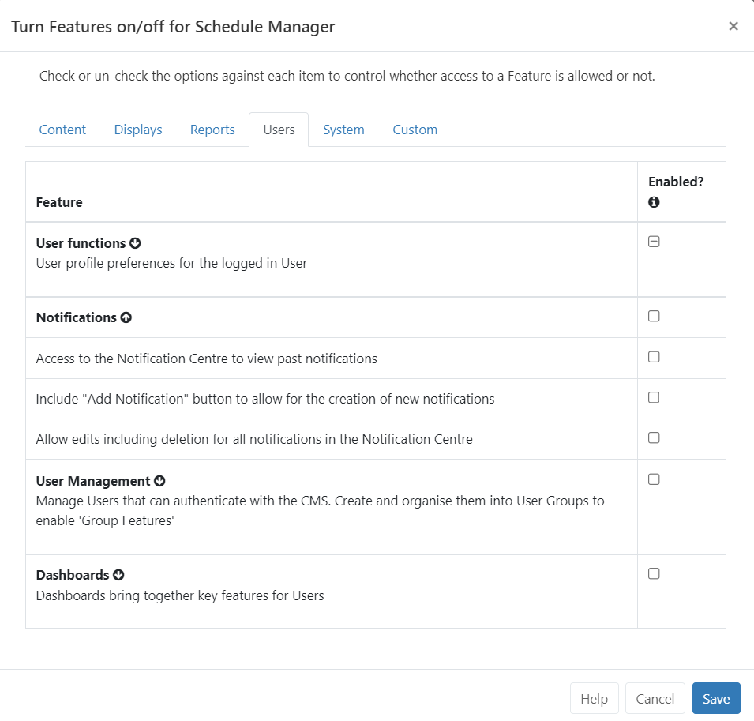
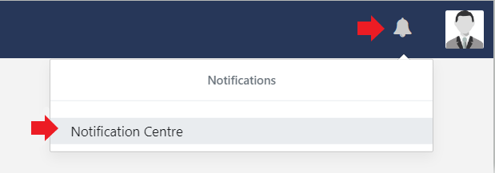

# 通知

[[PRODUCTNAME]] **通知システム** は、CMS の他のユーザーに重要なシステム イベントやユーザーが作成した通知を通知するために使用されます。

{tip}
通知がすでに有効になっているユーザーは、下の [通知ドロワー](users_notifications.html#content-notification-drawer) セクションに直接進んでください。
{/tip}

## 管理者の設定

[機能](users_features_and_sharing.html) を使用して、ユーザー/ユーザー グループの通知を有効にする必要があります。

- [**ユーザー**] タブをクリックします。
- **通知** 機能セットを展開し、適切なアクセスを有効にするためにチェックを入れます。

{version}
**注意:** 通知を有効にする前に、[CMS 設定] ページの [ネットワーク](tour_cms_settings.html#content-network) タブに **送信メール** アドレスが含まれていることを確認してください。

{/version}

## システム通知

[[PRODUCTNAME]] は、システム全体の状態を報告するために、さまざまな **システム通知** を発行します。

{tip}
通知は、[ネットワーク](tour_cms_settings.html#content-network) タブの **CMS 設定** で構成された **管理者** メール アドレスにメールで送信されます。

{/tip}

通知は、システム通知を受信するように構成されたユーザー グループに属するユーザー、またはこれらの通知を受信するように構成されたユーザー グループにも送信されます。システム通知は、ユーザー/ユーザー グループの編集フォームから管理されます:

{nonwhite}

{noncloud}

**CMS メンテナンス** に関する管理者向けの詳細情報は、[こちら](/docs/setup/xibo-maintenance.html) で確認できます

{/noncloud}
{/nonwhite}

## 通知ドロワー

ログインしたユーザーの通知は、画面の右上にあるアラーム ベル アイコンをクリックしてアクセスできる通知ドロワーに表示されます。

{tip}
未読の通知の数も赤で表示されます!

{/tip}

ドロワーには、受信した最新の 5 件の通知が表示されます。

未読の通知は黒のテキストで表示され、既読の通知は薄い灰色のテキストで表示されます。

{tip}
通知は、リリース日が過ぎていて、ログインしているユーザーに通知が割り当てられている場合にのみ、通知ドロワーに表示されます (例: [イベント リマインダーのスケジュール](scheduling_events.html#content-reminders))。
{/tip}

- **通知** のタイトルをクリックして開き、通知メッセージ全体を読んでください。

## 通知の作成

通知は、ユーザーが通知ドロワーから **通知センター** をクリックして作成します。

グリッドの右上にある **通知の追加** アクション ボタンをクリックします。

- **件名** のタイトルを追加します。

- 通知を公開する **日付** と時刻を選択します。

- オプションで通知を **メール** として追加送信する場合は、チェックを入れます。

{tip}
ユーザー レコードに入力されたメール アドレスが使用されます。この通知を受け取るユーザーは、[**Audience**] タブで定義されます。

{/tip}

- [**Interrupt**] オプションを使用すると、通知全体が表示されるページにユーザーを自動的にリダイレクトできます。

{tip}
このオプションは、重要なユーザー メッセージに便利です。ユーザーは、CMS のナビゲーションを続行するには、[続行] をクリックする必要があります。

[**Administration Settings**] ページの [**Maintenance**] タブで、[**Enable Email Alerts**] が有効になっていることを確認してください。不明な場合は、管理者に問い合わせてください。

{/tip}

- [**Message**] タブで、テキスト エディターを使用して、通知のメッセージ本文を作成し、書式設定します。

{tip}
[Notification Widget](media_module_notifications.html) を使用してメッセージを表示/表示グループにターゲット設定する場合、書式設定はウィジェットから適用され、ここでエディターで使用されている書式設定から適用されません。
{/tip}

- **Audience** タブから、この通知を受信する **Users/User Groups** を選択します。

- この通知を送信する CMS の非ユーザーのメール アドレスを入力します。

- 通知を表示する **Display/Display Groups** を選択します。

{tip}
Display/Display Groups を正常にターゲットにするには、レイアウトがスケジュールに既に存在し、[Notification Widget](media_module_notifications.html) が含まれている必要があります。

{/tip}

- 通知に添付するファイルをアップロードする必要がある場合は、添付ファイル タブを使用します。

{tip}
添付ファイルは、ユーザーが通知センターからダウンロードできます。

{/tip}

{version}
**注意:** 通知に加えられた編集は、CMS 側のみに反映されます。すでに送信された生成されたメールは取り消されません。
{/version}

## 通知ウィジェット

レイアウト/プレイリストに [通知ウィジェット](media_module_notifications.html) を追加して、**通知センター** から作成されたディスプレイにメッセージを表示します。

#### 次へ...

[レイアウト](layouts.html)
